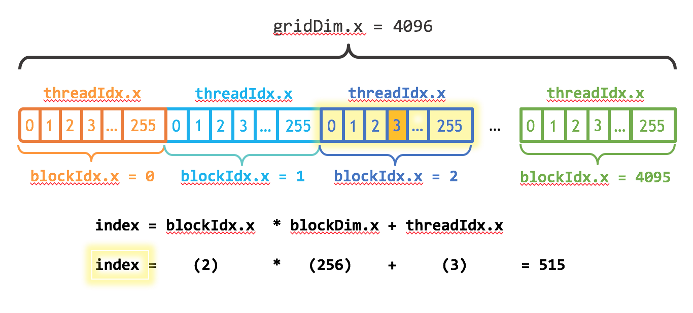

* GPUs have 2-4x greater floating point and bandwidth peak for the watts
  * also for the $ if you buy enterprise gear
  * better for the $ if you buy gaming gear
* Step 1 is to assess workload and latency requirements


* Don't waste time with GPUs if
  * your problem size or time to solution requirements don't align
  * if the work you'd like to move to the GPU is not a bottleneck
  * if the computation cost will be dwarfed by moving data to/from the GPU
    * often you need to restructure so that caller passes in data already on the device
    * can require nonlocal refactoring
* Almost never: pick one kernel at a time and move it to the GPU
  * DOE ACME/E3SM (to pick on one high-profile application) has basically done this for five years and it still doesn't help their production workloads so they bought a non-GPU machine
  

**Okay, okay, okay.  What if I have the right workload?**

## Terminology/intro

* [An even easier introduction to CUDA](https://devblogs.nvidia.com/even-easier-introduction-cuda/)
* [CUDA Programming Model](https://docs.nvidia.com/cuda/cuda-c-programming-guide/index.html#programming-model)

* On the CPU, we have a thread with vector registers/instructions
* In CUDA, we write code inside a single vector lane ("confusingly" called a CUDA thread)
* To get inside the lane, we launch a **kernel** from the CPU using special syntax
```c
add<<<numBlocks, blockSize>>>(N, x, y);
```

  * needs to be compiled using `nvcc`
  * Logically 1D/2D/3D rectangular tiled iteration space


* There are [many](https://en.wikipedia.org/wiki/CUDA#Version_features_and_specifications) constraints and limitations to the iteration "grid"


* Control flow for CUDA threads is nominally independent, but performance will be poor if you don't coordinate threads within each block.
  * Implicit coordination
    * Memory coalescing
    * Organize your algorithm to limit "divergence"
  * Explicit coordination
    * Shared memory
    * `__syncthreads()`
    * Warp shuffles
* We implement the kernel by using the `__global__` attribute
  * Visible from the CPU
  * Special [built-in variables](https://docs.nvidia.com/cuda/cuda-c-programming-guide/index.html#built-in-variables) are defined
    * `gridDim`
    * `blockIdx`
    * `blockDim`
    * `threadIdx`
  * There is also `__device__`, which is callable from other device functions
  * Can use `__host__ __device__` to compile two versions



#### How does this relate to the hardware?

* Each thread block is assigned to one streaming multiprocessor (SM)
* Executed in warps (number of hardware lanes)
* Multiple warps (from the same or different thread blocks) execute like hyperthreads

## Practical CUDA


### [CUDA Best Practices Guide](https://docs.nvidia.com/cuda/cuda-c-best-practices-guide/index.html)

#### Occupancy

> Thread instructions are executed sequentially in CUDA, and, as a result, executing other warps when one warp is paused or stalled is the only way to hide latencies and keep the hardware busy. Some metric related to the number of active warps on a multiprocessor is therefore important in **determining how effectively the hardware is kept busy** [emphasis added]. This metric is occupancy.

* Reality: occupancy is just one aspect, and often inversely correlated with keeping the hardware busy (and with performance).

> Occupancy is the ratio of the number of active warps per multiprocessor to the maximum number of possible active warps.

* If your kernel uses fewer registers/less shared memory, more warps can be scheduled.
* Register/shared memory usage is determined by the compiler.


```python
def render_c(filename):
    from IPython.display import Markdown
    with open(filename) as f:
        contents = f.read()
    return Markdown("```c\n" + contents + "```\n")

render_c('add.cu')
```


```c
__global__ void add(int n, float *x, float *y) {
  int index = blockIdx.x * blockDim.x + threadIdx.x;
  int stride = blockDim.x * gridDim.x;
  for (int i = index; i < n; i += stride)
    y[i] += x[i];
}
```


```python
! nvcc -arch sm_75 --resource-usage -c add.cu
```

    ptxas info    : 0 bytes gmem
    ptxas info    : Compiling entry function '_Z3addiPfS_' for 'sm_75'
    ptxas info    : Function properties for _Z3addiPfS_
        0 bytes stack frame, 0 bytes spill stores, 0 bytes spill loads
    ptxas info    : Used 12 registers, 376 bytes cmem[0]


```python
render_c('copy.cu')
```


```c
__global__ void copy(float *dst, float *src) {
  int iblock = blockIdx.x + blockIdx.y * gridDim.x;
  int index  = threadIdx.x + TILE_SIZE * iblock * blockDim.x;
  float a[TILE_SIZE]; // allocated in registers
  for (int i=0; i<TILE_SIZE; i++)
    a[i] = src[index + i * blockDim.x];
  for (int i=0; i<TILE_SIZE; i++)
    dst[index + i * blockDim.x] = a[i];
}
```


```python
! nvcc -arch sm_75 --resource-usage -DTILE_SIZE=16 -c copy.cu
```

    ptxas info    : 0 bytes gmem
    ptxas info    : Compiling entry function '_Z4copyPfS_' for 'sm_75'
    ptxas info    : Function properties for _Z4copyPfS_
        0 bytes stack frame, 0 bytes spill stores, 0 bytes spill loads
    ptxas info    : Used 64 registers, 368 bytes cmem[0]


* The [Occupancy Calculator](https://docs.nvidia.com/cuda/cuda-occupancy-calculator/index.html) can compute occupancy based on the register and shared memory usage.
* You can tell the compiler to reduce register usage, sometimes at the expense of spills.


```python
! nvcc -arch sm_75 --resource-usage -DTILE_SIZE=16 --maxrregcount 24 -c copy.cu
```

    ptxas info    : 0 bytes gmem
    ptxas info    : Compiling entry function '_Z4copyPfS_' for 'sm_75'
    ptxas info    : Function properties for _Z4copyPfS_
        80 bytes stack frame, 76 bytes spill stores, 76 bytes spill loads
    ptxas info    : Used 24 registers, 368 bytes cmem[0]


#### Further reading
* Vasily Volkov (2010) [**Better Performance at Lower Occupancy**](https://www.nvidia.com/content/GTC-2010/pdfs/2238_GTC2010.pdf) (slides)
* Vasily Volkov (2016) [**Understanding Latency Hiding on GPUs**](https://www2.eecs.berkeley.edu/Pubs/TechRpts/2016/EECS-2016-143.pdf) (very in-depth)
* Kasia Swirydowicz (2018) [**Finite Element Stiffness Matrix Action: monolithic kernel optimization on Titan V**](https://www.paranumal.com/single-post/2018/03/02/Finite-Element-Stiffness-Matrix-Action-monolithic-kernel-optimization-on-Titan-V)

### Memory

* GPU memory is not CPU memory


**Duh**, so why does NVIDIA [publish this](https://devblogs.nvidia.com/unified-memory-cuda-beginners/)?


#### Getting your memory into position is often the hardest part of CUDA programming.

* Allocate memory on the GPU
```c
cudaMalloc(&xdevice, N*sizeof(double));
```
* Populate it from the host
```c
cudaMemcpy(xdevice, xhost, N*sizeof(double), cudaMemcpyHostToDevice);
```
* Repeat for all data, including control parameters
* Easy to forget, ongoing maintenance/complexity cost

#### [Unified/managed memory](https://devblogs.nvidia.com/unified-memory-cuda-beginners/)

* Allocate "managed" memory, accessible from CPU and GPU
```c
cudaMallocManaged(&x, N*sizeof(float));
```
* How?


* With OpenACC, make all dynamic allocations in managed memory: `pgcc -ta=tesla:managed`
  * The GPU probably has a lot less memory than you have DRAM
  * Really convenient for incremental work in legacy code
  * Performance isn't great without `cudaMemPrefetchAsync`
  


**Further reading**: [Maximizing Unified Memory Performance in CUDA](https://devblogs.nvidia.com/maximizing-unified-memory-performance-cuda/)

### On memory coalescing and [strided access](https://docs.nvidia.com/cuda/cuda-c-best-practices-guide/index.html#strided-accesses)

```c
__global__ void strideCopy(float *odata, float* idata, int stride) {
    int xid = (blockIdx.x*blockDim.x + threadIdx.x)*stride;
    odata[xid] = idata[xid];
}
```


Lose half your bandwidth for `stride=2`.


