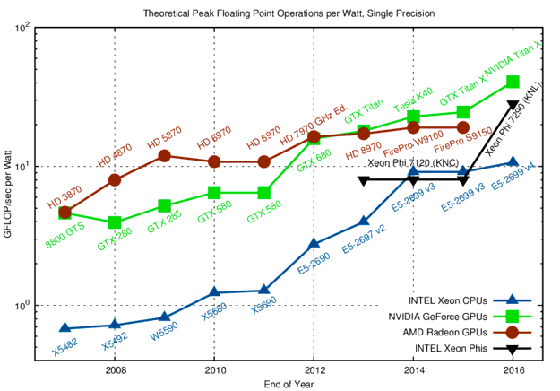
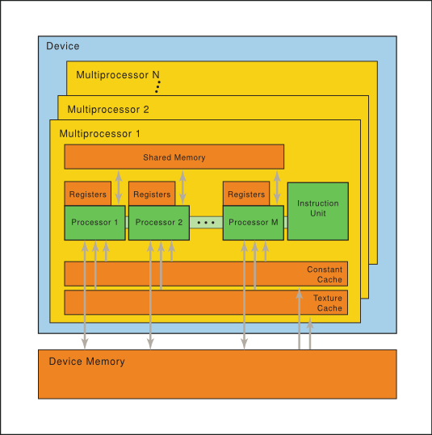
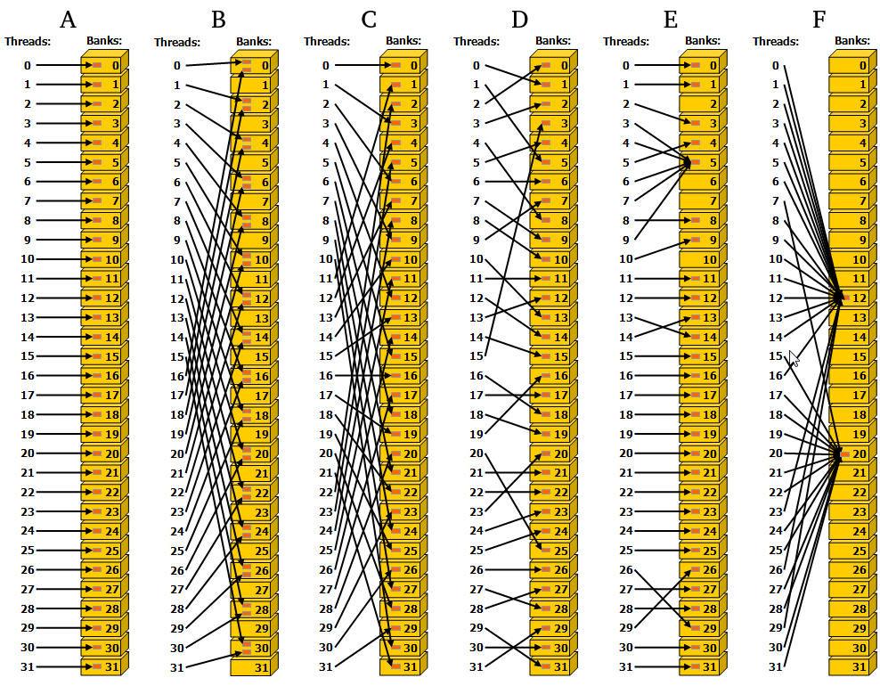

* GPU vs CPU characterization
* CUDA preview
* Execution heirarchy
* Memory managerie
* Optimizations

## Graphics Processing Units

Graphics Processing Units (GPUs) evolved from commercial demand for high-definition graphics.  HPC general purpose computing with GPUs picked up after programmable shaders were added in early 2000s.

GPU compute performance relative to CPU is not magic, rather it is based on difference in goals; GPUs were unpolluted by CPU demands for user-adaptability.


<center><i>Nvidia.com: real-estate difference</i></center>

GPUs have no\* branch prediction and no speculative execution.  (In the early days, computational uses even needed to implement their own error correction in software!)  Longer memory access latencies from tiny cache size is meant to be hidden behind co-resident compute.  The difference in mentality allowed GPUs to far surpass CPU compute efficiency.

*\*: recent devices use branch prediction to group divergent threads*


<center><i>karlrupp.net: compute efficiency</i></center>

Power can dominant the cost in HPC. Consider the Summit supercomputer:

* #2 GREEN500 (was #3, but #1 was decomissioned)
* cost \$200 million to build
* 13 MW to run compute+interconnect+file systems => roughly \$7 million/year in raw electricity to power
* (does not count facilities/infrastructure cost to actually supply this power, nor cooling)

The drawbacks: GPU efficiency needs the problem to fit well into SIMD and have a relatively high computation intensity.


## CUDA
Early general purpose computing GPU efforts required formulating problems in terms of graphics primatives (e.g. DirectX).

NVIDIA publicly launched CUDA in 2006, allowing programming in C (and Fortran).

Flash forward to 2019: AMD has its own language and there are also several vendor-independent languages (dominant: OpenCL), but CUDA still dominates overall.

Nvidia maintains good documentation to ease adoption, like its [https://docs.nvidia.com/cuda/cuda-c-programming-guide/index.html](programming guide).

### Kernel syntax example
```
// Add two matrices A and B of size NxN and stores the result into matrix C:
// Kernel definition
__global__ void MatAdd(float A[N][N], float B[N][N], float C[N][N])
{
    int i = blockIdx.x * blockDim.x + threadIdx.x;
    int j = blockIdx.y * blockDim.y + threadIdx.y;
    if (i < N && j < N)
        C[i][j] = A[i][j] + B[i][j];
}

int main()
{
    ...
    // Kernel invocation
    dim3 threadsPerBlock(16, 16);
    dim3 numBlocks(N / threadsPerBlock.x, N / threadsPerBlock.y);
    MatAdd<<<numBlocks, threadsPerBlock>>>(A, B, C);
    ...
}
```

CUDA-specific additions:
* Kernels are defined with a `__global__` specifier (when called by the host).
* `<<<numBlocks, threadsPerBlock>>>` gives the *execution configuration*.
* Ways for threads to query their location: `threadIdx`, `blockIdx`.

### Thread Heirarchy
Threads each have their own register allocation.  They are always executed in "SIMT" **warps** of up to 32 (could change, but hasn't yet).  This means:
* any divergence of instructions between threads within a warp causes some of the threads to no-op (relaxed recently);
* `product(threadsPerBlock)` should be a multiple of 32 (maximum 1024) where possible.

Blocks each have their own shared memory allocation.  All threads in a block are resident on the same processing core.  Thread layout can be up to three dimensions.
* can perform a lightweight synchronization within a block;
* co-resident blocks can be helpful at masking latency, but this is limited by block memory and register use.

Blocks themselves are layed out on a **grid** of up to three dimensions (on recent compute capabilities).  They must be logically executable in parallel or any serial order.
* no synchronization across blocks within a kernel;
* embarassingly parallel only, although caches can be reused.


<center><i>Nvidia.com: 2d grid and threads</i></center>

### Memory

<center><i>Nvidia.com: model of memory connections</i></center>

**Global**, **constant**, and **texture** memories persist across kernel calls, and each has its own cache per SM (L2 cache shared by SMs).  By default, host and device are assumed to maintain separate memory:
* explicit device allocation and deallocation;
* explicit transfer between host and device.

Alternatively, there is a "Unified Memory" configuration that automates these on an as-needed basis, pretending there is one common address space.

Each block has **shared** memory which tends to be fast (equivalent to a user-managed L1 cache).

Each thread has "**local**" memory (that is actually no more local than global memory!), which is mostly used for register spilling.  (Register and shared memory usage are reported by the compiler when compiling with the `-ptxas-options=-v` option.)

### Memory transfer example
```
__global__ void VecAdd(float* A, float* B, float* C, int N)
{
    int i = blockDim.x * blockIdx.x + threadIdx.x;
    if (i < N)
        C[i] = A[i] + B[i];
}

int main()
{
    int N = ...;
    size_t size = N * sizeof(float);
    
    // Allocate input vectors h_A and h_B in host memory
    float* h_A = (float*)malloc(size);
    float* h_B = (float*)malloc(size);
    float* h_C = (float*)malloc(size);

    // Initialize input vectors
    ...

    
    // Allocate vectors in device memory
    float* d_A;
    cudaMalloc(&d_A, size);
    float* d_B;
    cudaMalloc(&d_B, size);
    float* d_C;
    cudaMalloc(&d_C, size);

    // Copy vectors from host memory to device memory
    cudaMemcpy(d_A, h_A, size, cudaMemcpyHostToDevice);
    cudaMemcpy(d_B, h_B, size, cudaMemcpyHostToDevice);


    // Invoke kernel
    int threadsPerBlock = 256;
    int blocksPerGrid = (N + threadsPerBlock - 1) / threadsPerBlock;
    VecAdd<<<blocksPerGrid, threadsPerBlock>>>(d_A, d_B, d_C, N);


    // Copy result from device memory to host memory
    // h_C contains the result in host memory
    cudaMemcpy(h_C, d_C, size, cudaMemcpyDeviceToHost);

    // Free device memory
    cudaFree(d_A);
    cudaFree(d_B);
    cudaFree(d_C);
            
    // Free host memory
    ...
}
```
<hline>


```python

```

## Optimization Details
Often details depend on the particular "compute capability" of the device.

### Intrinsic function instructions
* similar tradeoffs to --ffast-math

### Memory

#### Hiding Memory Transfers:
Memory transfers between host and device generally have the greatest latency.  Modern capabilities can hide data transfer between host and device by giving the device other tasks to work on and having the host use asynchronous versions of the transfer functions.

This is managed through  **streams** on the host, where cuda calls within a stream are guaranteed to execute on the device in order, but those between streams may be out of order or overlap *depending on the compute capability*.

To minimize waiting with the following code, the compute capability needs to allow concurrent data transfers, concurrent kernel execution, and overlap of data transfer and kernel execution. 

```
for (int i = 0; i < 2; ++i) {
    cudaMemcpyAsync(inputDevPtr + i * size, hostPtr + i * size,
                    size, cudaMemcpyHostToDevice, stream[i]);
    MyKernel <<<100, 512, 0, stream[i]>>>
          (outputDevPtr + i * size, inputDevPtr + i * size, size);
    cudaMemcpyAsync(hostPtr + i * size, outputDevPtr + i * size,
                    size, cudaMemcpyDeviceToHost, stream[i]);
}
```

#### Global memory access size and alignment:
Example: an array of this struct would have elements that aren't aligned if not for the `__align__(16)`:
```
struct __align__(16) {
    float x;
    float y;
    float z;
};
```

This usually crops up with 2d arrays, which are more efficient if width-padded to a multiple of the warp size.

#### Coalescence:
Global (and local\*) memory requests must be **coalesced**---falling into the same 128-byte wide+aligned window (for all modern capabilities)---or they will require multiple instructions.

*\*: the compiler will generally ensure that local memory use is coalesced*

#### Bank Distribution:
Similar, but different from global-memory coalescence.  Shared memory is divided into **banks** (typically 32), where each bank can be accessed simultaneously.


<center><i>Nvidia.com: A) conflict-free, B) conflict depth 2, C) conflict-free, D) conflict-free, E) conflict-free, F) conflict-free</i></center>

*My impression is that most programmers rely on the compiler to sensibly structure bank accesses for temporary variables, but occasionally breaking into the "CUDA assembly" language `PTX` will yeild significant performance improvements.*

The combination of coalescence and shared banks can cause an interesting interplay for certain problems.  Consider:
* Mx31 array made of structs of 2 32-bit floats.
* Coalescence would suggest padding the array to 32 wide when reading from global memory, but then once it resides in a shared memory with 32-bit strided banks, a warp of threads accessing the first of the pair of floats will cause bank conflicts of depth 2.
* Shared memory would be better served by padding the array width to 31.5.

(the better solution might be to pull the struct apart...)

#### Texture-specific memory features:
* Optimized for 2d locality; can be faster than non-coalesced global/constant memory requests.
* Ability to automatically cast 8/16-bit integers into [0,1] 32-bit floats.


```python

```
