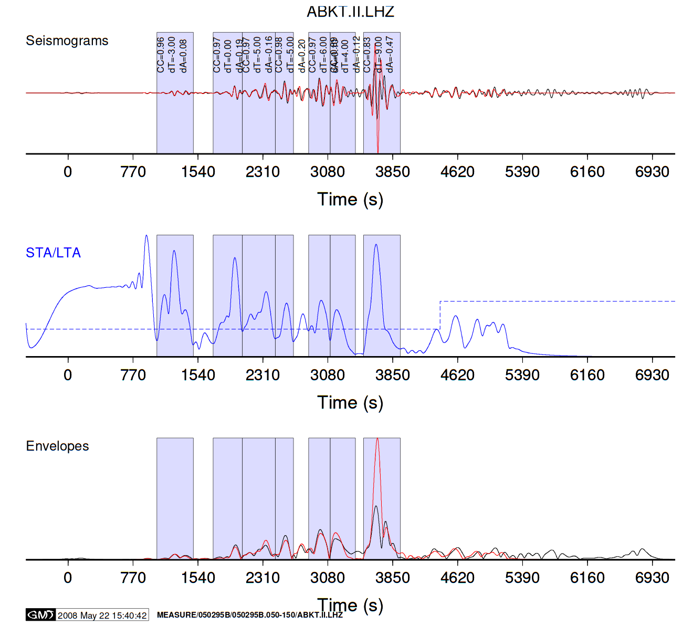
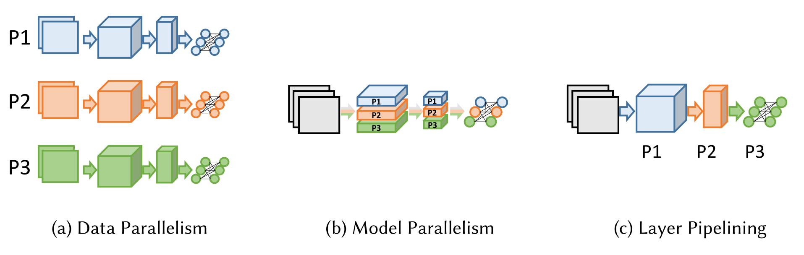
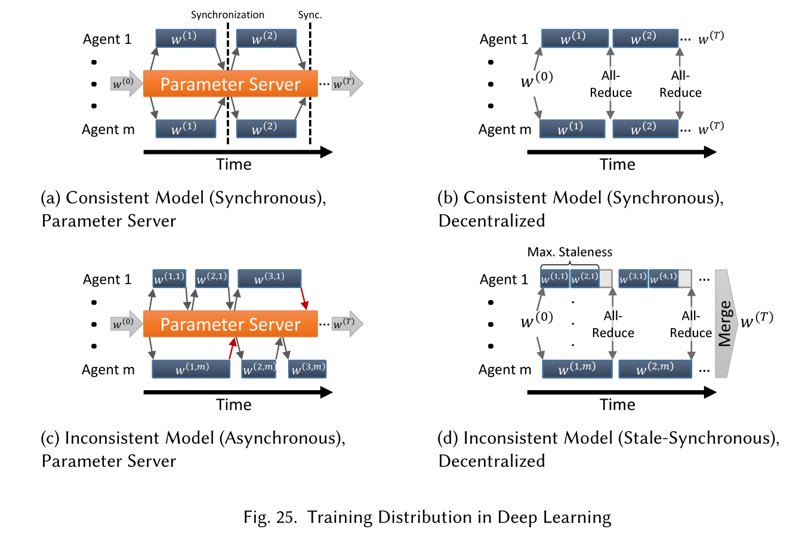
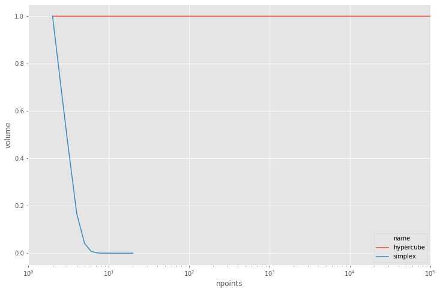

## Seismic Tomography


```python
from IPython.display import HTML

####HTML('<iframe width="854" height="422" src="https://www.youtube.com/embed/7zuICgLxSIk?rel=0&amp;controls=0&amp;showinfo=0" frameborder="0" allowfullscreen></iframe>')
```


<iframe width="854" height="422" src="https://www.youtube.com/embed/7zuICgLxSIk?rel=0&amp;controls=0&amp;showinfo=0" frameborder="0" allowfullscreen></iframe>


### Observed and synthectic seismograms



### Data sizes

| Name | Count/size |
|--------|-------------|
| Seismic events (earthquakes) | 100--1000 |
| Seismic stations that observe each event | 100--1000 |
| Seismograms (observed and synthetic) | 1-1000 TB |
| Elastic structure (3D mesh) | 1-1000 GB |
| Simulate one earthquake | 100-1000 CPU hours |
| Optimization iterations | ~30 |

* Problem: Local minima when high-frequency windows are included in early iterations.

### [Adaptable Seismic Data Format](https://asdf-definition.readthedocs.io/en/latest/big_picture.html) (based on HDF5)


## Parallelism in Machine Learning

* http://unixer.de/publications/img/distdl-preprint.pdf ([video](https://www.youtube.com/watch?v=xtxxLWZznBI))





## Curse of dimensionality


```python
%matplotlib inline
import pandas
import seaborn
import matplotlib.pyplot as plt
import numpy as np
plt.style.use('ggplot')
plt.rc('figure', figsize=(12,8))

def hypercube(d):
    return dict(name='hypercube', dim=d, npoints=2**d, volume=1)

def simplex(d):
    return dict(name='simplex', dim=d, npoints=d+1, volume=1/np.math.factorial(d))

df = pandas.DataFrame([hypercube(d) for d in range(1,20)] + [simplex(d) for d in range(1,20)])
df.head()
```


<div>
<style scoped>
    .dataframe tbody tr th:only-of-type {
        vertical-align: middle;
    }

    .dataframe tbody tr th {
        vertical-align: top;
    }

    .dataframe thead th {
        text-align: right;
    }
</style>
<table border="1" class="dataframe">
  <thead>
    <tr style="text-align: right;">
      <th></th>
      <th>name</th>
      <th>dim</th>
      <th>npoints</th>
      <th>volume</th>
    </tr>
  </thead>
  <tbody>
    <tr>
      <th>0</th>
      <td>hypercube</td>
      <td>1</td>
      <td>2</td>
      <td>1.0</td>
    </tr>
    <tr>
      <th>1</th>
      <td>hypercube</td>
      <td>2</td>
      <td>4</td>
      <td>1.0</td>
    </tr>
    <tr>
      <th>2</th>
      <td>hypercube</td>
      <td>3</td>
      <td>8</td>
      <td>1.0</td>
    </tr>
    <tr>
      <th>3</th>
      <td>hypercube</td>
      <td>4</td>
      <td>16</td>
      <td>1.0</td>
    </tr>
    <tr>
      <th>4</th>
      <td>hypercube</td>
      <td>5</td>
      <td>32</td>
      <td>1.0</td>
    </tr>
  </tbody>
</table>
</div>


```python
df.tail()
```


<div>
<style scoped>
    .dataframe tbody tr th:only-of-type {
        vertical-align: middle;
    }

    .dataframe tbody tr th {
        vertical-align: top;
    }

    .dataframe thead th {
        text-align: right;
    }
</style>
<table border="1" class="dataframe">
  <thead>
    <tr style="text-align: right;">
      <th></th>
      <th>name</th>
      <th>dim</th>
      <th>npoints</th>
      <th>volume</th>
    </tr>
  </thead>
  <tbody>
    <tr>
      <th>33</th>
      <td>simplex</td>
      <td>15</td>
      <td>16</td>
      <td>7.647164e-13</td>
    </tr>
    <tr>
      <th>34</th>
      <td>simplex</td>
      <td>16</td>
      <td>17</td>
      <td>4.779477e-14</td>
    </tr>
    <tr>
      <th>35</th>
      <td>simplex</td>
      <td>17</td>
      <td>18</td>
      <td>2.811457e-15</td>
    </tr>
    <tr>
      <th>36</th>
      <td>simplex</td>
      <td>18</td>
      <td>19</td>
      <td>1.561921e-16</td>
    </tr>
    <tr>
      <th>37</th>
      <td>simplex</td>
      <td>19</td>
      <td>20</td>
      <td>8.220635e-18</td>
    </tr>
  </tbody>
</table>
</div>


```python
grid = seaborn.lineplot(x='npoints', y='volume', hue='name', data=df)
grid.axes.set(xscale='log', xlim=(1, 1e5));
```




