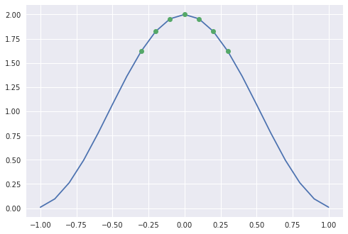
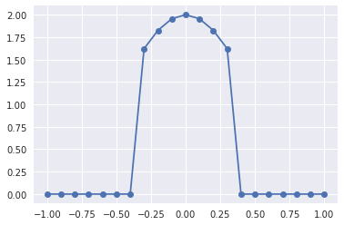
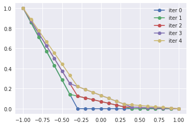

## Classical methods

We have discussed the Jacobi preconditioner
$$ P_{\text{Jacobi}}^{-1} = D^{-1} $$
where $D$ is the diagonal of $A$.
Gauss-Seidel is
$$ P_{GS}^{-1} = (L+D)^{-1} $$
where $L$ is the (strictly) lower triangular part of $A$.  The upper triangular part may be used instead, or a symmetric form
$$ P_{SGS}^{-1} = (D+U)^{-1} D (L+D)^{-1} . $$

[*Edit after class*: fixed mistake in the above formula and added snippet below.]

#### Aside: Where does $P_{SGS}^{-1}$ come from?

Let's take the error iteration matrix for a forward sweep $I - (L+D)^{-1} A$ followed by a backward sweep $I - (D+U)^{-1}A$ and compute

$$\begin{align}
I - P_{SGS}^{-1} A &= \big( I - (D+U)^{-1} A \big) \big(I - (L+D)^{-1} A \big) \\
  &= I - (D+U)^{-1} A - (L+D)^{-1} A + (D+U)^{-1} A (L+D)^{-1} A \\
  &= I - \Big( (D+U)^{-1} + (L+D)^{-1} - (D+U)^{-1} A (L+D)^{-1} \Big) A \\
  &= I - \Big( (D+U)^{-1} + \underbrace{\big[I - (D+U)^{-1} A \big]}_{I - (D+U)^{-1} (D+U+L)} (L+D)^{-1} \Big) A \\
  &= I - \Big( (D+U)^{-1} - (D+U)^{-1} L (L+D)^{-1} \Big) A \\
  &= I - \Big( (D+U)^{-1} - (D+U)^{-1} \underbrace{(L+D-D) (L+D)^{-1}}_{I - D (L+D)^{-1}} \Big) A \\
  &= I - \underbrace{(D+U)^{-1} D (L+D)^{-1}}_{P_{SGS}^{-1}} A .
\end{align}$$

### Further resources

* [Saad (2003) **Iterative Methods**](https://www-users.cs.umn.edu/~saad/IterMethBook_2ndEd.pdf): Chapter 4: Basic Iterative Methods

## Domain decomposition

Suppose we know how to solve problems on "subdomains", which may overlap.


This could be possible because they have special structure (e.g., above) or because they are small enough.  We want to use this ability to solve the global problem.

### Alternating Schwarz method

```python
bc_circle = guess()
while not converged:
    u_circle = solve(A_circle, bc_circle)
    bc_rectangle = eval(u_circle, rectangle)
    u_rectangle = solve(A_rectangle, bc_rectangle)
    bc_circle = eval(u_rectangle, circle)
```

This method was proposed in 1870 by [Hermann Schwarz](https://en.wikipedia.org/wiki/Hermann_Schwarz) as a theoretical tool, and is now called a "multiplicative" Schwarz method because the solves depend on each other.  We can see it as a generalization of Gauss-Seidel in which we solve on subdomains instead of at individual grid points.  As with Gauss-Seidel, it is difficult to expose parallelism.

### Additive Schwarz methods

The additive Schwarz method is more comparable to Jacobi, with each domain solved in parallel.  Our fundamental operation will be an embedding of each subdomain $V_i$ into the global domain $V$, which we call the **prolongation**

$$ P_i : V_i \to V $$

The transpose of prolongation, $P_i^T$, will sometimes be called **restriction**.
Let's work an example.


```python
%matplotlib inline
import numpy as np
import matplotlib.pyplot as plt
plt.style.use('seaborn')

N = 21
x = np.linspace(-1, 1, N)
overlap = 0
domains = [(0,N//3+overlap), (N//3-overlap, 2*N//3+overlap), (2*N//3-overlap, N)]
P = []
for i, (start, end) in enumerate(domains):
    P.append(np.eye(N, end-start, -start))
u = 1 + np.cos(3*x)
plt.plot(x, u)
u1 = P[1].T @ u   # Restrict to subdomain 1
plt.plot(P[1].T @ x, u1, 'o')
print(P[1].shape)
```

    (21, 7)





```python
plt.plot(x, P[1] @ u1, 'o-');  # Prolong to global domain
```





```python
# Define a Laplacian
A = np.eye(N)
A[1:-1] = (2*np.eye(N-2, N, 1) - np.eye(N-2, N, 0) - np.eye(N-2, N, 2)) / (N-1)**2
A[:5, :5]
```


    array([[ 1.    ,  0.    ,  0.    ,  0.    ,  0.    ],
           [-0.0025,  0.005 , -0.0025,  0.    ,  0.    ],
           [ 0.    , -0.0025,  0.005 , -0.0025,  0.    ],
           [ 0.    ,  0.    , -0.0025,  0.005 , -0.0025],
           [ 0.    ,  0.    ,  0.    , -0.0025,  0.005 ]])


The first and last rows implement boundary conditions; the interior is the familiar centered difference method for the Laplacian.


```python
A1 = P[1].T @ A @ P[1]
A1
```


    array([[ 0.005 , -0.0025,  0.    ,  0.    ,  0.    ,  0.    ,  0.    ],
           [-0.0025,  0.005 , -0.0025,  0.    ,  0.    ,  0.    ,  0.    ],
           [ 0.    , -0.0025,  0.005 , -0.0025,  0.    ,  0.    ,  0.    ],
           [ 0.    ,  0.    , -0.0025,  0.005 , -0.0025,  0.    ,  0.    ],
           [ 0.    ,  0.    ,  0.    , -0.0025,  0.005 , -0.0025,  0.    ],
           [ 0.    ,  0.    ,  0.    ,  0.    , -0.0025,  0.005 , -0.0025],
           [ 0.    ,  0.    ,  0.    ,  0.    ,  0.    , -0.0025,  0.005 ]])


```python
rhs = np.zeros_like(x)
rhs[0] = 1 # Boundary condition
u = np.zeros_like(x) # Initial guess
for iter in range(5):
    r = rhs - A @ u      # Residual
    u_next = u.copy()
    for Pi in P:
        Ai = Pi.T @ A @ Pi
        ui = np.linalg.solve(Ai, Pi.T @ r)
        u_next += Pi @ ui
    u = u_next
    plt.plot(x, u, 'o-', label=f'iter {iter}')
plt.legend();
```





#### Hands-on
Go back and increase `overlap` to see how it affects convergence.

### Theory

Given a linear operator $A : V \to V$, suppose we have a collection of prolongation operators $P_i : V_i \to V$.  The columns of $P_i$ are "basis functions" for the subspace $V_i$.  The Galerkin operator $A_i = P_i^T A P_i$ is the action of the original operator $A$ in the subspace.

Define the subspace projection

$$ S_i = P_i A_i^{-1} P_i^T A . $$

* $S_i$ is a projection: $S_i^2 = S_i$
* If $A$ is SPD, $S_i$ is SPD with respect to the $A$ inner product $x^T A y$
* $I - S_i$ is $A$-orthogonal to the range of $P_i$


```python
S1 = P[1] @ np.linalg.inv(A1) @ P[1].T @ A
np.linalg.norm(S1 @ S1 - S1)
```


    1.2457015262873114e-15


```python
I = np.eye(*S1.shape)
np.linalg.norm(P[1].T @ A @ (I - S1))
```


    6.9011609626021565e-18


Note, the concept of $A$-orthogonality is meaningful only when $A$ is SPD.
Does the mathematical expression $ P_i^T A (I - S_i) = 0 $ hold even when $A$ is nonsymmetric?

These projections may be applied additively

$$ I - \sum_{i=0}^n S_i, $$

multiplicatively

$$ \prod_{i=0}^n (I - S_i), $$

or in some hybrid manner, such as

$$ (I - S_0) (I - \sum_{i=1}^n S_i) . $$
In each case above, the action is expressed in terms of the error iteration operator.

### Examples

* Jacobi corresponds to the additive preconditioner with $P_i$ as the $i$th column of the identity
* Gauss-Seidel is the multiplicate preconditioner with $P_i$ as the $i$th column of the identity
* Block Jacobi corresponds to labeling "subdomains" and $P_i$ as the columns of the identity corresponding to non-overlapping subdomains
* Overlapping Schwarz corresponds to overlapping subdomains
* $P_i$ are eigenvectors of $A$
* A domain is partitioned into interior $V_{I}$ and interface $V_\Gamma$ degrees of freedom.  $P_{I}$ is embedding of the interior degrees of freedom while $P_\Gamma$ is "harmonic extension" of the interface degrees of freedom.  Consider the multiplicative combination $(I - S_\Gamma)(I - S_{I})$.

### Convergence theory

The formal convergence is beyond the scope of this course, but the following estimates are useful.  We let $h$ be the element diameter, $H$ be the subdomain diameter, and $\delta$ be the overlap, each normalized such that the global domain diameter is 1.  We express the convergence in terms of the condition number $\kappa$ for the preconditioned operator.

* (Block) Jacobi: $\delta=0$, $\kappa \sim H^{-2} H/h = (Hh)^{-1}$
* Overlapping Schwarz: $\kappa \sim H^{-2} H/\delta = (H \delta)^{-1}$
* 2-level overlapping Schwarz: $\kappa \sim H/\delta$

### Hands-on with PETSc: demonstrate these estimates

* Symmetric example: `src/snes/examples/tutorials/ex5.c`
* Nonsymmetric example: `src/snes/examples/tutorials/ex19.c`
* Compare preconditioned versus unpreconditioned norms.
* Compare BiCG versus GMRES
* Compare domain decomposition and multigrid preconditioning
 * `-pc_type asm` (Additive Schwarz)
  * `-pc_asm_type basic` (symmetric, versus `restrict`)
  * `-pc_asm_overlap 2` (increase overlap)
  * Effect of direct subdomain solver: `-sub_pc_type lu`
 * `-pc_type mg` (Geometric Multigrid)
* Use monitors:
 * `-ksp_monitor_true_residual`
 * `-ksp_monitor_singular_value`
 * `-ksp_converged_reason`
* Explain methods: `-snes_view`
* Performance info: `-log_view`

#### Examples
```
mpiexec -n 4 ./ex19 -lidvelocity 2 -snes_monitor -da_refine 5 -ksp_monitor -pc_type asm -sub_pc_type lu
```
