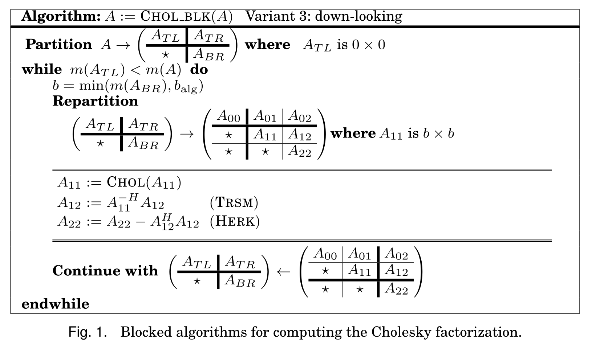
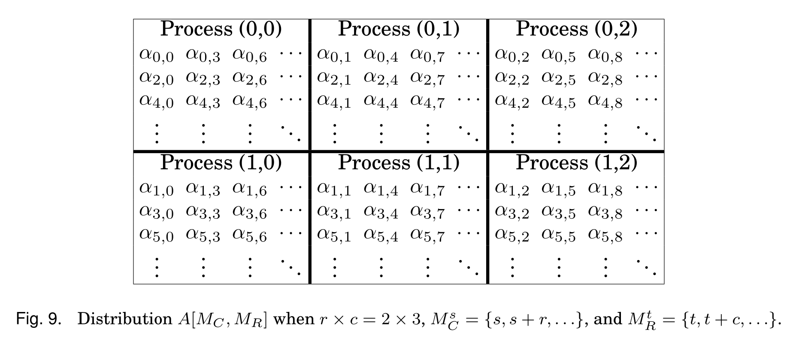
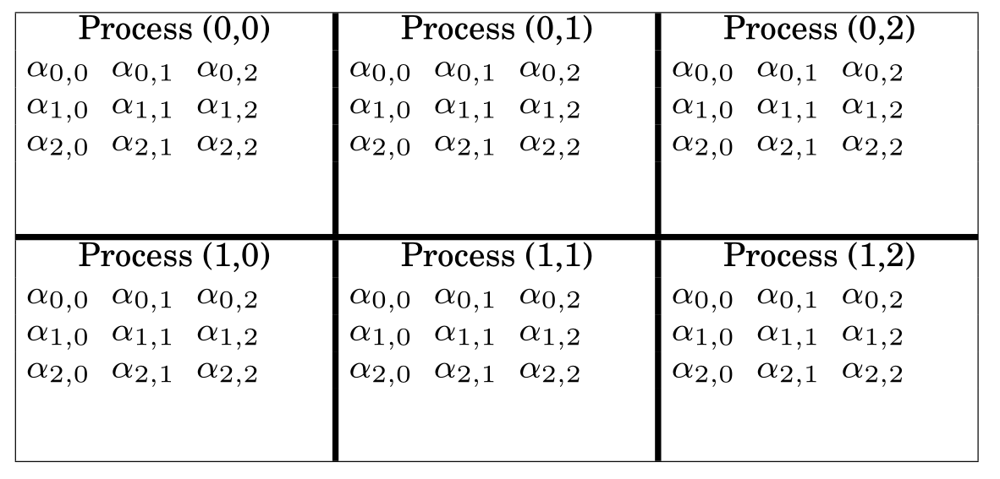

## FLAME diagram for Cholesky

## $A[M_C, M_R]$ distribution

## The $A[*,*]$ distribution

## References

* Poulson et al. (2013) [Elemental: A New Framework for Distributed Memory Dense Matrix Computations](https://wiki.alcf.anl.gov/parts/images/1/14/Elemental.pdf) doi:[10.1145/2427023.2427030](https://doi.org/10.1145/2427023.2427030)
