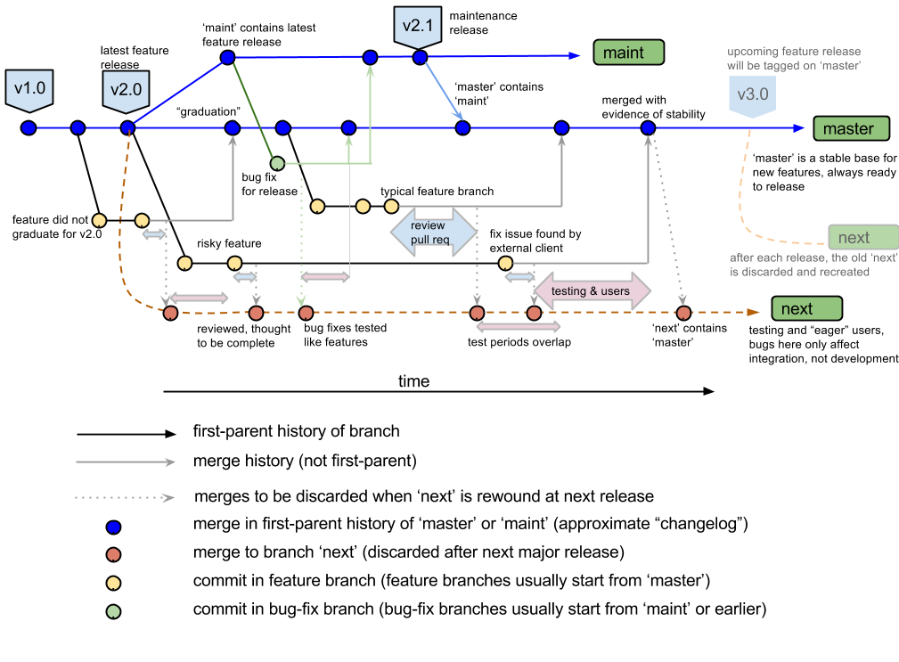

## Project roles

* **Users** stress features, report issues, ask questions that steer project.
* **Developers** fix bugs and create features. They write code and docs and generally are agents of change in a software project. There are often many more developers than reviewers or maintainers.
* **Reviewers** are known experts in a part of a project and are called on to review the work of developers, mostly to make sure that the developers don’t break anything, but also to point them to related work, ensure common development practices, and pass on institutional knowledge. There are often more developers than reviewers, and more reviewers than maintainers.
* **Maintainers** are loosely aware of the entire project. They track ongoing work and make sure that it gets reviewed and merged in a timely manner. They direct the orchestra of developers and reviewers, making sure that they connect to each other appropriately, often serving as dispatcher.

    Maintainers also have final responsibility. If no reviewer can be found for an important contribution, they review. If no developer can be found to fix an important bug, they develop. If something goes wrong, it’s eventually the maintainer’s fault.

-- [Rocklin: The Role of a Maintainer](https://matthewrocklin.com/blog//2019/05/18/maintainer)

> Each change has to be reviewed. **This is the single biggest cost.**

-- [Gommers: The cost of an open source contribution](https://rgommers.github.io/2019/06/the-cost-of-an-open-source-contribution/)

## Principles of Git workflows

* Reviewable
  * Prioritize time and accuracy for reviewers
* Testable
  * Untested code is usually broken
  * Reviewing broken code is a waste of time
  * Exception: "request for comment" (RFC) commits sketch an idea for discussion; will be revised before review/merging
* [Atomic](https://en.wikipedia.org/wiki/Atomic_commit#Atomic_commit_convention)
  * [Small commits](https://google.github.io/eng-practices/review/developer/small-cls.html) are easier to understand and make bug-free
  * Also easier to revert
* [Bisectable](https://git-scm.com/docs/git-bisect)
  * Test suites are always incomplete
  * When we learn about a bug
* Stable `master`
  * Bugs in `master` are highly disruptive
* Minimize dependencies
  * Deliver the bug-fix and nothing but the bug-fix
    * To anyone who has the bug
  * Deliver the feature and nothing but the feature

## Examples
### [`gitworkflows(7)`](https://git-scm.com/docs/gitworkflows)


#### Inspecting history in the Git project


```python
! git -C ~/src/git log -20 --graph --decorate --pretty=oneline --abbrev-commit
```

    * 228f53135a (HEAD -> master, gitster/master) The second batch
    *   6c630f237e Merge branch 'jk/gitweb-anti-xss'
    |\  
    | * a376e37b2c (gitster/jk/gitweb-anti-xss) gitweb: escape URLs generated by href()
    | * b178c207d7 t/gitweb-lib.sh: set $REQUEST_URI
    | * f28bceca75 t/gitweb-lib.sh: drop confusing quotes
    | * 0eba60c9b7 t9502: pass along all arguments in xss helper
    * |   3288d99c92 Merge branch 'ar/install-doc-update-cmds-needing-the-shell'
    |\ \  
    | * | 932757b0cc (gitster/ar/install-doc-update-cmds-needing-the-shell) INSTALL: use existing shell scripts as example
    | |/  
    * |   4775e02a5c Merge branch 'ma/t7004'
    |\ \  
    | * | b018719927 (gitster/ma/t7004) t7004: check existence of correct tag
    | |/  
    * |   a6c6f8d02a Merge branch 'js/complete-svn-recursive'
    |\ \  
    | * | 1f9247a3bd (gitster/js/complete-svn-recursive) completion: tab-complete "git svn --recursive"
    | |/  
    * |   3ae8defaf9 Merge branch 'jk/send-pack-remote-failure'
    |\ \  
    | * | ad7a403268 (gitster/jk/send-pack-remote-failure) send-pack: check remote ref status on pack-objects failure
    | |/  
    * |   aec3b2e24f Merge branch 'jc/fsmonitor-sanity-fix'
    |\ \  
    | * | 61eea521fe (gitster/jc/fsmonitor-sanity-fix) fsmonitor: do not compare bitmap size with size of split index
    * | |   4ab9616c76 Merge branch 'sg/skip-skipped-prereq'
    |\ \ \  
    | * | | e0316695ec (gitster/sg/skip-skipped-prereq) test-lib: don't check prereqs of test cases that won't be run anyway
    | | |/  
    | |/|   
    * | |   723a8adba5 Merge branch 'ds/test-read-graph'
    |\ \ \  
    | * | | 4bd0593e0f (gitster/ds/test-read-graph) test-tool: use 'read-graph' helper


```python
! git -C ~/src/git log -20 --graph --decorate --pretty=oneline --abbrev-commit --topo-order
```

    * 228f53135a (HEAD -> master, gitster/master) The second batch
    *   6c630f237e Merge branch 'jk/gitweb-anti-xss'
    |\  
    | * a376e37b2c (gitster/jk/gitweb-anti-xss) gitweb: escape URLs generated by href()
    | * b178c207d7 t/gitweb-lib.sh: set $REQUEST_URI
    | * f28bceca75 t/gitweb-lib.sh: drop confusing quotes
    | * 0eba60c9b7 t9502: pass along all arguments in xss helper
    * |   3288d99c92 Merge branch 'ar/install-doc-update-cmds-needing-the-shell'
    |\ \  
    | * | 932757b0cc (gitster/ar/install-doc-update-cmds-needing-the-shell) INSTALL: use existing shell scripts as example
    | |/  
    * |   4775e02a5c Merge branch 'ma/t7004'
    |\ \  
    | * | b018719927 (gitster/ma/t7004) t7004: check existence of correct tag
    | |/  
    * |   a6c6f8d02a Merge branch 'js/complete-svn-recursive'
    |\ \  
    | * | 1f9247a3bd (gitster/js/complete-svn-recursive) completion: tab-complete "git svn --recursive"
    | |/  
    * |   3ae8defaf9 Merge branch 'jk/send-pack-remote-failure'
    |\ \  
    | * | ad7a403268 (gitster/jk/send-pack-remote-failure) send-pack: check remote ref status on pack-objects failure
    | |/  
    * |   aec3b2e24f Merge branch 'jc/fsmonitor-sanity-fix'
    |\ \  
    | * | 61eea521fe (gitster/jc/fsmonitor-sanity-fix) fsmonitor: do not compare bitmap size with size of split index
    * | |   4ab9616c76 Merge branch 'sg/skip-skipped-prereq'
    |\ \ \  
    | * | | e0316695ec (gitster/sg/skip-skipped-prereq) test-lib: don't check prereqs of test cases that won't be run anyway
    | | |/  
    | |/|   
    * | |   723a8adba5 Merge branch 'ds/test-read-graph'
    |\ \ \  
    | * | | 4bd0593e0f (gitster/ds/test-read-graph) test-tool: use 'read-graph' helper


```python
! cd ~/src/git && gitk
```

### [git-flow](https://nvie.com/posts/a-successful-git-branching-model/)


* `master` sees only releases
  * very stable (like `maint` in the standard model), but looks inactive

### Rebase & Squash

* A linear sequence of feature-complete commits
* Suitable for new developers
* Not atomic; bisection can land on huge commits
* Bug-fixes may be duplicated in `maint` and `master`

### On merging from upstream

```
commit b8ffc1990c2cdad4f847a03479b787c8e1b99c7e (HEAD -> maint)
Merge: 77ec769c3b 9ff78c21f3
Author: Jed Brown <jed@jedbrown.org>
Date:   Mon Dec 2 10:55:51 2019 -0700

    Merge branch 'master' into my/feature-branch
    
    * master: (218 commits)
      ex18 update
      DMSetFromOptions_Plex: add -dm_plex_check_all option
      doc: Make DMSetFromOptions() manpage a hub for all Check functions.
      DMSetFromOptions_Plex: process -dm_plex_check_pointsf and -dm_plex_check_interface_cones
      DMPlexCheckSkeleton: Pass for uninterpolated meshes.
      DMPlexCheckConesConformOnInterfaces -> DMPlexCheckInterfaceCones.
      Update CHANGELOG
      KSP ex49: add cholmod and superlu_dist cholesky tests
      Mat tests ex127: add test for MatMult and MatMultAdd for sbaij + hermitian
      MATSUPERLUDIST: fix MPIAIJ with commsize 1 case
      MatMPIAIJGetLocalMat: fix reuse case and clarify man page
      MATCHOLMOD: support for MatMatSolve and MatGetInfo
      Mat: propagate properly symmetry options
      MATSBAIJ: Fix Hermitian MatMult for Seq and MPI code paths
      KSPComputeOperator: do not assume a DM is attached to the KSP
      PetscLog: add utility routine to log external packages GPU time
      PCBDDC: adjust conversions and fix solver type for sub_schurs
      minor
      CHOLMOD: expose customizable GPU parameters and number of methods
      Add suitesparse to make check
```

* This is a huge vulnerability: we get lots of features that could cause problems in this branch.
* Almost always better to focus on your own work in the branch.
  * If you must merge from upstream, explain why
  ```
  Merge branch 'master' into my/feature-branch due to BaseClass API change
  ```
* Consider rebasing instead, but that may invalidate testing of earlier commits in your feature branch.

#### Philosophy

> * A branch has a purpose. The most obvious is a topic branch you use for developing a new feature. A topic branch 'add-frotz' would be about adding a new 'frotz' feature and shouldn't do anything else. In a well organized project, 'master' branch (or 'trunk' if you are coming from subversion) has the sole purpose of containing proven-to-be-good changes to produce the next release. Your per-customer branch is to contain the changes suitable for the next customer code dump and nothing else. It typically consists of bugfixes and selected features the particular customer asked (and paid for).
> * The act of making a commit with one or more parents and advancing the tip of a branch with that commit is to make this statement: I have considered what all of these parent commits represent, and in my belief the state I am committing is more suitable for the purpose of this branch than any of them.

-- [Junio Hamano: Fun with merges and purposes of branches](https://gitster.livejournal.com/42247.html)

See also:
* [Rebasing and merging: some git best practices](https://lwn.net/Articles/328436/)
* [Linus Torvalds on merging from upstream](https://yarchive.net/comp/linux/git_merges_from_upstream.html)
