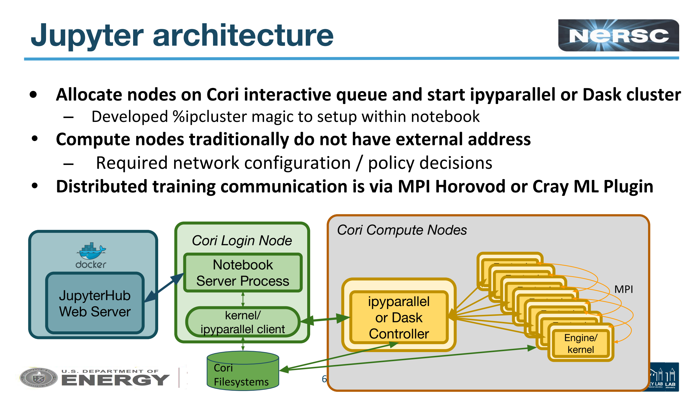
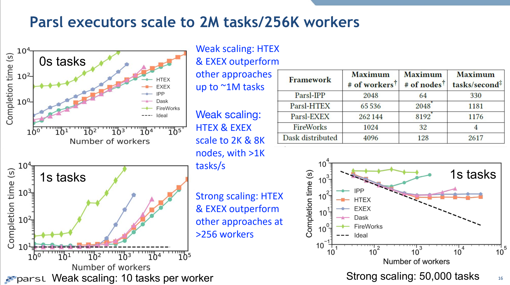
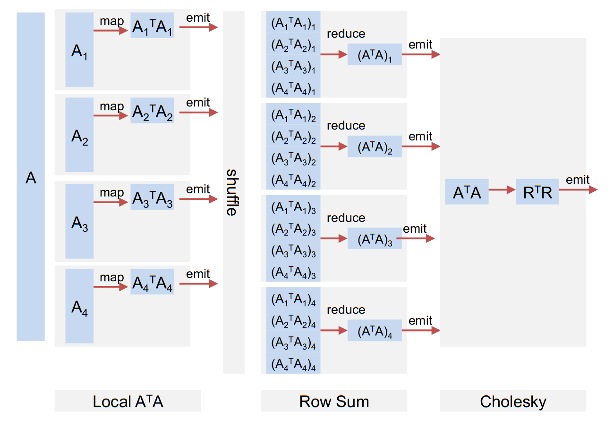
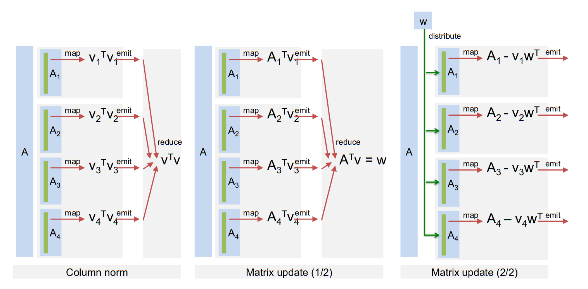
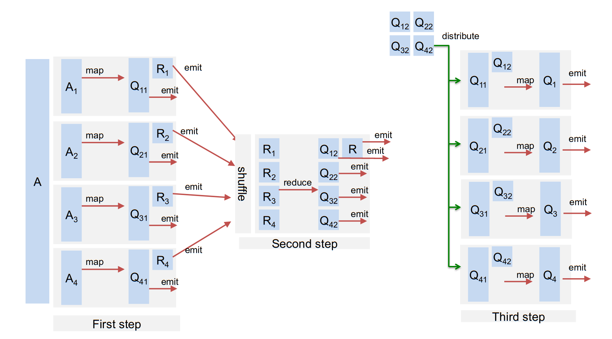
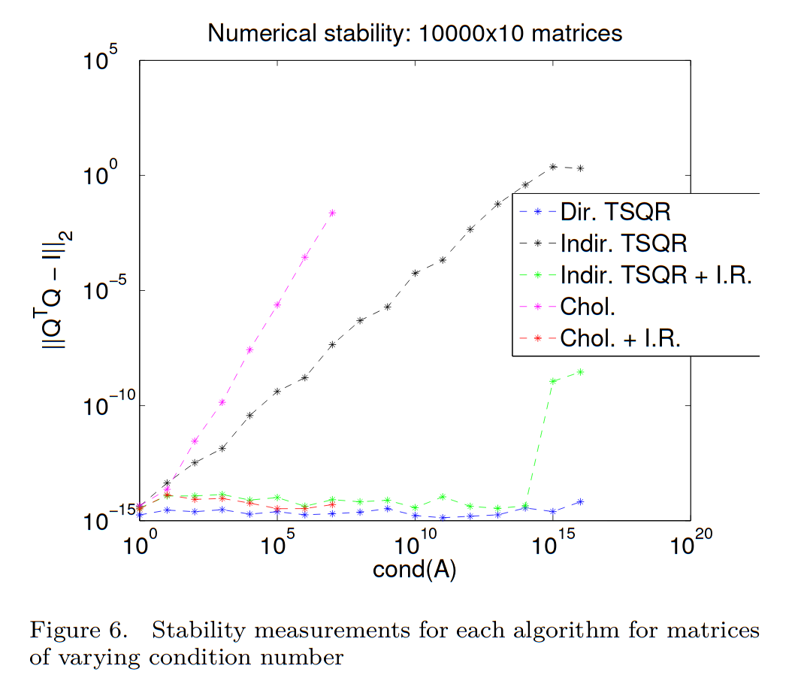
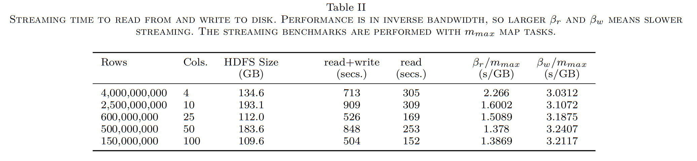
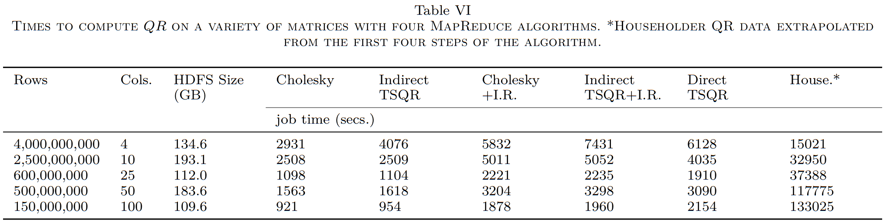
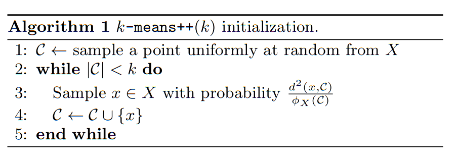
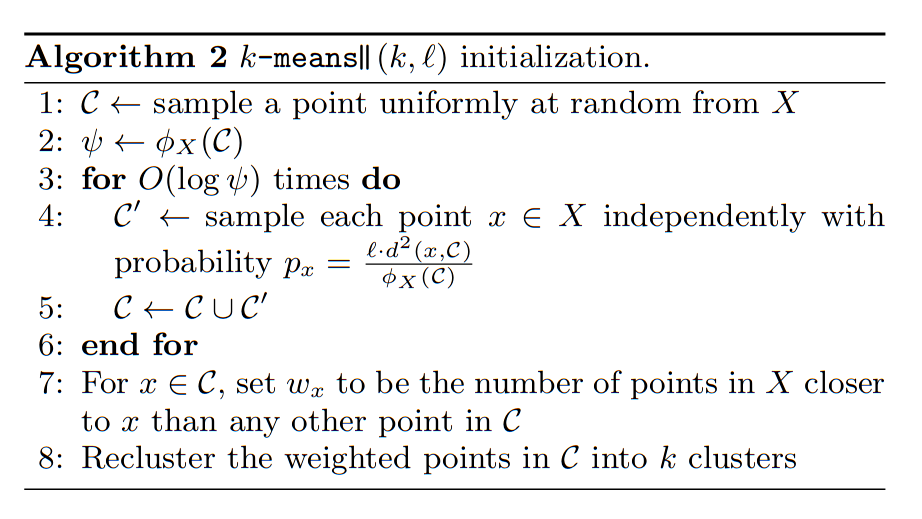

## Interactive Parallelism

* Batch parallelism (e.g., MPI)
  * Computation more expensive than data load/store
  * Thinking up-front to maximize efficiency
  * Scalable and low-latency
* Interactive/exploratory analysis
  * Don't know the question until seeing data
  * Iterative exploration
  * Some analyses are cheap, others are expensive
  * Data load/store and preprocessing expensive compared to (some) analysis
  * Modest scale (single node to perhaps dozens of hundreds of nodes for the right problem)

### Example platforms

* [Hadoop](https://hadoop.apache.org/)
  * Reliable MapReduce system with disk-based storage and replication for fault tolerance
  * Java with bindings for other languages
* [Spark](https://spark.apache.org/docs/latest/quick-start.html)
  * In-memory child of Hadoop
  
* [Dask](https://dask.org/)
  * Python-based platform that integrates with NumPy, SciPy, Pandas, and Scikit-Learn
  * Lead developer employed by NVIDIA
* [IPyParallel](https://ipyparallel.readthedocs.io/en/latest/)
  * Control-worker design
  * Can use MPI
    * Expressive parallel algorithms
    * A bit flaky, especially after error conditions (in my experience)
  * [On NERSC's Cori](https://drive.google.com/file/d/1-OFjrk1q3L1d3uakr2xkozrPn2c2VZpZ/view)
  
* [Parsl-python](http://parsl-project.org/)
  * [Slides](https://drive.google.com/file/d/1Yy_jUWLvdSPHsXd4wtsfcIXoGvO2DY9g/view)
  

* [Workshop: Jupyter for Science User Facilities and High Performance Computing](https://jupyter-workshop-2019.lbl.gov/agenda)

## Dask notes

Distributed API operations are lazy, returning futures. Computation actually occurs when you ask for `.result()` (gathers result locally) or call `.persist()` to start computing a distributed result.

#### Overhead

> Partitions should fit comfortably in memory (smaller than a gigabyte) but also not be too many. **Every operation on every partition takes the central scheduler a few hundred microseconds to process.** If you have a few thousand tasks this is barely noticeable, but it is nice to reduce the number if possible.

```python
df = dd.read_csv('s3://bucket/path/to/*.csv')
df = df[df.name == 'Alice']  # only 1/100th of the data
df = df.repartition(npartitions=df.npartitions // 100)

df = df.persist()  # if on a distributed system
```

* https://docs.dask.org/en/latest/dataframe-best-practices.html
* https://distributed.readthedocs.io/en/latest/limitations.html

#### Keeping data distributed

https://distributed.readthedocs.io/en/latest/efficiency.html


```python
from dask.distributed import Client

client = Client()
client
```


<table style="border: 2px solid white;">
<tr>
<td style="vertical-align: top; border: 0px solid white">
<h3 style="text-align: left;">Client</h3>
<ul style="text-align: left; list-style: none; margin: 0; padding: 0;">
  <li><b>Scheduler: </b>tcp://127.0.0.1:45897</li>
</ul>
</td>
<td style="vertical-align: top; border: 0px solid white">
<h3 style="text-align: left;">Cluster</h3>
<ul style="text-align: left; list-style:none; margin: 0; padding: 0;">
  <li><b>Workers: </b>4</li>
  <li><b>Cores: </b>4</li>
  <li><b>Memory: </b>16.67 GB</li>
</ul>
</td>
</tr>
</table>


```python
import numpy as np

x = client.submit(np.random.random, (1000, 1000))
x
```


<b>Future: random</b> <font color="gray">status: </font><font color="black">pending</font>, <font color="gray">key: </font>random-4fead107d39a451af48ce8db919b0254


```python
x
```


<b>Future: random</b> <font color="gray">status: </font><font color="black">finished</font>, <font color="gray">type: </font>numpy.ndarray, <font color="gray">key: </font>random-4fead107d39a451af48ce8db919b0254


```python
x.result().shape # Moves data to control process, then computes shape
```


    (1000, 1000)


```python
client.submit(lambda a: a.shape, x).result()
```


    (1000, 1000)


* https://distributed.readthedocs.io/en/latest/diagnosing-performance.html

## QR factorization

* [Direct QR factorizations for tall-and-skinnymatrices in MapReduce architectures](https://arxiv.org/pdf/1301.1071.pdf)

### Indirect approach: compute $R$, then $Q = A R^{-1}$

$$ R^T R = A^T A $$



### "Direct" Householder $QR = A$

Operates one column at a time; inefficient parallel distribution and memory access.



### Direct TSQR





| Name | Value |
|------|----------|
| Nodes | 10 |
| Processor | [i7-960](https://ark.intel.com/content/www/us/en/ark/products/37151/intel-core-i7-960-processor-8m-cache-3-20-ghz-4-80-gt-s-intel-qpi.html) |
| Memory/node | 24 GB |
| Total memory | 240 GB |
| Memory BW/node | 25 GB/s |
| Cores/node | 4 |
| Clock | 3.2 GHz |
| flops/cycle/core | 2 |
| GF/s/node | 25.6 |
| flops/byte | 1 |




```python
import pandas
df = pandas.DataFrame(dict(rows=[4e9, 2.5e9, .6e9, .5e9, .15e9], cols=[4,10,25,50,100]))
df['bytes'] = 8 * df.rows * df.cols
df['flops'] = 2 * df.rows * df.cols**2
bandwidth = 125e9  # 50% of peak
flops = 256e9 * .2 # 20% of peak
df['sec_mem'] = df.bytes / bandwidth
df['sec_flops'] = df.flops / flops
df
```


<div>
<style scoped>
    .dataframe tbody tr th:only-of-type {
        vertical-align: middle;
    }

    .dataframe tbody tr th {
        vertical-align: top;
    }

    .dataframe thead th {
        text-align: right;
    }
</style>
<table border="1" class="dataframe">
  <thead>
    <tr style="text-align: right;">
      <th></th>
      <th>rows</th>
      <th>cols</th>
      <th>bytes</th>
      <th>flops</th>
      <th>sec_mem</th>
      <th>sec_flops</th>
    </tr>
  </thead>
  <tbody>
    <tr>
      <th>0</th>
      <td>4.000000e+09</td>
      <td>4</td>
      <td>1.280000e+11</td>
      <td>1.280000e+11</td>
      <td>1.024</td>
      <td>2.500000</td>
    </tr>
    <tr>
      <th>1</th>
      <td>2.500000e+09</td>
      <td>10</td>
      <td>2.000000e+11</td>
      <td>5.000000e+11</td>
      <td>1.600</td>
      <td>9.765625</td>
    </tr>
    <tr>
      <th>2</th>
      <td>6.000000e+08</td>
      <td>25</td>
      <td>1.200000e+11</td>
      <td>7.500000e+11</td>
      <td>0.960</td>
      <td>14.648438</td>
    </tr>
    <tr>
      <th>3</th>
      <td>5.000000e+08</td>
      <td>50</td>
      <td>2.000000e+11</td>
      <td>2.500000e+12</td>
      <td>1.600</td>
      <td>48.828125</td>
    </tr>
    <tr>
      <th>4</th>
      <td>1.500000e+08</td>
      <td>100</td>
      <td>1.200000e+11</td>
      <td>3.000000e+12</td>
      <td>0.960</td>
      <td>58.593750</td>
    </tr>
  </tbody>
</table>
</div>




#### Notes
* The data always fits in (distributed) memory
* Limited by flops for all numbers of columns
  * What about on today's computers?
* Using disk and the present algorithm is tens to hundreds of times slower than an efficient in-memory algorithm.
* The many passes over data in (unblocked) Householder is crippling
* Direct TSQR and Cholesky QR with refinement are good algorithms

## [K-means clustering](https://en.wikipedia.org/wiki/K-means_clustering)

Given $n$ points $x_i$ in $d$-dimensional space, the k-means algorithm finds $K$ clusters by
1. Initialize centers $\{ c_k \in R^d \}_{k=1}^K $
2. Repeat (Lloyd's algorithm)
  * Assign each $x_i$ to the nearest center $c_k$
  * Shift each center $c_k$ to the mean (centroid) of its $x_i$
  
This minimizes the cost function

$$ \phi(\mathcal C) = \sum_{x\in X} \min_k \lVert x - c_k \rVert^2 $$


By <a href="//commons.wikimedia.org/wiki/User:Chire" title="User:Chire">Chire</a> - <span class="int-own-work" lang="en">Own work</span>, <a href="https://creativecommons.org/licenses/by-sa/4.0" title="Creative Commons Attribution-Share Alike 4.0">CC BY-SA 4.0</a>, <a href="https://commons.wikimedia.org/w/index.php?curid=59409335">Link</a>

### Initialization matters

<blockquote class="twitter-tweet"><p lang="en" dir="ltr">K-means++ defines a seeding strategy which is approximately optimal up to a logarithmic factor. Running k-means afterward only marginally improves the quantization error (as opposed to bad seeding). <a href="https://t.co/L8w45IE9gV">https://t.co/L8w45IE9gV</a> <a href="https://t.co/7DtaTZukTU">pic.twitter.com/7DtaTZukTU</a></p>&mdash; Gabriel Peyré (@gabrielpeyre) <a href="https://twitter.com/gabrielpeyre/status/1194495104855052288?ref_src=twsrc%5Etfw">November 13, 2019</a></blockquote> <script async src="https://platform.twitter.com/widgets.js" charset="utf-8"></script> 

#### Serial `kmeans++` and parallel `kmeans||`



