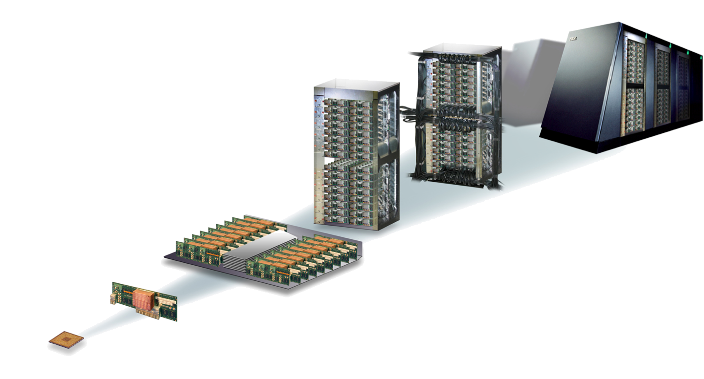

# Cores, caches, and memory

### A [von Neumann Architecture](https://en.wikipedia.org/wiki/Von_Neumann_architecture)


### A contemporary architecture


### My laptop
We can get this kind of information for our machine using [hwloc](https://www.open-mpi.org/projects/hwloc/), which provides a library as well as the command-line tool `lstopo`.


```python
!lstopo --output-format svg > lstopo-local.svg
```


### A double-socket compute node with two GPUs
2x Xeon Ivy-Bridge-EP [E5-2680v2](https://ark.intel.com/content/www/us/en/ark/products/75277/intel-xeon-processor-e5-2680-v2-25m-cache-2-80-ghz.html) + 2x NVIDIA GPUs (from 2013, with hwloc v1.11).
GPUs are reported as CUDA devices and X11 display :1.0: (from the [hwloc gallery](https://www-lb.open-mpi.org/projects/hwloc/lstopo/))


### Block diagrams

A block diagram from a vendor can include additional information about how cores are physically connected.

#### Ring bus (Xeon E5-2600 family)


#### Mesh bus (Xeon Scalable family)


#### Multi-socket configurations


https://software.intel.com/en-us/articles/intel-xeon-processor-scalable-family-technical-overview

### Multiple nodes go into **racks** or **cabinets**




### Terminology

* **Core** (virtual and physical): has a single program counter (logically sequential processing of instructions)
* **Memory channel**: e.g., DDR4-2400: transfers 64 bits (8 bytes) at a rate of 2400 MHz = 15.36 GB/s
* **Socket** or **CPU**: contains multiple cores in a single piece* of silicon
* **Non-Uniform Memory Access (NUMA)**: different channels may be different distances from a core
* **Compute node**: one or more sockets, plus memory, network card, etc.

### How expensive is it to access memory?

What does that mean?  How would we measure?

[McKenney (2013): Laws of Physics](http://www.rdrop.com/~paulmck/RCU/RCU.2013.01.22d.PLMW.pdf)

[Interactive](https://people.eecs.berkeley.edu/~rcs/research/interactive_latency.html)

[Variation by vendor](https://www.anandtech.com/show/14694/amd-rome-epyc-2nd-gen/7)

# How your program accesses memory

```c
double a[1000];

void foo() {
    for (int i=0; i<1000; i++)
        a[i] = 1.234 * i;
}
```

The compiler turns the loop body into instructions, which we can examine using [Godbolt](https://gcc.godbolt.org/z/gbhuZR).

```
pxor xmm0, xmm0                  ; zero the xmm0 register
cvtsi2sd xmm0, eax               ; convert the integer i to double
mulsd xmm0, xmm1                 ; multiply by 1.234 (held in xmm1)
movsd QWORD PTR a[0+rax*8], xmm0 ; store to memory address a[i]
```

Only one instruction here accesses memory, and the performance will be affected greatly by where that memory resides (which level of cache, where in DRAM).

Most architectures today have **64-byte cache lines**: all transfers from main memory (DRAM) to and from cache operate in units of 64 bytes.


### Let's compare three code samples

```c
for (int i=0; i<N; i++)
    a[i] = b[i];
```

```c
for (int i=0; i<N; i++)
    a[i] = b[(i*8) % N];
```

```c
for (int i=0; i<N; i++)
    a[i] = b[random() % N];
```

### What happens when you request a cache line?


## Operating system effects

Most systems today use virtual addressing, so every address in your program needs to be translated to a physical address before looking for it (in cache or memory).  Fortunately, there is hardware to assist with this: the Translation Lookaside Buffer (TLB).


## Further resources

* [Julia Evans (2016): How much memory is my process using?](https://jvns.ca/blog/2016/12/03/how-much-memory-is-my-process-using-/)
* [Gustavo Duarte (2009): Cache: a place for concealment and safekeeping](https://manybutfinite.com/post/intel-cpu-caches/)
* [Gustavo Duarte (2009): Getting Physical With Memory](https://manybutfinite.com/post/getting-physical-with-memory/)
* [Ulrich Drepper (2007): What Every Programmer Should Know About Memory](https://www.akkadia.org/drepper/cpumemory.pdf)
