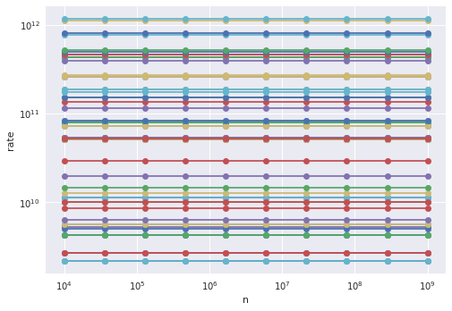

## Why model performance?

Models give is a conceptual and roughly quantitative framework by which to answer the following types of questions.

* Why is an implementation exhibiting its observed performance?
* How will performance change if we:
  * optimize this component?
  * buy new hardware? (Which new hardware?)
  * run a different configuration?
* While conceptualizing a new algorithm, what performance can we expect and what will be bottlenecks?

Models are a guide for performance, but not an absolute.

### Terms

| Symbol | Meaning |
|--------|---------|
| $n$    | Input parameter related to problem size |
| $W$    | Amount of work to solve problem $n$ |
| $T$    | Execution time |
| $R$    | Rate at which work is done |

#### STREAM Triad

```c
for (i=0; i<n; i++)
    a[i] = b[i] + scalar*c[i];
```
$n$ is the array size and
$$W = 3 \cdot \texttt{sizeof(double)} \cdot n$$
is the number of bytes transferred.  The rate $R = W/T$ is measured in bytes per second (or MB/s, etc.).

#### Dense matrix multiplication
To perform the operation $C \gets C + A B$ where $A,B,C$ are $n\times n$ matrices.
```c
for (i=0; i<n; i++)
    for (j=0; j<n; j++)
        for (k=0; k<n; k++)
            c[i*n+j] += a[i*n+k] * b[k*n+j];
```

* Can you identify two expressions for the total amount of work $W(n)$ and the associated units?
* Can you think of a context in which one is better than the other and vice-versa?

### Estimating time

To estimate time, we need to know how fast hardware executes flops and moves bytes.


```python
%matplotlib inline
import matplotlib.pyplot as plt
import pandas
import numpy as np
plt.style.use('seaborn')

hardware = pandas.read_csv('data-intel.csv', index_col="Name")
hardware
```


<div>
<style scoped>
    .dataframe tbody tr th:only-of-type {
        vertical-align: middle;
    }

    .dataframe tbody tr th {
        vertical-align: top;
    }

    .dataframe thead th {
        text-align: right;
    }
</style>
<table border="1" class="dataframe">
  <thead>
    <tr style="text-align: right;">
      <th></th>
      <th>Year</th>
      <th>GFLOPs-SP</th>
      <th>GFLOPs-DP</th>
      <th>Cores</th>
      <th>Mem-GBps</th>
      <th>TDP</th>
      <th>Freq(MHz)</th>
    </tr>
    <tr>
      <th>Name</th>
      <th></th>
      <th></th>
      <th></th>
      <th></th>
      <th></th>
      <th></th>
      <th></th>
    </tr>
  </thead>
  <tbody>
    <tr>
      <th>Xeon X5482</th>
      <td>2007</td>
      <td>102</td>
      <td>51</td>
      <td>4</td>
      <td>26</td>
      <td>150</td>
      <td>3200</td>
    </tr>
    <tr>
      <th>Xeon X5492</th>
      <td>2008</td>
      <td>108</td>
      <td>54</td>
      <td>4</td>
      <td>26</td>
      <td>150</td>
      <td>3400</td>
    </tr>
    <tr>
      <th>Xeon W5590</th>
      <td>2009</td>
      <td>106</td>
      <td>53</td>
      <td>4</td>
      <td>32</td>
      <td>130</td>
      <td>3300</td>
    </tr>
    <tr>
      <th>Xeon X5680</th>
      <td>2010</td>
      <td>160</td>
      <td>80</td>
      <td>6</td>
      <td>32</td>
      <td>130</td>
      <td>3300</td>
    </tr>
    <tr>
      <th>Xeon X5690</th>
      <td>2011</td>
      <td>166</td>
      <td>83</td>
      <td>6</td>
      <td>32</td>
      <td>130</td>
      <td>3470</td>
    </tr>
    <tr>
      <th>Xeon E5-2690</th>
      <td>2012</td>
      <td>372</td>
      <td>186</td>
      <td>8</td>
      <td>51</td>
      <td>135</td>
      <td>2900</td>
    </tr>
    <tr>
      <th>Xeon E5-2697 v2</th>
      <td>2013</td>
      <td>518</td>
      <td>259</td>
      <td>12</td>
      <td>60</td>
      <td>130</td>
      <td>2700</td>
    </tr>
    <tr>
      <th>Xeon E5-2699 v3</th>
      <td>2014</td>
      <td>1324</td>
      <td>662</td>
      <td>18</td>
      <td>68</td>
      <td>145</td>
      <td>2300</td>
    </tr>
    <tr>
      <th>Xeon E5-2699 v3</th>
      <td>2015</td>
      <td>1324</td>
      <td>662</td>
      <td>18</td>
      <td>68</td>
      <td>145</td>
      <td>2300</td>
    </tr>
    <tr>
      <th>Xeon E5-2699 v4</th>
      <td>2016</td>
      <td>1548</td>
      <td>774</td>
      <td>22</td>
      <td>77</td>
      <td>145</td>
      <td>2200</td>
    </tr>
    <tr>
      <th>Xeon Platinum 8180</th>
      <td>2017</td>
      <td>4480</td>
      <td>2240</td>
      <td>28</td>
      <td>120</td>
      <td>205</td>
      <td>2500</td>
    </tr>
    <tr>
      <th>Xeon Platinum 9282</th>
      <td>2018</td>
      <td>9320</td>
      <td>4660</td>
      <td>56</td>
      <td>175</td>
      <td>400</td>
      <td>2600</td>
    </tr>
  </tbody>
</table>
</div>


```python
fig = hardware.plot(x='GFLOPs-DP', y='Mem-GBps', marker='o')
fig.set_xlim(left=0)
fig.set_ylim(bottom=0);
```


So we have rates $R_f = 4660 \cdot 10^9$ flops/second and $R_m = 175 \cdot 10^9$ bytes/second.  Now we need to characterize some algorithms.


```python
algs = pandas.read_csv('algs.csv', index_col='Name')
algs['intensity'] = algs['flops'] / algs['bytes']
algs = algs.sort_values('intensity')
algs
```


<div>
<style scoped>
    .dataframe tbody tr th:only-of-type {
        vertical-align: middle;
    }

    .dataframe tbody tr th {
        vertical-align: top;
    }

    .dataframe thead th {
        text-align: right;
    }
</style>
<table border="1" class="dataframe">
  <thead>
    <tr style="text-align: right;">
      <th></th>
      <th>bytes</th>
      <th>flops</th>
      <th>intensity</th>
    </tr>
    <tr>
      <th>Name</th>
      <th></th>
      <th></th>
      <th></th>
    </tr>
  </thead>
  <tbody>
    <tr>
      <th>Triad</th>
      <td>24</td>
      <td>2</td>
      <td>0.083333</td>
    </tr>
    <tr>
      <th>SpMV</th>
      <td>12</td>
      <td>2</td>
      <td>0.166667</td>
    </tr>
    <tr>
      <th>Stencil27-cache</th>
      <td>24</td>
      <td>54</td>
      <td>2.250000</td>
    </tr>
    <tr>
      <th>MatFree-FEM</th>
      <td>2376</td>
      <td>15228</td>
      <td>6.409091</td>
    </tr>
    <tr>
      <th>Stencil27-ideal</th>
      <td>8</td>
      <td>54</td>
      <td>6.750000</td>
    </tr>
  </tbody>
</table>
</div>


```python
def exec_time(machine, alg, n):
    bytes = n * alg.bytes
    flops = n * alg.flops
    T_mem = bytes / (machine['Mem-GBps'] * 1e9)
    T_flops = flops / (machine['GFLOPs-DP'] * 1e9)
    return max(T_mem, T_flops)
    
exec_time(hardware.loc['Xeon Platinum 9282'], algs.loc['SpMV'], 1e8)
```


    0.006857142857142857


```python
for _, machine in hardware.iterrows():
    for _, alg in algs.iterrows():
        ns = np.geomspace(1e4, 1e9, 10)
        times = np.array([exec_time(machine, alg, n) for n in ns])
        flops = np.array([alg.flops * n for n in ns])
        rates = flops/times
        plt.loglog(ns, rates, 'o-')
plt.xlabel('n')
plt.ylabel('rate');
```





It looks like performance does not depend on problem size.

Well, yeah, we chose a model in which flops and bytes were both proportional to $n$, and our machine model has no sense of cache hierarchy or latency, so time is also proportional to $n$.  We can divide through by $n$ and yield a more illuminating plot.


```python
for _, machine in hardware.iterrows():
    times = np.array([exec_time(machine, alg, 1) 
                      for _, alg in algs.iterrows()])
    rates = algs.flops/times
    intensities = algs.intensity
    plt.loglog(intensities, rates, 'o-', label=machine.name)
plt.xlabel('intensity')
plt.ylabel('rate')
plt.legend();
```


We're seeing the "roofline" for the older processors while the newer models are memory bandwidth limited for all of these algorithms.

### Recommended reading on single-node performance modeling
* [Williams, Waterman, Patterson (2009): **Roofline: An insightful visual performance model for multicore architectures**](https://doi.org/10.1145/1498765.1498785)
