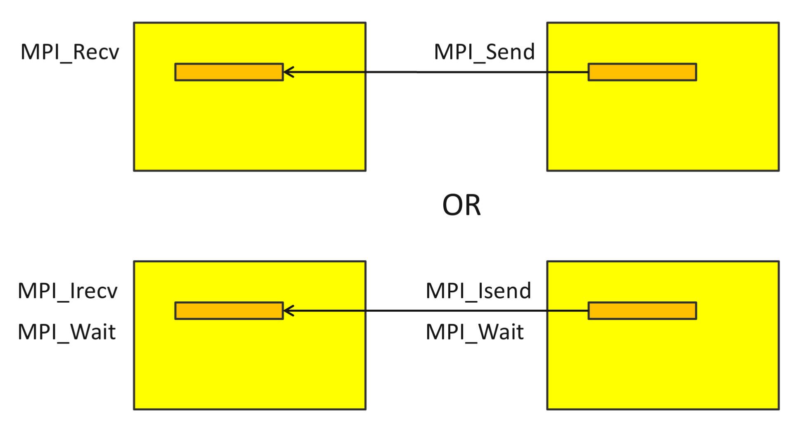
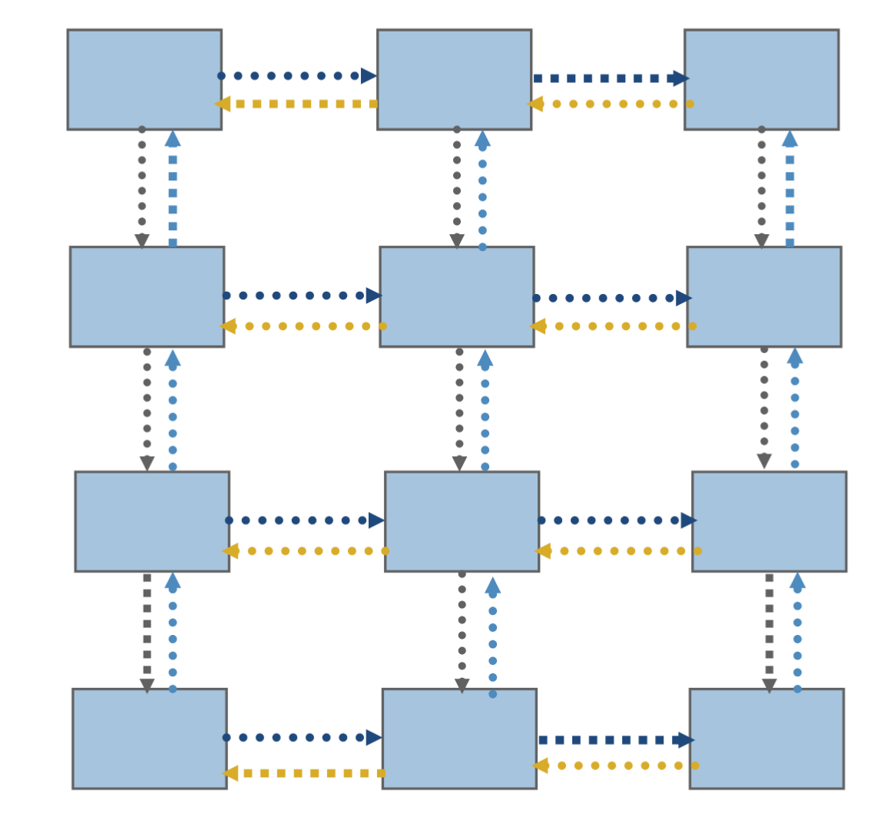

```python
def render_c(filename):
    from IPython.display import Markdown
    with open(filename) as f:
        contents = f.read()
    return Markdown("```c\n" + contents + "```\n")
```

## Processes and Threads

Threads and processes are very similar
* Both created via [`clone` system call](https://linux.die.net/man/2/clone) on Linux
* Scheduled in the same way by the operating system
* Separate stacks (automatic variables)
* Access to same memory before `fork()` or `clone()`

with some important distinctions

* Threads set `CLONE_VM`
  * threads share the same virtual-to-physical address mapping
  * threads can access the same data at the same addresses; private data is private only because other threads don't know its address
* Threads set `CLONE_FILES`
  * threads share file descriptors
* Threads set `CLONE_THREAD`, `CLONE_SIGHAND`
  * process id and signal handlers shared

#### Myths
* Processes can't share memory
  * `mmap()`, `shm_open()`, and `MPI_Win_allocate_shared()`
* Processes are "heavy"
  * same data structures and kernel scheduling; no difference in context switching
  * data from parent is inherited copy-on-write at very low overhead
  * startup costs ~100 microseconds to duplicate page tables
  * caches are physically tagged; processes can share L1 cache

## MPI: Message Passing Interface

* Just a library: plain C, C++, or Fortran compiler
  * Two active open source libraries: [MPICH](https://www.mpich.org/) and [Open MPI](https://www.open-mpi.org/)
  * Numerous vendor implementations modify/extend these open source implementations
  * MVAPICH is an MPICH-derived open source implementation for InfiniBand and related networks
* Bindings from many other languages; [mpi4py](https://mpi4py.readthedocs.io/en/stable/) is popular
* Scales to millions of processes across ~100k nodes
  * Shared memory systems can be scaled up to [~4000 cores](https://www.uvhpc.com/sgi-uv-3000), but latency and price ($) increase
* Standard usage: processes are separate on startup
* Timeline
  * MPI-1 (1994) point-to-point messaging, collectives
  * MPI-2 (1997) parallel IO, dynamic processes, one-sided
  * MPI-3 (2012) nonblocking collectives, neighborhood collectives, improved one-sided


```python
render_c('mpi-demo.c')
```


```c
#include <mpi.h>
#include <stdio.h>

int main(int argc, char **argv) {
  MPI_Init(&argc, &argv);   // Must call before any other MPI functions
  int size, rank, sum;
  MPI_Comm_rank(MPI_COMM_WORLD, &rank);
  MPI_Comm_size(MPI_COMM_WORLD, &size);
  MPI_Allreduce(&rank, &sum, 1, MPI_INT, MPI_SUM, MPI_COMM_WORLD);
  printf("I am rank %d of %d: sum=%d\n", rank, size, sum);
  MPI_Finalize();
}
```


This may remind you of the top-level OpenMP strategy
```c
int main() {
    #pragma omp parallel
    {
        int rank = omp_get_thread_num();
        int size = omp_get_num_threads();
        // your code
    }
}
```

* We use the compiler wrapper `mpicc`, but it just passes some flags to the real compiler.


```python
! mpicc -show
```

    gcc -pthread -Wl,-rpath -Wl,/usr/lib/openmpi -Wl,--enable-new-dtags -L/usr/lib/openmpi -lmpi


```python
! make CC=mpicc CFLAGS=-Wall mpi-demo
```

    mpicc -Wall    mpi-demo.c   -o mpi-demo


* We use `mpiexec` to run locally.  Clusters/supercomputers often have different job launching programs.


```python
! mpiexec -n 2 ./mpi-demo
```

    I am rank 0 of 2: sum=1
    I am rank 1 of 2: sum=1


* We can run more MPI processes than cores (or hardware threads), but you might need to use the `--oversubscribe` option because **oversubscription is usually expensive**.


```python
! mpiexec -n 6 --oversubscribe ./mpi-demo
```

    I am rank 1 of 6: sum=15
    I am rank 3 of 6: sum=15
    I am rank 4 of 6: sum=15
    I am rank 5 of 6: sum=15
    I am rank 0 of 6: sum=15
    I am rank 2 of 6: sum=15


* You can use OpenMP within ranks of MPI (but use `MPI_Init_thread()`)
* Everything is private by default

#### Advice from Bill Gropp

>   You want to think about how you decompose your data structures, how
    you think about them globally.  [...]  If you were building a house,
    you'd start with a set of blueprints that give you a picture of what
    the whole house looks like.  You wouldn't start with a bunch of
    tiles and say. "Well I'll put this tile down on the ground, and
    then I'll find a tile to go next to it."  But all too many people
    try to build their parallel programs by creating the smallest
    possible tiles and then trying to have the structure of their code
    emerge from the chaos of all these little pieces.  You have to have
    an organizing principle if you're going to survive making your code
    parallel.
    -- https://www.rce-cast.com/Podcast/rce-28-mpich2.html

### Communicators

* `MPI_COMM_WORLD` contains all ranks in the `mpiexec`.  Those ranks may be on different nodes, even in different parts of the world.
* `MPI_COMM_SELF` contains only one rank
* Can create new communicators from existing ones
```c
int MPI_Comm_dup(MPI_Comm comm, MPI_Comm *newcomm);
int MPI_Comm_split(MPI_Comm comm, int color, int key, MPI_Comm *newcomm);
int MPI_Comm_create(MPI_Comm comm, MPI_Group group, MPI_Comm *newcomm);
```
* Can spawn new processes (but not supported on all machines)
```c
int MPI_Comm_spawn(const char *command, char *argv[], int maxprocs,
            MPI_Info info, int root, MPI_Comm comm,
            MPI_Comm *intercomm, int array_of_errcodes[]);
```
* Can attach _attributes_ to communicators (useful for library composition)

### Collective operations

MPI has a rich set of collective operations scoped by communicator, including the following.

```c
int MPI_Allreduce(const void *sendbuf, void *recvbuf, int count,
        MPI_Datatype datatype, MPI_Op op, MPI_Comm comm);
int MPI_Reduce(const void *sendbuf, void *recvbuf, int count,
        MPI_Datatype datatype, MPI_Op op, int root, MPI_Comm comm);
int MPI_Scan(const void *sendbuf, void *recvbuf, int count,
        MPI_Datatype datatype, MPI_Op op, MPI_Comm comm);
int MPI_Gather(const void *sendbuf, int sendcount, MPI_Datatype sendtype,
        void *recvbuf, int recvcount, MPI_Datatype recvtype, int root, MPI_Comm comm);
int MPI_Scatter(const void *sendbuf, int sendcount, MPI_Datatype sendtype,
        void *recvbuf, int recvcount, MPI_Datatype recvtype, int root, MPI_Comm comm);
```

* Implementations are optimized by vendors for their custom networks, and can be very fast.


Notice how the time is basically independent of number of processes $P$, and only a small multiple of the cost to send a single message. Not all networks are this good.

### Point-to-point messaging

In addition to collectives, MPI supports messaging directly between individual ranks.



* Interfaces can be:
  * blocking like `MPI_Send()` and `MPI_Recv()`, or
  * "immediate" (asynchronous), like `MPI_Isend()` and `MPI_Irecv()`.  The immediate varliants return an `MPI_Request`, which must be waited on to complete the send or receive.
* Be careful of deadlock when using blocking interfaces.
  * I never use blocking send/recv.
  * There are also "synchronous" `MPI_Ssend` and "buffered" `MPI_Bsend`, and nonblocking variants of these, `MPI_Issend`, etc.
    * I never use these either (with one cool exception that we'll talk about).
* Point-to-point messaging is like the assembly of parallel computing
  * It can be good for building libraries, but it's a headache to use directly for most purposes
  * Better to use collectives when possible, or higher level libraries

### Neighbors

A common pattern involves communicating with neighbors, often many times in sequence (such as each iteration or time step).



This can be achieved with
* Point-to-point: `MPI_Isend`, `MPI_Irecv`, `MPI_Waitall`
* Persistent: `MPI_Send_init` (once), `MPI_Startall`, `MPI_Waitall`.
* Neighborhood collectives (need to create special communicator)
* One-sided (need to manage safety yourself)
