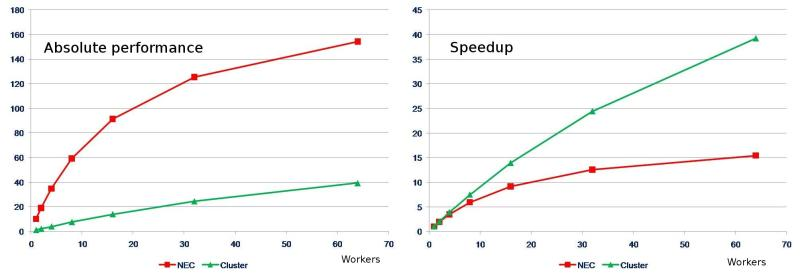

## Programs with more than one part

So far, we've focused on simple programs with only one part, but real programs have several different parts, often with data dependencies.
Some parts will be amenable to optimization and/or parallelism and others will not.

This principle is called [Amdahl's Law](https://en.wikipedia.org/wiki/Amdahl%27s_law).


```python
def exec_time(f, p, n=10, latency=1):
    # Suppose that a fraction f of the total work is amenable to optimization
    # We run a problem size n with parallelization factor p
    return latency + (1-f)*n + f*n/p
```


```python
%matplotlib inline
import matplotlib.pyplot as plt
import pandas
import numpy as np
plt.style.use('seaborn')

ps = np.geomspace(1, 1000)

plt.loglog(ps, exec_time(.99, ps, latency=0))
plt.loglog(ps, exec_time(1, ps, latency=0))
plt.title('Strong scaling')
plt.xlabel('p')
plt.ylabel('time');
```


## Strong scaling: fixed total problem size

### Cost = `time * p`


```python
def exec_cost(f, p, **kwargs):
    return exec_time(f, p, **kwargs) * p

plt.loglog(ps, exec_cost(.99, ps))
plt.title('Strong scaling')
plt.xlabel('p')
plt.ylabel('cost');
```


### Efficiency


```python
plt.semilogx(ps, 1/exec_cost(.99, ps, latency=1))
plt.title('Strong scaling')
plt.xlabel('p')
plt.ylabel('efficiency')
plt.ylim(bottom=0);
```


### Speedup

$$ S(p) = \frac{T(1)}{T(p)} $$


```python
plt.plot(ps, exec_time(.99, 1, latency=1) / exec_time(.99, ps, latency=1))
plt.title('Strong scaling')
plt.xlabel('p')
plt.ylabel('speedup')
plt.ylim(bottom=0);
```


## Stunt 1: Report speedup, not absolute performance!



## Efficiency-Time spectrum (my preference)

People care about two observable properties
* **Time** until job completes
* **Cost** in core-hours or dollars to do job

Most HPC applications have access to large machines, so don't really care how many processes they use for any given job.


```python
plt.plot(exec_time(.99, ps), 1/exec_cost(.99, ps), 'o-')
plt.title('Strong scaling')
plt.xlabel('time')
plt.ylabel('efficiency')
plt.ylim(bottom=0);
plt.xlim(left=0);
```


#### Principles
* [No "soft" `log` scale](https://blogs.fau.de/hager/archives/5835)
* Both axes have tangible units
* Bigger is better on the $y$ axis

## Weak Scaling: Fixed work per processor

We've kept the problem size $n$ fixed thus far, but parallel computers are also used to solve large problems.  If we keep the amount of work per processor fixed, we are [weak/Gustafson scaling](https://en.wikipedia.org/wiki/Gustafson's_law).


```python
ns = 10*ps
plt.semilogx(ps, ns/exec_cost(.99, ps, n=ns, latency=1), 'o-')
ns = 100*ps
plt.semilogx(ps, ns/exec_cost(.99, ps, n=ns, latency=1), 's-')
plt.title('Weak scaling')
plt.xlabel('procs')
plt.ylabel('efficiency')
plt.ylim(bottom=0);
```


```python
for w in np.geomspace(0.1, 1e3, 20):
    ns = w*ps
    plt.semilogx(exec_time(.99, ps, n=ns, latency=1),
                 ns/exec_cost(.99, ps, n=ns, latency=1), 'o-')
plt.title('Weak scaling')
plt.xlabel('time')
plt.ylabel('efficiency')
plt.ylim(bottom=0);
```


## [Fuhrer et al (2018): Near-global climate simulation at 1 km resolution](https://www.geosci-model-dev.net/11/1665/2018/gmd-11-1665-2018.pdf)


I replotted these data for [my talk](https://jedbrown.org/files/20190822-Latsis.pdf) at the [Latsis Symposium](https://latsis2019.ethz.ch/) last month.


# Further resources
* [Hager: Fooling the masses](https://blogs.fau.de/hager/archives/5260)
  * Learn by counter-examples
* [Hoefler and Belli: Scientific Benchmarking of Parallel Computing Systems](https://htor.inf.ethz.ch/publications/index.php?pub=222)
  * Recommended best practices, especially for dealing with performance variability

Please read/watch something from this list and be prepared to share on Monday.
