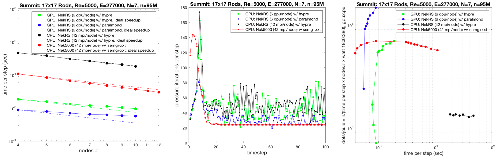
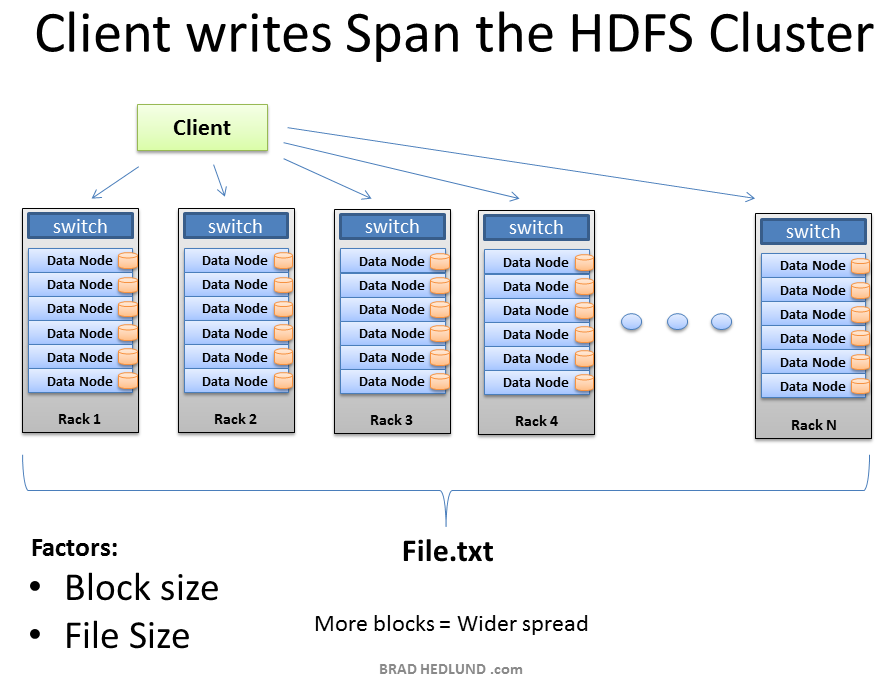
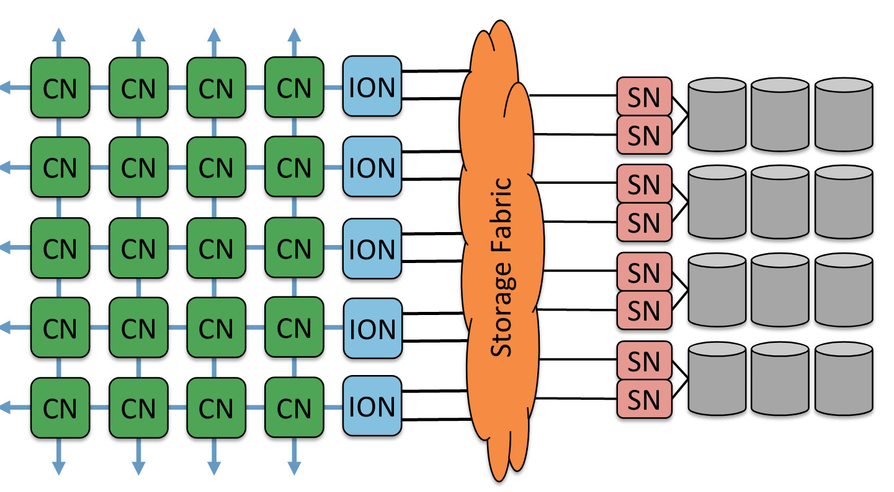
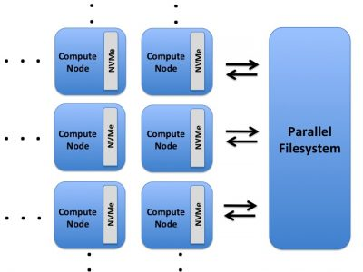
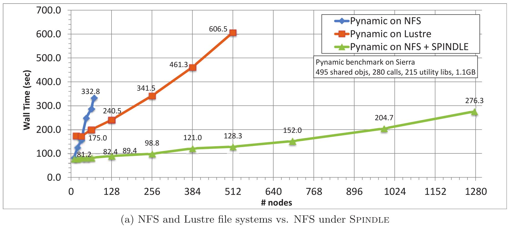

## Hiding latency
Throughout this course, we've discussed ways in which computer architecture and algorithms hide latency.
* instruction-level parallelism
* SMT/SIMT multi-threading
* memory prefetch
* organizing data structures for streaming access and cache reuse
* tiling, etc.

File latency is vastly higher than memory.


```python
from IPython.display import IFrame    
IFrame('https://people.eecs.berkeley.edu/~rcs/research/interactive_latency.html', width=1200, height=700)
```


<iframe
    width="1200"
    height="700"
    src="https://people.eecs.berkeley.edu/~rcs/research/interactive_latency.html"
    frameborder="0"
    allowfullscreen
></iframe>


| Device | Bandwidth (GB/s) | Cost (\$/TB) | Seek Latency ($\mu$s) |
|----|----|----|----|
| 7200 RPM disk | 0.3 | 50 | >3000 |
| SSD (SATA 3.0) | 0.6 | 100-200 | 15-50 |
| SSD/NVMe (PCIe-3 x4) | 3 | 200-1000 | 10-20 |
| DRAM DDR4 | 25 | 5000 | 0.1 |


[slide credit](http://www.pdsw.org/pdsw-discs18/slides/luttgau-pdsw-discs18-slides.pdf)

## How much storage bandwidth does a similation need?




```python
wall_clock_per_timestep = 0.6
dofs_per_node = 1800 * 1e4
MBps_per_node = dofs_per_node * 8 / wall_clock_per_timestep / 1e6
dofs = 95e6
MBps = dofs * 8 / wall_clock_per_timestep / 1e6
MBps_per_node, MBps
```


    (240.0, 1266.6666666666667)


```python
seconds_per_day = 24 * 60 * 60
TB_per_day = MBps * seconds_per_day / 1e6 # TB
TB_per_day
```


    109.44


What if all nodes used storage at this rate?


```python
MBps_per_node * 4600 / 1e6 # TB/s
```


    1.104


```python
TB_per_day * 4600 / 8 / 1e3 # PB/day
```


    62.928


### [Summit File Systems](https://www.olcf.ornl.gov/for-users/system-user-guides/summit/summit-user-guide/#file-systems)

* Capacity: 250 PB
* Theoretical Bandwidth: 2.5 TB/s

## Storage architecture

### Hadoop File System: Medium/long-term storage collocated with compute nodes


### HPC-style parallel storage


https://www.olcf.ornl.gov/for-users/system-user-guides/summit/summit-user-guide/#file-systems

### Recommended slide decks

* [ATPESC 2019: Principles of HPC I/O:Everything you always wanted to know about HPC I/O but were afraid to ask](https://press3.mcs.anl.gov//atpesc/files/2019/08/ATPESC_2019_Track-3_1_8-2_830am_Carns-Principles_of_HPC_IO.pdf)
* [ATPESC 2019: I/O Architectures and Technology](https://press3.mcs.anl.gov//atpesc/files/2019/08/ATPESC_2019_Track-3_7_8-2_345pm_Lockwood-IO_Architectures_and_Technology.pdf)

### [Burst buffers](https://www.olcf.ornl.gov/for-users/system-user-guides/summit/summit-user-guide/#burst-buffer)




```python
! strace python -c 'import numpy' |& grep open
```

    openat(AT_FDCWD, "/opt/pgi/linux86-64/19.4/mpi/openmpi/lib/tls/haswell/x86_64/libc.so.6", O_RDONLY|O_CLOEXEC) = -1 ENOENT (No such file or directory)
    stat("/opt/pgi/linux86-64/19.4/mpi/openmpi/lib/tls/haswell/x86_64", 0x7ffc51a1a890) = -1 ENOENT (No such file or directory)
    openat(AT_FDCWD, "/opt/pgi/linux86-64/19.4/mpi/openmpi/lib/tls/haswell/libc.so.6", O_RDONLY|O_CLOEXEC) = -1 ENOENT (No such file or directory)
    stat("/opt/pgi/linux86-64/19.4/mpi/openmpi/lib/tls/haswell", 0x7ffc51a1a890) = -1 ENOENT (No such file or directory)
    openat(AT_FDCWD, "/opt/pgi/linux86-64/19.4/mpi/openmpi/lib/tls/x86_64/libc.so.6", O_RDONLY|O_CLOEXEC) = -1 ENOENT (No such file or directory)
    stat("/opt/pgi/linux86-64/19.4/mpi/openmpi/lib/tls/x86_64", 0x7ffc51a1a890) = -1 ENOENT (No such file or directory)
    openat(AT_FDCWD, "/opt/pgi/linux86-64/19.4/mpi/openmpi/lib/tls/libc.so.6", O_RDONLY|O_CLOEXEC) = -1 ENOENT (No such file or directory)
    stat("/opt/pgi/linux86-64/19.4/mpi/openmpi/lib/tls", 0x7ffc51a1a890) = -1 ENOENT (No such file or directory)
    openat(AT_FDCWD, "/opt/pgi/linux86-64/19.4/mpi/openmpi/lib/haswell/x86_64/libc.so.6", O_RDONLY|O_CLOEXEC) = -1 ENOENT (No such file or directory)
    stat("/opt/pgi/linux86-64/19.4/mpi/openmpi/lib/haswell/x86_64", 0x7ffc51a1a890) = -1 ENOENT (No such file or directory)
    openat(AT_FDCWD, "/opt/pgi/linux86-64/19.4/mpi/openmpi/lib/haswell/libc.so.6", O_RDONLY|O_CLOEXEC) = -1 ENOENT (No such file or directory)
    stat("/opt/pgi/linux86-64/19.4/mpi/openmpi/lib/haswell", 0x7ffc51a1a890) = -1 ENOENT (No such file or directory)
    openat(AT_FDCWD, "/opt/pgi/linux86-64/19.4/mpi/openmpi/lib/x86_64/libc.so.6", O_RDONLY|O_CLOEXEC) = -1 ENOENT (No such file or directory)
    stat("/opt/pgi/linux86-64/19.4/mpi/openmpi/lib/x86_64", 0x7ffc51a1a890) = -1 ENOENT (No such file or directory)
    openat(AT_FDCWD, "/opt/pgi/linux86-64/19.4/mpi/openmpi/lib/libc.so.6", O_RDONLY|O_CLOEXEC) = -1 ENOENT (No such file or directory)
    stat("/opt/pgi/linux86-64/19.4/mpi/openmpi/lib", 0x7ffc51a1a890) = -1 ENOENT (No such file or directory)
    openat(AT_FDCWD, "/home/jed/usr/paraview/lib/tls/haswell/x86_64/libc.so.6", O_RDONLY|O_CLOEXEC) = -1 ENOENT (No such file or directory)
    openat(AT_FDCWD, "/home/jed/usr/paraview/lib/tls/haswell/libc.so.6", O_RDONLY|O_CLOEXEC) = -1 ENOENT (No such file or directory)
    openat(AT_FDCWD, "/home/jed/usr/paraview/lib/tls/x86_64/libc.so.6", O_RDONLY|O_CLOEXEC) = -1 ENOENT (No such file or directory)
    openat(AT_FDCWD, "/home/jed/usr/paraview/lib/tls/libc.so.6", O_RDONLY|O_CLOEXEC) = -1 ENOENT (No such file or directory)
    openat(AT_FDCWD, "/home/jed/usr/paraview/lib/haswell/x86_64/libc.so.6", O_RDONLY|O_CLOEXEC) = -1 ENOENT (No such file or directory)
    openat(AT_FDCWD, "/home/jed/usr/paraview/lib/haswell/libc.so.6", O_RDONLY|O_CLOEXEC) = -1 ENOENT (No such file or directory)
    openat(AT_FDCWD, "/home/jed/usr/paraview/lib/x86_64/libc.so.6", O_RDONLY|O_CLOEXEC) = -1 ENOENT (No such file or directory)
    openat(AT_FDCWD, "/home/jed/usr/paraview/lib/libc.so.6", O_RDONLY|O_CLOEXEC) = -1 ENOENT (No such file or directory)
    openat(AT_FDCWD, "/usr/lib/R/lib/tls/haswell/x86_64/libc.so.6", O_RDONLY|O_CLOEXEC) = -1 ENOENT (No such file or directory)
    openat(AT_FDCWD, "/usr/lib/R/lib/tls/haswell/libc.so.6", O_RDONLY|O_CLOEXEC) = -1 ENOENT (No such file or directory)
    openat(AT_FDCWD, "/usr/lib/R/lib/tls/x86_64/libc.so.6", O_RDONLY|O_CLOEXEC) = -1 ENOENT (No such file or directory)
    openat(AT_FDCWD, "/usr/lib/R/lib/tls/libc.so.6", O_RDONLY|O_CLOEXEC) = -1 ENOENT (No such file or directory)
    openat(AT_FDCWD, "/usr/lib/R/lib/haswell/x86_64/libc.so.6", O_RDONLY|O_CLOEXEC) = -1 ENOENT (No such file or directory)
    openat(AT_FDCWD, "/usr/lib/R/lib/haswell/libc.so.6", O_RDONLY|O_CLOEXEC) = -1 ENOENT (No such file or directory)
    openat(AT_FDCWD, "/usr/lib/R/lib/x86_64/libc.so.6", O_RDONLY|O_CLOEXEC) = -1 ENOENT (No such file or directory)
    openat(AT_FDCWD, "/usr/lib/R/lib/libc.so.6", O_RDONLY|O_CLOEXEC) = -1 ENOENT (No such file or directory)
    openat(AT_FDCWD, "/etc/ld.so.cache", O_RDONLY|O_CLOEXEC) = 3
    openat(AT_FDCWD, "/usr/lib/libc.so.6", O_RDONLY|O_CLOEXEC) = 3
    openat(AT_FDCWD, "/usr/lib/R/lib/libpython3.7m.so.1.0", O_RDONLY|O_CLOEXEC) = -1 ENOENT (No such file or directory)
    openat(AT_FDCWD, "/usr/lib/libpython3.7m.so.1.0", O_RDONLY|O_CLOEXEC) = 3
    openat(AT_FDCWD, "/usr/lib/R/lib/libpthread.so.0", O_RDONLY|O_CLOEXEC) = -1 ENOENT (No such file or directory)
    openat(AT_FDCWD, "/usr/lib/libpthread.so.0", O_RDONLY|O_CLOEXEC) = 3
    openat(AT_FDCWD, "/usr/lib/R/lib/libdl.so.2", O_RDONLY|O_CLOEXEC) = -1 ENOENT (No such file or directory)
    openat(AT_FDCWD, "/usr/lib/libdl.so.2", O_RDONLY|O_CLOEXEC) = 3
    openat(AT_FDCWD, "/usr/lib/R/lib/libutil.so.1", O_RDONLY|O_CLOEXEC) = -1 ENOENT (No such file or directory)
    openat(AT_FDCWD, "/usr/lib/libutil.so.1", O_RDONLY|O_CLOEXEC) = 3
    openat(AT_FDCWD, "/usr/lib/R/lib/libm.so.6", O_RDONLY|O_CLOEXEC) = -1 ENOENT (No such file or directory)
    openat(AT_FDCWD, "/usr/lib/libm.so.6", O_RDONLY|O_CLOEXEC) = 3
    openat(AT_FDCWD, "/usr/lib/locale/locale-archive", O_RDONLY|O_CLOEXEC) = 3
    openat(AT_FDCWD, "/usr/lib/gconv/gconv-modules.cache", O_RDONLY) = -1 ENOENT (No such file or directory)
    openat(AT_FDCWD, "/usr/lib/gconv/gconv-modules", O_RDONLY|O_CLOEXEC) = 3
    openat(AT_FDCWD, "/bin/pyvenv.cfg", O_RDONLY) = -1 ENOENT (No such file or directory)
    openat(AT_FDCWD, "pyvenv.cfg", O_RDONLY) = -1 ENOENT (No such file or directory)
    openat(AT_FDCWD, "/home/jed/usr/lib/python3.7/site-packages", O_RDONLY|O_NONBLOCK|O_CLOEXEC|O_DIRECTORY) = 3
    openat(AT_FDCWD, "/home/jed/petsc/lib/petsc/bin", O_RDONLY|O_NONBLOCK|O_CLOEXEC|O_DIRECTORY) = 3
    openat(AT_FDCWD, "/usr/lib/python3.7", O_RDONLY|O_NONBLOCK|O_CLOEXEC|O_DIRECTORY) = 3
    openat(AT_FDCWD, "/usr/lib/python3.7/encodings/__pycache__/__init__.cpython-37.pyc", O_RDONLY|O_CLOEXEC) = 3
    openat(AT_FDCWD, "/usr/lib/python3.7/encodings/__init__.py", O_RDONLY|O_CLOEXEC) = 3
    openat(AT_FDCWD, "/usr/lib/python3.7/__pycache__/codecs.cpython-37.pyc", O_RDONLY|O_CLOEXEC) = 3
    openat(AT_FDCWD, "/usr/lib/python3.7/codecs.py", O_RDONLY|O_CLOEXEC) = 3
    openat(AT_FDCWD, "/usr/lib/python3.7/encodings", O_RDONLY|O_NONBLOCK|O_CLOEXEC|O_DIRECTORY) = 3
    openat(AT_FDCWD, "/usr/lib/python3.7/encodings/__pycache__/aliases.cpython-37.pyc", O_RDONLY|O_CLOEXEC) = 3
    openat(AT_FDCWD, "/usr/lib/python3.7/encodings/aliases.py", O_RDONLY|O_CLOEXEC) = 3
    openat(AT_FDCWD, "/usr/lib/python3.7/encodings/__pycache__/utf_8.cpython-37.pyc", O_RDONLY|O_CLOEXEC) = 3
    openat(AT_FDCWD, "/usr/lib/python3.7/encodings/utf_8.py", O_RDONLY|O_CLOEXEC) = 3
    openat(AT_FDCWD, "/usr/lib/python3.7/encodings/__pycache__/latin_1.cpython-37.pyc", O_RDONLY|O_CLOEXEC) = 3
    openat(AT_FDCWD, "/usr/lib/python3.7/encodings/latin_1.py", O_RDONLY|O_CLOEXEC) = 3
    openat(AT_FDCWD, "/usr/lib/python3.7/__pycache__/io.cpython-37.pyc", O_RDONLY|O_CLOEXEC) = 3
    openat(AT_FDCWD, "/usr/lib/python3.7/io.py", O_RDONLY|O_CLOEXEC) = 3
    openat(AT_FDCWD, "/usr/lib/python3.7/__pycache__/abc.cpython-37.pyc", O_RDONLY|O_CLOEXEC) = 3
    openat(AT_FDCWD, "/usr/lib/python3.7/abc.py", O_RDONLY|O_CLOEXEC) = 3
    openat(AT_FDCWD, "/usr/lib/python3.7/__pycache__/_bootlocale.cpython-37.pyc", O_RDONLY|O_CLOEXEC) = 3
    openat(AT_FDCWD, "/usr/lib/python3.7/_bootlocale.py", O_RDONLY|O_CLOEXEC) = 3
    openat(AT_FDCWD, "/home/jed/usr/lib/python3.7/site-packages/__pycache__/site.cpython-37.pyc", O_RDONLY|O_CLOEXEC) = 3
    openat(AT_FDCWD, "/usr/lib/python3.7/__pycache__/os.cpython-37.pyc", O_RDONLY|O_CLOEXEC) = 3
    openat(AT_FDCWD, "/usr/lib/python3.7/os.py", O_RDONLY|O_CLOEXEC) = 3
    openat(AT_FDCWD, "/usr/lib/python3.7/__pycache__/stat.cpython-37.pyc", O_RDONLY|O_CLOEXEC) = 3
    openat(AT_FDCWD, "/usr/lib/python3.7/stat.py", O_RDONLY|O_CLOEXEC) = 3
    openat(AT_FDCWD, "/usr/lib/python3.7/__pycache__/posixpath.cpython-37.pyc", O_RDONLY|O_CLOEXEC) = 3
    openat(AT_FDCWD, "/usr/lib/python3.7/posixpath.py", O_RDONLY|O_CLOEXEC) = 3
    openat(AT_FDCWD, "/usr/lib/python3.7/__pycache__/genericpath.cpython-37.pyc", O_RDONLY|O_CLOEXEC) = 3
    openat(AT_FDCWD, "/usr/lib/python3.7/genericpath.py", O_RDONLY|O_CLOEXEC) = 3
    openat(AT_FDCWD, "/usr/lib/python3.7/__pycache__/_collections_abc.cpython-37.pyc", O_RDONLY|O_CLOEXEC) = 3
    openat(AT_FDCWD, "/usr/lib/python3.7/_collections_abc.py", O_RDONLY|O_CLOEXEC) = 3
    openat(AT_FDCWD, "/usr/lib/python3.7/__pycache__/imp.cpython-37.pyc", O_RDONLY|O_CLOEXEC) = 3
    openat(AT_FDCWD, "/usr/lib/python3.7/imp.py", O_RDONLY|O_CLOEXEC) = 3
    openat(AT_FDCWD, "/usr/lib/python3.7/importlib/__pycache__/__init__.cpython-37.pyc", O_RDONLY|O_CLOEXEC) = 3
    openat(AT_FDCWD, "/usr/lib/python3.7/importlib/__init__.py", O_RDONLY|O_CLOEXEC) = 3
    openat(AT_FDCWD, "/usr/lib/python3.7/__pycache__/types.cpython-37.pyc", O_RDONLY|O_CLOEXEC) = 3
    openat(AT_FDCWD, "/usr/lib/python3.7/types.py", O_RDONLY|O_CLOEXEC) = 3
    openat(AT_FDCWD, "/usr/lib/python3.7/__pycache__/warnings.cpython-37.pyc", O_RDONLY|O_CLOEXEC) = 3
    openat(AT_FDCWD, "/usr/lib/python3.7/warnings.py", O_RDONLY|O_CLOEXEC) = 3
    openat(AT_FDCWD, "/usr/lib/python3.7/importlib", O_RDONLY|O_NONBLOCK|O_CLOEXEC|O_DIRECTORY) = 3
    openat(AT_FDCWD, "/usr/lib/python3.7/importlib/__pycache__/machinery.cpython-37.pyc", O_RDONLY|O_CLOEXEC) = 3
    openat(AT_FDCWD, "/usr/lib/python3.7/importlib/machinery.py", O_RDONLY|O_CLOEXEC) = 3
    openat(AT_FDCWD, "/usr/lib/python3.7/importlib/__pycache__/util.cpython-37.pyc", O_RDONLY|O_CLOEXEC) = 3
    openat(AT_FDCWD, "/usr/lib/python3.7/importlib/util.py", O_RDONLY|O_CLOEXEC) = 3
    openat(AT_FDCWD, "/usr/lib/python3.7/importlib/__pycache__/abc.cpython-37.pyc", O_RDONLY|O_CLOEXEC) = 3
    openat(AT_FDCWD, "/usr/lib/python3.7/importlib/abc.py", O_RDONLY|O_CLOEXEC) = 3
    openat(AT_FDCWD, "/usr/lib/python3.7/__pycache__/contextlib.cpython-37.pyc", O_RDONLY|O_CLOEXEC) = 3
    openat(AT_FDCWD, "/usr/lib/python3.7/contextlib.py", O_RDONLY|O_CLOEXEC) = 3
    openat(AT_FDCWD, "/usr/lib/python3.7/collections/__pycache__/__init__.cpython-37.pyc", O_RDONLY|O_CLOEXEC) = 3
    openat(AT_FDCWD, "/usr/lib/python3.7/collections/__init__.py", O_RDONLY|O_CLOEXEC) = 3
    openat(AT_FDCWD, "/usr/lib/python3.7/__pycache__/operator.cpython-37.pyc", O_RDONLY|O_CLOEXEC) = 3
    openat(AT_FDCWD, "/usr/lib/python3.7/operator.py", O_RDONLY|O_CLOEXEC) = 3
    openat(AT_FDCWD, "/usr/lib/python3.7/__pycache__/keyword.cpython-37.pyc", O_RDONLY|O_CLOEXEC) = 3
    openat(AT_FDCWD, "/usr/lib/python3.7/keyword.py", O_RDONLY|O_CLOEXEC) = 3
    openat(AT_FDCWD, "/usr/lib/python3.7/__pycache__/heapq.cpython-37.pyc", O_RDONLY|O_CLOEXEC) = 3
    openat(AT_FDCWD, "/usr/lib/python3.7/heapq.py", O_RDONLY|O_CLOEXEC) = 3
    openat(AT_FDCWD, "/usr/lib/python3.7/lib-dynload", O_RDONLY|O_NONBLOCK|O_CLOEXEC|O_DIRECTORY) = 3
    openat(AT_FDCWD, "/usr/lib/python3.7/lib-dynload/_heapq.cpython-37m-x86_64-linux-gnu.so", O_RDONLY|O_CLOEXEC) = 3
    openat(AT_FDCWD, "/usr/lib/python3.7/__pycache__/reprlib.cpython-37.pyc", O_RDONLY|O_CLOEXEC) = 3
    openat(AT_FDCWD, "/usr/lib/python3.7/reprlib.py", O_RDONLY|O_CLOEXEC) = 3
    openat(AT_FDCWD, "/usr/lib/python3.7/__pycache__/functools.cpython-37.pyc", O_RDONLY|O_CLOEXEC) = 3
    openat(AT_FDCWD, "/usr/lib/python3.7/functools.py", O_RDONLY|O_CLOEXEC) = 3
    openat(AT_FDCWD, "/usr/lib/python3.7/__pycache__/tokenize.cpython-37.pyc", O_RDONLY|O_CLOEXEC) = 3
    openat(AT_FDCWD, "/usr/lib/python3.7/tokenize.py", O_RDONLY|O_CLOEXEC) = 3
    openat(AT_FDCWD, "/usr/lib/python3.7/__pycache__/re.cpython-37.pyc", O_RDONLY|O_CLOEXEC) = 3
    openat(AT_FDCWD, "/usr/lib/python3.7/re.py", O_RDONLY|O_CLOEXEC) = 3
    openat(AT_FDCWD, "/usr/lib/python3.7/__pycache__/enum.cpython-37.pyc", O_RDONLY|O_CLOEXEC) = 3
    openat(AT_FDCWD, "/usr/lib/python3.7/enum.py", O_RDONLY|O_CLOEXEC) = 3
    openat(AT_FDCWD, "/usr/lib/python3.7/__pycache__/sre_compile.cpython-37.pyc", O_RDONLY|O_CLOEXEC) = 3
    openat(AT_FDCWD, "/usr/lib/python3.7/sre_compile.py", O_RDONLY|O_CLOEXEC) = 3
    openat(AT_FDCWD, "/usr/lib/python3.7/__pycache__/sre_parse.cpython-37.pyc", O_RDONLY|O_CLOEXEC) = 3
    openat(AT_FDCWD, "/usr/lib/python3.7/sre_parse.py", O_RDONLY|O_CLOEXEC) = 3
    openat(AT_FDCWD, "/usr/lib/python3.7/__pycache__/sre_constants.cpython-37.pyc", O_RDONLY|O_CLOEXEC) = 3
    openat(AT_FDCWD, "/usr/lib/python3.7/sre_constants.py", O_RDONLY|O_CLOEXEC) = 3
    openat(AT_FDCWD, "/usr/lib/python3.7/__pycache__/copyreg.cpython-37.pyc", O_RDONLY|O_CLOEXEC) = 3
    openat(AT_FDCWD, "/usr/lib/python3.7/copyreg.py", O_RDONLY|O_CLOEXEC) = 3
    openat(AT_FDCWD, "/usr/lib/python3.7/__pycache__/token.cpython-37.pyc", O_RDONLY|O_CLOEXEC) = 3
    openat(AT_FDCWD, "/usr/lib/python3.7/token.py", O_RDONLY|O_CLOEXEC) = 3
    openat(AT_FDCWD, "/usr/lib/python3.7/__pycache__/site.cpython-37.pyc", O_RDONLY|O_CLOEXEC) = 3
    openat(AT_FDCWD, "/usr/lib/python3.7/site.py", O_RDONLY|O_CLOEXEC) = 3
    openat(AT_FDCWD, "/usr/lib/python3.7/__pycache__/_sitebuiltins.cpython-37.pyc", O_RDONLY|O_CLOEXEC) = 3
    openat(AT_FDCWD, "/usr/lib/python3.7/_sitebuiltins.py", O_RDONLY|O_CLOEXEC) = 3
    openat(AT_FDCWD, "/home/jed/.local/lib/python3.7/site-packages", O_RDONLY|O_NONBLOCK|O_CLOEXEC|O_DIRECTORY) = 3
    openat(AT_FDCWD, "/home/jed/.local/lib/python3.7/site-packages/easy-install.pth", O_RDONLY|O_CLOEXEC) = 3
    openat(AT_FDCWD, "/home/jed/.local/lib/python3.7/site-packages/python_graph_core-1.8.2-py3.7-nspkg.pth", O_RDONLY|O_CLOEXEC) = 3
    openat(AT_FDCWD, "/home/jed/.local/lib/python3.7/site-packages", O_RDONLY|O_NONBLOCK|O_CLOEXEC|O_DIRECTORY) = 4
    openat(AT_FDCWD, "/home/jed/.local/lib/python3.7/site-packages/sphinxcontrib_spelling-4.2.0-py3.6-nspkg.pth", O_RDONLY|O_CLOEXEC) = 3
    openat(AT_FDCWD, "/usr/lib/python3.7/site-packages", O_RDONLY|O_NONBLOCK|O_CLOEXEC|O_DIRECTORY) = 3
    openat(AT_FDCWD, "/usr/lib/python3.7/site-packages/matplotlib-3.1.1-py3.7-nspkg.pth", O_RDONLY|O_CLOEXEC) = 3
    openat(AT_FDCWD, "/usr/lib/python3.7/site-packages", O_RDONLY|O_NONBLOCK|O_CLOEXEC|O_DIRECTORY) = 4
    openat(AT_FDCWD, "/usr/lib/python3.7/site-packages/protobuf-3.10.0-py3.7-nspkg.pth", O_RDONLY|O_CLOEXEC) = 3
    openat(AT_FDCWD, "/usr/lib/python3.7/site-packages/pytest-cov.pth", O_RDONLY|O_CLOEXEC) = 3
    openat(AT_FDCWD, "/usr/lib/python3.7/site-packages/ruamel.yaml-0.16.5-py3.7-nspkg.pth", O_RDONLY|O_CLOEXEC) = 3
    openat(AT_FDCWD, "/usr/lib/python3.7/site-packages/sphinxcontrib_applehelp-1.0.1-py3.7-nspkg.pth", O_RDONLY|O_CLOEXEC) = 3
    openat(AT_FDCWD, "/home/jed/src/nbgrader", O_RDONLY|O_NONBLOCK|O_CLOEXEC|O_DIRECTORY) = 4
    openat(AT_FDCWD, "/home/jed/.local/lib/python3.7/site-packages/jupyter-1.0.0-py3.7.egg", O_RDONLY|O_NONBLOCK|O_CLOEXEC|O_DIRECTORY) = 4
    openat(AT_FDCWD, "/home/jed/src/meshio", O_RDONLY|O_NONBLOCK|O_CLOEXEC|O_DIRECTORY) = 4
    openat(AT_FDCWD, "/usr/lib/python3.7/site-packages/sphinxcontrib_devhelp-1.0.1-py3.7-nspkg.pth", O_RDONLY|O_CLOEXEC) = 3
    openat(AT_FDCWD, "/usr/lib/python3.7/site-packages/sphinxcontrib_htmlhelp-1.0.2-py3.7-nspkg.pth", O_RDONLY|O_CLOEXEC) = 3
    openat(AT_FDCWD, "/usr/lib/python3.7/site-packages/sphinxcontrib_jsmath-1.0.1-py3.7-nspkg.pth", O_RDONLY|O_CLOEXEC) = 3
    openat(AT_FDCWD, "/usr/lib/python3.7/site-packages/sphinxcontrib_qthelp-1.0.2-py3.7-nspkg.pth", O_RDONLY|O_CLOEXEC) = 3
    openat(AT_FDCWD, "/usr/lib/python3.7/site-packages/sphinxcontrib_serializinghtml-1.1.3-py3.7-nspkg.pth", O_RDONLY|O_CLOEXEC) = 3
    openat(AT_FDCWD, "/usr/lib/python3.7/site-packages/zope.component-4.5-py3.7-nspkg.pth", O_RDONLY|O_CLOEXEC) = 3
    openat(AT_FDCWD, "/usr/lib/python3.7/site-packages/zope.deferredimport-4.3.1-py3.7-nspkg.pth", O_RDONLY|O_CLOEXEC) = 3
    openat(AT_FDCWD, "/usr/lib/python3.7/site-packages/zope.deprecation-4.4.0-py3.7-nspkg.pth", O_RDONLY|O_CLOEXEC) = 3
    openat(AT_FDCWD, "/usr/lib/python3.7/site-packages/zope.event-4.4-py3.7-nspkg.pth", O_RDONLY|O_CLOEXEC) = 3
    openat(AT_FDCWD, "/usr/lib/python3.7/site-packages/zope.hookable-4.2.0-py3.7-nspkg.pth", O_RDONLY|O_CLOEXEC) = 3
    openat(AT_FDCWD, "/usr/lib/python3.7/site-packages/zope.interface-4.6.0-py3.7-nspkg.pth", O_RDONLY|O_CLOEXEC) = 3
    openat(AT_FDCWD, "/usr/lib/python3.7/site-packages/zope.proxy-4.3.2-py3.7-nspkg.pth", O_RDONLY|O_CLOEXEC) = 3
    openat(AT_FDCWD, "/home/jed/usr/lib/python3.7/site-packages", O_RDONLY|O_NONBLOCK|O_CLOEXEC|O_DIRECTORY) = 3
    openat(AT_FDCWD, "/home/jed/usr/lib/python3.7/site-packages/easy-install.pth", O_RDONLY|O_CLOEXEC) = 3
    openat(AT_FDCWD, "/home/jed/petsc/lib/petsc/bin", O_RDONLY|O_NONBLOCK|O_CLOEXEC|O_DIRECTORY) = 3
    openat(AT_FDCWD, "/home/jed/cu/hpsc/hpsc-class/content/fall2019/io", O_RDONLY|O_NONBLOCK|O_CLOEXEC|O_DIRECTORY) = 3
    openat(AT_FDCWD, "/home/jed/src/python-vote-core", O_RDONLY|O_NONBLOCK|O_CLOEXEC|O_DIRECTORY) = 3
    openat(AT_FDCWD, "/home/jed/src/academic-admin", O_RDONLY|O_NONBLOCK|O_CLOEXEC|O_DIRECTORY) = 3
    openat(AT_FDCWD, "/usr/lib/python3.7/site-packages/numpy/__pycache__/__init__.cpython-37.pyc", O_RDONLY|O_CLOEXEC) = 3
    openat(AT_FDCWD, "/usr/lib/python3.7/site-packages/numpy/__init__.py", O_RDONLY|O_CLOEXEC) = 3
    openat(AT_FDCWD, "/usr/lib/python3.7/__pycache__/__future__.cpython-37.pyc", O_RDONLY|O_CLOEXEC) = 3
    openat(AT_FDCWD, "/usr/lib/python3.7/__future__.py", O_RDONLY|O_CLOEXEC) = 3
    openat(AT_FDCWD, "/usr/lib/python3.7/site-packages/numpy", O_RDONLY|O_NONBLOCK|O_CLOEXEC|O_DIRECTORY) = 3
    openat(AT_FDCWD, "/usr/lib/python3.7/site-packages/numpy/__pycache__/_globals.cpython-37.pyc", O_RDONLY|O_CLOEXEC) = 3
    openat(AT_FDCWD, "/usr/lib/python3.7/site-packages/numpy/_globals.py", O_RDONLY|O_CLOEXEC) = 3
    openat(AT_FDCWD, "/usr/lib/python3.7/site-packages/numpy/__pycache__/__config__.cpython-37.pyc", O_RDONLY|O_CLOEXEC) = 3
    openat(AT_FDCWD, "/usr/lib/python3.7/site-packages/numpy/__config__.py", O_RDONLY|O_CLOEXEC) = 3
    openat(AT_FDCWD, "/usr/lib/python3.7/site-packages/numpy/__pycache__/version.cpython-37.pyc", O_RDONLY|O_CLOEXEC) = 3
    openat(AT_FDCWD, "/usr/lib/python3.7/site-packages/numpy/version.py", O_RDONLY|O_CLOEXEC) = 3
    openat(AT_FDCWD, "/usr/lib/python3.7/site-packages/numpy/__pycache__/_distributor_init.cpython-37.pyc", O_RDONLY|O_CLOEXEC) = 3
    openat(AT_FDCWD, "/usr/lib/python3.7/site-packages/numpy/_distributor_init.py", O_RDONLY|O_CLOEXEC) = 3
    openat(AT_FDCWD, "/usr/lib/python3.7/site-packages/numpy/core/__pycache__/__init__.cpython-37.pyc", O_RDONLY|O_CLOEXEC) = 3
    openat(AT_FDCWD, "/usr/lib/python3.7/site-packages/numpy/core/__init__.py", O_RDONLY|O_CLOEXEC) = 3
    openat(AT_FDCWD, "/usr/lib/python3.7/site-packages/numpy/core", O_RDONLY|O_NONBLOCK|O_CLOEXEC|O_DIRECTORY) = 3
    openat(AT_FDCWD, "/usr/lib/python3.7/site-packages/numpy/core/__pycache__/info.cpython-37.pyc", O_RDONLY|O_CLOEXEC) = 3
    openat(AT_FDCWD, "/usr/lib/python3.7/site-packages/numpy/core/info.py", O_RDONLY|O_CLOEXEC) = 3
    openat(AT_FDCWD, "/usr/lib/python3.7/site-packages/numpy/core/__pycache__/multiarray.cpython-37.pyc", O_RDONLY|O_CLOEXEC) = 3
    openat(AT_FDCWD, "/usr/lib/python3.7/site-packages/numpy/core/multiarray.py", O_RDONLY|O_CLOEXEC) = 3
    openat(AT_FDCWD, "/usr/lib/python3.7/site-packages/numpy/core/__pycache__/overrides.cpython-37.pyc", O_RDONLY|O_CLOEXEC) = 3
    openat(AT_FDCWD, "/usr/lib/python3.7/site-packages/numpy/core/overrides.py", O_RDONLY|O_CLOEXEC) = 3
    openat(AT_FDCWD, "/usr/lib/python3.7/__pycache__/textwrap.cpython-37.pyc", O_RDONLY|O_CLOEXEC) = 3
    openat(AT_FDCWD, "/usr/lib/python3.7/textwrap.py", O_RDONLY|O_CLOEXEC) = 3
    openat(AT_FDCWD, "/usr/lib/python3.7/site-packages/numpy/core/_multiarray_umath.cpython-37m-x86_64-linux-gnu.so", O_RDONLY|O_CLOEXEC) = 3
    openat(AT_FDCWD, "/usr/lib/R/lib/libcblas.so.3", O_RDONLY|O_CLOEXEC) = -1 ENOENT (No such file or directory)
    openat(AT_FDCWD, "/etc/ld.so.cache", O_RDONLY|O_CLOEXEC) = 3
    openat(AT_FDCWD, "/usr/lib/libcblas.so.3", O_RDONLY|O_CLOEXEC) = 3
    openat(AT_FDCWD, "/usr/lib/R/lib/libblas.so.3", O_RDONLY|O_CLOEXEC) = -1 ENOENT (No such file or directory)
    openat(AT_FDCWD, "/usr/lib/tls/haswell/x86_64/libblas.so.3", O_RDONLY|O_CLOEXEC) = -1 ENOENT (No such file or directory)
    openat(AT_FDCWD, "/usr/lib/tls/haswell/libblas.so.3", O_RDONLY|O_CLOEXEC) = -1 ENOENT (No such file or directory)
    openat(AT_FDCWD, "/usr/lib/tls/x86_64/libblas.so.3", O_RDONLY|O_CLOEXEC) = -1 ENOENT (No such file or directory)
    openat(AT_FDCWD, "/usr/lib/tls/libblas.so.3", O_RDONLY|O_CLOEXEC) = -1 ENOENT (No such file or directory)
    openat(AT_FDCWD, "/usr/lib/haswell/x86_64/libblas.so.3", O_RDONLY|O_CLOEXEC) = -1 ENOENT (No such file or directory)
    openat(AT_FDCWD, "/usr/lib/haswell/libblas.so.3", O_RDONLY|O_CLOEXEC) = -1 ENOENT (No such file or directory)
    openat(AT_FDCWD, "/usr/lib/x86_64/libblas.so.3", O_RDONLY|O_CLOEXEC) = -1 ENOENT (No such file or directory)
    openat(AT_FDCWD, "/usr/lib/libblas.so.3", O_RDONLY|O_CLOEXEC) = 3
    openat(AT_FDCWD, "/usr/lib/R/lib/libgomp.so.1", O_RDONLY|O_CLOEXEC) = -1 ENOENT (No such file or directory)
    openat(AT_FDCWD, "/usr/lib/libgomp.so.1", O_RDONLY|O_CLOEXEC) = 3
    openat(AT_FDCWD, "/sys/devices/system/cpu", O_RDONLY|O_NONBLOCK|O_CLOEXEC|O_DIRECTORY) = 3
    openat(AT_FDCWD, "/sys/devices/system/cpu", O_RDONLY|O_NONBLOCK|O_CLOEXEC|O_DIRECTORY) = 3
    openat(AT_FDCWD, "/usr/lib/python3.7/__pycache__/datetime.cpython-37.pyc", O_RDONLY|O_CLOEXEC) = 3
    openat(AT_FDCWD, "/usr/lib/python3.7/datetime.py", O_RDONLY|O_CLOEXEC) = 3
    openat(AT_FDCWD, "/etc/localtime", O_RDONLY|O_CLOEXEC) = 3
    openat(AT_FDCWD, "/usr/lib/python3.7/lib-dynload/math.cpython-37m-x86_64-linux-gnu.so", O_RDONLY|O_CLOEXEC) = 3
    openat(AT_FDCWD, "/usr/lib/python3.7/lib-dynload/_datetime.cpython-37m-x86_64-linux-gnu.so", O_RDONLY|O_CLOEXEC) = 3
    openat(AT_FDCWD, "/usr/lib/python3.7/site-packages/numpy/compat/__pycache__/__init__.cpython-37.pyc", O_RDONLY|O_CLOEXEC) = 3
    openat(AT_FDCWD, "/usr/lib/python3.7/site-packages/numpy/compat/__init__.py", O_RDONLY|O_CLOEXEC) = 3
    openat(AT_FDCWD, "/usr/lib/python3.7/site-packages/numpy/compat", O_RDONLY|O_NONBLOCK|O_CLOEXEC|O_DIRECTORY) = 3
    openat(AT_FDCWD, "/usr/lib/python3.7/site-packages/numpy/compat/__pycache__/_inspect.cpython-37.pyc", O_RDONLY|O_CLOEXEC) = 3
    openat(AT_FDCWD, "/usr/lib/python3.7/site-packages/numpy/compat/_inspect.py", O_RDONLY|O_CLOEXEC) = 3
    openat(AT_FDCWD, "/usr/lib/python3.7/site-packages/numpy/compat/__pycache__/py3k.cpython-37.pyc", O_RDONLY|O_CLOEXEC) = 3
    openat(AT_FDCWD, "/usr/lib/python3.7/site-packages/numpy/compat/py3k.py", O_RDONLY|O_CLOEXEC) = 3
    openat(AT_FDCWD, "/usr/lib/python3.7/__pycache__/pathlib.cpython-37.pyc", O_RDONLY|O_CLOEXEC) = 3
    openat(AT_FDCWD, "/usr/lib/python3.7/pathlib.py", O_RDONLY|O_CLOEXEC) = 3
    openat(AT_FDCWD, "/usr/lib/python3.7/__pycache__/fnmatch.cpython-37.pyc", O_RDONLY|O_CLOEXEC) = 3
    openat(AT_FDCWD, "/usr/lib/python3.7/fnmatch.py", O_RDONLY|O_CLOEXEC) = 3
    openat(AT_FDCWD, "/usr/lib/python3.7/__pycache__/ntpath.cpython-37.pyc", O_RDONLY|O_CLOEXEC) = 3
    openat(AT_FDCWD, "/usr/lib/python3.7/ntpath.py", O_RDONLY|O_CLOEXEC) = 3
    openat(AT_FDCWD, "/usr/lib/python3.7/urllib/__pycache__/__init__.cpython-37.pyc", O_RDONLY|O_CLOEXEC) = 3
    openat(AT_FDCWD, "/usr/lib/python3.7/urllib/__init__.py", O_RDONLY|O_CLOEXEC) = 3
    openat(AT_FDCWD, "/usr/lib/python3.7/urllib", O_RDONLY|O_NONBLOCK|O_CLOEXEC|O_DIRECTORY) = 3
    openat(AT_FDCWD, "/usr/lib/python3.7/urllib/__pycache__/parse.cpython-37.pyc", O_RDONLY|O_CLOEXEC) = 3
    openat(AT_FDCWD, "/usr/lib/python3.7/urllib/parse.py", O_RDONLY|O_CLOEXEC) = 3
    openat(AT_FDCWD, "/usr/lib/python3.7/__pycache__/pickle.cpython-37.pyc", O_RDONLY|O_CLOEXEC) = 3
    openat(AT_FDCWD, "/usr/lib/python3.7/pickle.py", O_RDONLY|O_CLOEXEC) = 3
    openat(AT_FDCWD, "/usr/lib/python3.7/__pycache__/struct.cpython-37.pyc", O_RDONLY|O_CLOEXEC) = 3
    openat(AT_FDCWD, "/usr/lib/python3.7/struct.py", O_RDONLY|O_CLOEXEC) = 3
    openat(AT_FDCWD, "/usr/lib/python3.7/lib-dynload/_struct.cpython-37m-x86_64-linux-gnu.so", O_RDONLY|O_CLOEXEC) = 3
    openat(AT_FDCWD, "/usr/lib/python3.7/__pycache__/_compat_pickle.cpython-37.pyc", O_RDONLY|O_CLOEXEC) = 3
    openat(AT_FDCWD, "/usr/lib/python3.7/_compat_pickle.py", O_RDONLY|O_CLOEXEC) = 3
    openat(AT_FDCWD, "/usr/lib/python3.7/lib-dynload/_pickle.cpython-37m-x86_64-linux-gnu.so", O_RDONLY|O_CLOEXEC) = 3
    openat(AT_FDCWD, "/usr/lib/python3.7/site-packages/numpy/core/__pycache__/umath.cpython-37.pyc", O_RDONLY|O_CLOEXEC) = 3
    openat(AT_FDCWD, "/usr/lib/python3.7/site-packages/numpy/core/umath.py", O_RDONLY|O_CLOEXEC) = 3
    openat(AT_FDCWD, "/usr/lib/python3.7/site-packages/numpy/core/__pycache__/numerictypes.cpython-37.pyc", O_RDONLY|O_CLOEXEC) = 3
    openat(AT_FDCWD, "/usr/lib/python3.7/site-packages/numpy/core/numerictypes.py", O_RDONLY|O_CLOEXEC) = 3
    openat(AT_FDCWD, "/usr/lib/python3.7/__pycache__/numbers.cpython-37.pyc", O_RDONLY|O_CLOEXEC) = 3
    openat(AT_FDCWD, "/usr/lib/python3.7/numbers.py", O_RDONLY|O_CLOEXEC) = 3
    openat(AT_FDCWD, "/usr/lib/python3.7/site-packages/numpy/core/__pycache__/_string_helpers.cpython-37.pyc", O_RDONLY|O_CLOEXEC) = 3
    openat(AT_FDCWD, "/usr/lib/python3.7/site-packages/numpy/core/_string_helpers.py", O_RDONLY|O_CLOEXEC) = 3
    openat(AT_FDCWD, "/usr/lib/python3.7/site-packages/numpy/core/__pycache__/_type_aliases.cpython-37.pyc", O_RDONLY|O_CLOEXEC) = 3
    openat(AT_FDCWD, "/usr/lib/python3.7/site-packages/numpy/core/_type_aliases.py", O_RDONLY|O_CLOEXEC) = 3
    openat(AT_FDCWD, "/usr/lib/python3.7/site-packages/numpy/core/__pycache__/_dtype.cpython-37.pyc", O_RDONLY|O_CLOEXEC) = 3
    openat(AT_FDCWD, "/usr/lib/python3.7/site-packages/numpy/core/_dtype.py", O_RDONLY|O_CLOEXEC) = 3
    openat(AT_FDCWD, "/usr/lib/python3.7/site-packages/numpy/core/__pycache__/numeric.cpython-37.pyc", O_RDONLY|O_CLOEXEC) = 3
    openat(AT_FDCWD, "/usr/lib/python3.7/site-packages/numpy/core/numeric.py", O_RDONLY|O_CLOEXEC) = 3
    openat(AT_FDCWD, "/usr/lib/python3.7/site-packages/numpy/core/__pycache__/_exceptions.cpython-37.pyc", O_RDONLY|O_CLOEXEC) = 3
    openat(AT_FDCWD, "/usr/lib/python3.7/site-packages/numpy/core/_exceptions.py", O_RDONLY|O_CLOEXEC) = 3
    openat(AT_FDCWD, "/usr/lib/python3.7/site-packages/numpy/core/__pycache__/_asarray.cpython-37.pyc", O_RDONLY|O_CLOEXEC) = 3
    openat(AT_FDCWD, "/usr/lib/python3.7/site-packages/numpy/core/_asarray.py", O_RDONLY|O_CLOEXEC) = 3
    openat(AT_FDCWD, "/usr/lib/python3.7/site-packages/numpy/core/__pycache__/_ufunc_config.cpython-37.pyc", O_RDONLY|O_CLOEXEC) = 3
    openat(AT_FDCWD, "/usr/lib/python3.7/site-packages/numpy/core/_ufunc_config.py", O_RDONLY|O_CLOEXEC) = 3
    openat(AT_FDCWD, "/usr/lib/python3.7/collections", O_RDONLY|O_NONBLOCK|O_CLOEXEC|O_DIRECTORY) = 3
    openat(AT_FDCWD, "/usr/lib/python3.7/collections/__pycache__/abc.cpython-37.pyc", O_RDONLY|O_CLOEXEC) = 3
    openat(AT_FDCWD, "/usr/lib/python3.7/collections/abc.py", O_RDONLY|O_CLOEXEC) = 3
    openat(AT_FDCWD, "/usr/lib/python3.7/site-packages/numpy/core/__pycache__/fromnumeric.cpython-37.pyc", O_RDONLY|O_CLOEXEC) = 3
    openat(AT_FDCWD, "/usr/lib/python3.7/site-packages/numpy/core/fromnumeric.py", O_RDONLY|O_CLOEXEC) = 3
    openat(AT_FDCWD, "/usr/lib/python3.7/site-packages/numpy/core/__pycache__/_methods.cpython-37.pyc", O_RDONLY|O_CLOEXEC) = 3
    openat(AT_FDCWD, "/usr/lib/python3.7/site-packages/numpy/core/_methods.py", O_RDONLY|O_CLOEXEC) = 3
    openat(AT_FDCWD, "/usr/lib/python3.7/site-packages/numpy/core/__pycache__/arrayprint.cpython-37.pyc", O_RDONLY|O_CLOEXEC) = 3
    openat(AT_FDCWD, "/usr/lib/python3.7/site-packages/numpy/core/arrayprint.py", O_RDONLY|O_CLOEXEC) = 3
    openat(AT_FDCWD, "/usr/lib/python3.7/site-packages/numpy/core/__pycache__/defchararray.cpython-37.pyc", O_RDONLY|O_CLOEXEC) = 3
    openat(AT_FDCWD, "/usr/lib/python3.7/site-packages/numpy/core/defchararray.py", O_RDONLY|O_CLOEXEC) = 3
    openat(AT_FDCWD, "/usr/lib/python3.7/site-packages/numpy/core/__pycache__/records.cpython-37.pyc", O_RDONLY|O_CLOEXEC) = 3
    openat(AT_FDCWD, "/usr/lib/python3.7/site-packages/numpy/core/records.py", O_RDONLY|O_CLOEXEC) = 3
    openat(AT_FDCWD, "/usr/lib/python3.7/site-packages/numpy/core/__pycache__/memmap.cpython-37.pyc", O_RDONLY|O_CLOEXEC) = 3
    openat(AT_FDCWD, "/usr/lib/python3.7/site-packages/numpy/core/memmap.py", O_RDONLY|O_CLOEXEC) = 3
    openat(AT_FDCWD, "/usr/lib/python3.7/site-packages/numpy/core/__pycache__/function_base.cpython-37.pyc", O_RDONLY|O_CLOEXEC) = 3
    openat(AT_FDCWD, "/usr/lib/python3.7/site-packages/numpy/core/function_base.py", O_RDONLY|O_CLOEXEC) = 3
    openat(AT_FDCWD, "/usr/lib/python3.7/site-packages/numpy/core/__pycache__/machar.cpython-37.pyc", O_RDONLY|O_CLOEXEC) = 3
    openat(AT_FDCWD, "/usr/lib/python3.7/site-packages/numpy/core/machar.py", O_RDONLY|O_CLOEXEC) = 3
    openat(AT_FDCWD, "/usr/lib/python3.7/site-packages/numpy/core/__pycache__/getlimits.cpython-37.pyc", O_RDONLY|O_CLOEXEC) = 3
    openat(AT_FDCWD, "/usr/lib/python3.7/site-packages/numpy/core/getlimits.py", O_RDONLY|O_CLOEXEC) = 3
    openat(AT_FDCWD, "/usr/lib/python3.7/site-packages/numpy/core/__pycache__/shape_base.cpython-37.pyc", O_RDONLY|O_CLOEXEC) = 3
    openat(AT_FDCWD, "/usr/lib/python3.7/site-packages/numpy/core/shape_base.py", O_RDONLY|O_CLOEXEC) = 3
    openat(AT_FDCWD, "/usr/lib/python3.7/site-packages/numpy/core/__pycache__/einsumfunc.cpython-37.pyc", O_RDONLY|O_CLOEXEC) = 3
    openat(AT_FDCWD, "/usr/lib/python3.7/site-packages/numpy/core/einsumfunc.py", O_RDONLY|O_CLOEXEC) = 3
    openat(AT_FDCWD, "/usr/lib/python3.7/site-packages/numpy/core/__pycache__/_add_newdocs.cpython-37.pyc", O_RDONLY|O_CLOEXEC) = 3
    openat(AT_FDCWD, "/usr/lib/python3.7/site-packages/numpy/core/_add_newdocs.py", O_RDONLY|O_CLOEXEC) = 3
    openat(AT_FDCWD, "/usr/lib/python3.7/site-packages/numpy/core/_multiarray_tests.cpython-37m-x86_64-linux-gnu.so", O_RDONLY|O_CLOEXEC) = 3
    openat(AT_FDCWD, "/usr/lib/python3.7/site-packages/numpy/core/__pycache__/_dtype_ctypes.cpython-37.pyc", O_RDONLY|O_CLOEXEC) = 3
    openat(AT_FDCWD, "/usr/lib/python3.7/site-packages/numpy/core/_dtype_ctypes.py", O_RDONLY|O_CLOEXEC) = 3
    openat(AT_FDCWD, "/usr/lib/python3.7/lib-dynload/_ctypes.cpython-37m-x86_64-linux-gnu.so", O_RDONLY|O_CLOEXEC) = 3
    openat(AT_FDCWD, "/usr/lib/R/lib/libffi.so.6", O_RDONLY|O_CLOEXEC) = -1 ENOENT (No such file or directory)
    openat(AT_FDCWD, "/etc/ld.so.cache", O_RDONLY|O_CLOEXEC) = 3
    openat(AT_FDCWD, "/usr/lib/libffi.so.6", O_RDONLY|O_CLOEXEC) = 3
    openat(AT_FDCWD, "/usr/lib/python3.7/ctypes/__pycache__/__init__.cpython-37.pyc", O_RDONLY|O_CLOEXEC) = 3
    openat(AT_FDCWD, "/usr/lib/python3.7/ctypes/__init__.py", O_RDONLY|O_CLOEXEC) = 3
    openat(AT_FDCWD, "/usr/lib/python3.7/ctypes", O_RDONLY|O_NONBLOCK|O_CLOEXEC|O_DIRECTORY) = 3
    openat(AT_FDCWD, "/usr/lib/python3.7/ctypes/__pycache__/_endian.cpython-37.pyc", O_RDONLY|O_CLOEXEC) = 3
    openat(AT_FDCWD, "/usr/lib/python3.7/ctypes/_endian.py", O_RDONLY|O_CLOEXEC) = 3
    openat(AT_FDCWD, "/proc/self/status", O_RDONLY) = 3
    openat(AT_FDCWD, "/proc/mounts", O_RDONLY) = 3
    openat(AT_FDCWD, "/usr/lib/python3.7/site-packages/numpy/core/__pycache__/_internal.cpython-37.pyc", O_RDONLY|O_CLOEXEC) = 3
    openat(AT_FDCWD, "/usr/lib/python3.7/site-packages/numpy/core/_internal.py", O_RDONLY|O_CLOEXEC) = 3
    openat(AT_FDCWD, "/usr/lib/python3.7/__pycache__/platform.cpython-37.pyc", O_RDONLY|O_CLOEXEC) = 3
    openat(AT_FDCWD, "/usr/lib/python3.7/platform.py", O_RDONLY|O_CLOEXEC) = 3
    openat(AT_FDCWD, "/usr/lib/python3.7/__pycache__/subprocess.cpython-37.pyc", O_RDONLY|O_CLOEXEC) = 3
    openat(AT_FDCWD, "/usr/lib/python3.7/subprocess.py", O_RDONLY|O_CLOEXEC) = 3
    openat(AT_FDCWD, "/usr/lib/python3.7/__pycache__/signal.cpython-37.pyc", O_RDONLY|O_CLOEXEC) = 3
    openat(AT_FDCWD, "/usr/lib/python3.7/signal.py", O_RDONLY|O_CLOEXEC) = 3
    openat(AT_FDCWD, "/usr/lib/python3.7/lib-dynload/_posixsubprocess.cpython-37m-x86_64-linux-gnu.so", O_RDONLY|O_CLOEXEC) = 3
    openat(AT_FDCWD, "/usr/lib/python3.7/lib-dynload/select.cpython-37m-x86_64-linux-gnu.so", O_RDONLY|O_CLOEXEC) = 3
    openat(AT_FDCWD, "/usr/lib/python3.7/__pycache__/selectors.cpython-37.pyc", O_RDONLY|O_CLOEXEC) = 3
    openat(AT_FDCWD, "/usr/lib/python3.7/selectors.py", O_RDONLY|O_CLOEXEC) = 3
    openat(AT_FDCWD, "/usr/lib/python3.7/__pycache__/threading.cpython-37.pyc", O_RDONLY|O_CLOEXEC) = 3
    openat(AT_FDCWD, "/usr/lib/python3.7/threading.py", O_RDONLY|O_CLOEXEC) = 3
    openat(AT_FDCWD, "/usr/lib/python3.7/__pycache__/traceback.cpython-37.pyc", O_RDONLY|O_CLOEXEC) = 3
    openat(AT_FDCWD, "/usr/lib/python3.7/traceback.py", O_RDONLY|O_CLOEXEC) = 3
    openat(AT_FDCWD, "/usr/lib/python3.7/__pycache__/linecache.cpython-37.pyc", O_RDONLY|O_CLOEXEC) = 3
    openat(AT_FDCWD, "/usr/lib/python3.7/linecache.py", O_RDONLY|O_CLOEXEC) = 3
    openat(AT_FDCWD, "/usr/lib/python3.7/__pycache__/_weakrefset.cpython-37.pyc", O_RDONLY|O_CLOEXEC) = 3
    openat(AT_FDCWD, "/usr/lib/python3.7/_weakrefset.py", O_RDONLY|O_CLOEXEC) = 3
    openat(AT_FDCWD, "/usr/lib/python3.7/site-packages/numpy/__pycache__/_pytesttester.cpython-37.pyc", O_RDONLY|O_CLOEXEC) = 3
    openat(AT_FDCWD, "/usr/lib/python3.7/site-packages/numpy/_pytesttester.py", O_RDONLY|O_CLOEXEC) = 3
    openat(AT_FDCWD, "/usr/lib/python3.7/site-packages/numpy/lib/__pycache__/__init__.cpython-37.pyc", O_RDONLY|O_CLOEXEC) = 3
    openat(AT_FDCWD, "/usr/lib/python3.7/site-packages/numpy/lib/__init__.py", O_RDONLY|O_CLOEXEC) = 3
    openat(AT_FDCWD, "/usr/lib/python3.7/site-packages/numpy/lib", O_RDONLY|O_NONBLOCK|O_CLOEXEC|O_DIRECTORY) = 3
    openat(AT_FDCWD, "/usr/lib/python3.7/site-packages/numpy/lib/__pycache__/info.cpython-37.pyc", O_RDONLY|O_CLOEXEC) = 3
    openat(AT_FDCWD, "/usr/lib/python3.7/site-packages/numpy/lib/info.py", O_RDONLY|O_CLOEXEC) = 3
    openat(AT_FDCWD, "/usr/lib/python3.7/site-packages/numpy/lib/__pycache__/type_check.cpython-37.pyc", O_RDONLY|O_CLOEXEC) = 3
    openat(AT_FDCWD, "/usr/lib/python3.7/site-packages/numpy/lib/type_check.py", O_RDONLY|O_CLOEXEC) = 3
    openat(AT_FDCWD, "/usr/lib/python3.7/site-packages/numpy/lib/__pycache__/ufunclike.cpython-37.pyc", O_RDONLY|O_CLOEXEC) = 3
    openat(AT_FDCWD, "/usr/lib/python3.7/site-packages/numpy/lib/ufunclike.py", O_RDONLY|O_CLOEXEC) = 3
    openat(AT_FDCWD, "/usr/lib/python3.7/site-packages/numpy/lib/__pycache__/index_tricks.cpython-37.pyc", O_RDONLY|O_CLOEXEC) = 3
    openat(AT_FDCWD, "/usr/lib/python3.7/site-packages/numpy/lib/index_tricks.py", O_RDONLY|O_CLOEXEC) = 3
    openat(AT_FDCWD, "/usr/lib/python3.7/site-packages/numpy/matrixlib/__pycache__/__init__.cpython-37.pyc", O_RDONLY|O_CLOEXEC) = 3
    openat(AT_FDCWD, "/usr/lib/python3.7/site-packages/numpy/matrixlib/__init__.py", O_RDONLY|O_CLOEXEC) = 3
    openat(AT_FDCWD, "/usr/lib/python3.7/site-packages/numpy/matrixlib", O_RDONLY|O_NONBLOCK|O_CLOEXEC|O_DIRECTORY) = 3
    openat(AT_FDCWD, "/usr/lib/python3.7/site-packages/numpy/matrixlib/__pycache__/defmatrix.cpython-37.pyc", O_RDONLY|O_CLOEXEC) = 3
    openat(AT_FDCWD, "/usr/lib/python3.7/site-packages/numpy/matrixlib/defmatrix.py", O_RDONLY|O_CLOEXEC) = 3
    openat(AT_FDCWD, "/usr/lib/python3.7/__pycache__/ast.cpython-37.pyc", O_RDONLY|O_CLOEXEC) = 3
    openat(AT_FDCWD, "/usr/lib/python3.7/ast.py", O_RDONLY|O_CLOEXEC) = 3
    openat(AT_FDCWD, "/usr/lib/python3.7/site-packages/numpy/linalg/__pycache__/__init__.cpython-37.pyc", O_RDONLY|O_CLOEXEC) = 3
    openat(AT_FDCWD, "/usr/lib/python3.7/site-packages/numpy/linalg/__init__.py", O_RDONLY|O_CLOEXEC) = 3
    openat(AT_FDCWD, "/usr/lib/python3.7/site-packages/numpy/linalg", O_RDONLY|O_NONBLOCK|O_CLOEXEC|O_DIRECTORY) = 3
    openat(AT_FDCWD, "/usr/lib/python3.7/site-packages/numpy/linalg/__pycache__/info.cpython-37.pyc", O_RDONLY|O_CLOEXEC) = 3
    openat(AT_FDCWD, "/usr/lib/python3.7/site-packages/numpy/linalg/info.py", O_RDONLY|O_CLOEXEC) = 3
    openat(AT_FDCWD, "/usr/lib/python3.7/site-packages/numpy/linalg/__pycache__/linalg.cpython-37.pyc", O_RDONLY|O_CLOEXEC) = 3
    openat(AT_FDCWD, "/usr/lib/python3.7/site-packages/numpy/linalg/linalg.py", O_RDONLY|O_CLOEXEC) = 3
    openat(AT_FDCWD, "/usr/lib/python3.7/site-packages/numpy/lib/__pycache__/twodim_base.cpython-37.pyc", O_RDONLY|O_CLOEXEC) = 3
    openat(AT_FDCWD, "/usr/lib/python3.7/site-packages/numpy/lib/twodim_base.py", O_RDONLY|O_CLOEXEC) = 3
    openat(AT_FDCWD, "/usr/lib/python3.7/site-packages/numpy/linalg/lapack_lite.cpython-37m-x86_64-linux-gnu.so", O_RDONLY|O_CLOEXEC) = 3
    openat(AT_FDCWD, "/usr/lib/R/lib/liblapack.so.3", O_RDONLY|O_CLOEXEC) = -1 ENOENT (No such file or directory)
    openat(AT_FDCWD, "/etc/ld.so.cache", O_RDONLY|O_CLOEXEC) = 3
    openat(AT_FDCWD, "/usr/lib/liblapack.so.3", O_RDONLY|O_CLOEXEC) = 3
    openat(AT_FDCWD, "/usr/lib/R/lib/libgfortran.so.5", O_RDONLY|O_CLOEXEC) = -1 ENOENT (No such file or directory)
    openat(AT_FDCWD, "/usr/lib/libgfortran.so.5", O_RDONLY|O_CLOEXEC) = 3
    openat(AT_FDCWD, "/usr/lib/R/lib/libgcc_s.so.1", O_RDONLY|O_CLOEXEC) = -1 ENOENT (No such file or directory)
    openat(AT_FDCWD, "/usr/lib/libgcc_s.so.1", O_RDONLY|O_CLOEXEC) = 3
    openat(AT_FDCWD, "/usr/lib/../lib/tls/haswell/x86_64/libquadmath.so.0", O_RDONLY|O_CLOEXEC) = -1 ENOENT (No such file or directory)
    openat(AT_FDCWD, "/usr/lib/../lib/tls/haswell/libquadmath.so.0", O_RDONLY|O_CLOEXEC) = -1 ENOENT (No such file or directory)
    openat(AT_FDCWD, "/usr/lib/../lib/tls/x86_64/libquadmath.so.0", O_RDONLY|O_CLOEXEC) = -1 ENOENT (No such file or directory)
    openat(AT_FDCWD, "/usr/lib/../lib/tls/libquadmath.so.0", O_RDONLY|O_CLOEXEC) = -1 ENOENT (No such file or directory)
    openat(AT_FDCWD, "/usr/lib/../lib/haswell/x86_64/libquadmath.so.0", O_RDONLY|O_CLOEXEC) = -1 ENOENT (No such file or directory)
    openat(AT_FDCWD, "/usr/lib/../lib/haswell/libquadmath.so.0", O_RDONLY|O_CLOEXEC) = -1 ENOENT (No such file or directory)
    openat(AT_FDCWD, "/usr/lib/../lib/x86_64/libquadmath.so.0", O_RDONLY|O_CLOEXEC) = -1 ENOENT (No such file or directory)
    openat(AT_FDCWD, "/usr/lib/../lib/libquadmath.so.0", O_RDONLY|O_CLOEXEC) = 3
    openat(AT_FDCWD, "/usr/lib/python3.7/site-packages/numpy/linalg/_umath_linalg.cpython-37m-x86_64-linux-gnu.so", O_RDONLY|O_CLOEXEC) = 3
    openat(AT_FDCWD, "/usr/lib/python3.7/site-packages/numpy/lib/__pycache__/function_base.cpython-37.pyc", O_RDONLY|O_CLOEXEC) = 3
    openat(AT_FDCWD, "/usr/lib/python3.7/site-packages/numpy/lib/function_base.py", O_RDONLY|O_CLOEXEC) = 3
    openat(AT_FDCWD, "/usr/lib/python3.7/site-packages/numpy/lib/__pycache__/histograms.cpython-37.pyc", O_RDONLY|O_CLOEXEC) = 3
    openat(AT_FDCWD, "/usr/lib/python3.7/site-packages/numpy/lib/histograms.py", O_RDONLY|O_CLOEXEC) = 3
    openat(AT_FDCWD, "/usr/lib/python3.7/site-packages/numpy/lib/__pycache__/stride_tricks.cpython-37.pyc", O_RDONLY|O_CLOEXEC) = 3
    openat(AT_FDCWD, "/usr/lib/python3.7/site-packages/numpy/lib/stride_tricks.py", O_RDONLY|O_CLOEXEC) = 3
    openat(AT_FDCWD, "/usr/lib/python3.7/site-packages/numpy/lib/__pycache__/mixins.cpython-37.pyc", O_RDONLY|O_CLOEXEC) = 3
    openat(AT_FDCWD, "/usr/lib/python3.7/site-packages/numpy/lib/mixins.py", O_RDONLY|O_CLOEXEC) = 3
    openat(AT_FDCWD, "/usr/lib/python3.7/site-packages/numpy/lib/__pycache__/nanfunctions.cpython-37.pyc", O_RDONLY|O_CLOEXEC) = 3
    openat(AT_FDCWD, "/usr/lib/python3.7/site-packages/numpy/lib/nanfunctions.py", O_RDONLY|O_CLOEXEC) = 3
    openat(AT_FDCWD, "/usr/lib/python3.7/site-packages/numpy/lib/__pycache__/shape_base.cpython-37.pyc", O_RDONLY|O_CLOEXEC) = 3
    openat(AT_FDCWD, "/usr/lib/python3.7/site-packages/numpy/lib/shape_base.py", O_RDONLY|O_CLOEXEC) = 3
    openat(AT_FDCWD, "/usr/lib/python3.7/site-packages/numpy/lib/__pycache__/scimath.cpython-37.pyc", O_RDONLY|O_CLOEXEC) = 3
    openat(AT_FDCWD, "/usr/lib/python3.7/site-packages/numpy/lib/scimath.py", O_RDONLY|O_CLOEXEC) = 3
    openat(AT_FDCWD, "/usr/lib/python3.7/site-packages/numpy/lib/__pycache__/polynomial.cpython-37.pyc", O_RDONLY|O_CLOEXEC) = 3
    openat(AT_FDCWD, "/usr/lib/python3.7/site-packages/numpy/lib/polynomial.py", O_RDONLY|O_CLOEXEC) = 3
    openat(AT_FDCWD, "/usr/lib/python3.7/site-packages/numpy/lib/__pycache__/utils.cpython-37.pyc", O_RDONLY|O_CLOEXEC) = 3
    openat(AT_FDCWD, "/usr/lib/python3.7/site-packages/numpy/lib/utils.py", O_RDONLY|O_CLOEXEC) = 3
    openat(AT_FDCWD, "/usr/lib/python3.7/site-packages/numpy/lib/__pycache__/arraysetops.cpython-37.pyc", O_RDONLY|O_CLOEXEC) = 3
    openat(AT_FDCWD, "/usr/lib/python3.7/site-packages/numpy/lib/arraysetops.py", O_RDONLY|O_CLOEXEC) = 3
    openat(AT_FDCWD, "/usr/lib/python3.7/site-packages/numpy/lib/__pycache__/npyio.cpython-37.pyc", O_RDONLY|O_CLOEXEC) = 3
    openat(AT_FDCWD, "/usr/lib/python3.7/site-packages/numpy/lib/npyio.py", O_RDONLY|O_CLOEXEC) = 3
    openat(AT_FDCWD, "/usr/lib/python3.7/__pycache__/weakref.cpython-37.pyc", O_RDONLY|O_CLOEXEC) = 3
    openat(AT_FDCWD, "/usr/lib/python3.7/weakref.py", O_RDONLY|O_CLOEXEC) = 3
    openat(AT_FDCWD, "/usr/lib/python3.7/site-packages/numpy/lib/__pycache__/format.cpython-37.pyc", O_RDONLY|O_CLOEXEC) = 3
    openat(AT_FDCWD, "/usr/lib/python3.7/site-packages/numpy/lib/format.py", O_RDONLY|O_CLOEXEC) = 3
    openat(AT_FDCWD, "/usr/lib/python3.7/site-packages/numpy/lib/__pycache__/_datasource.cpython-37.pyc", O_RDONLY|O_CLOEXEC) = 3
    openat(AT_FDCWD, "/usr/lib/python3.7/site-packages/numpy/lib/_datasource.py", O_RDONLY|O_CLOEXEC) = 3
    openat(AT_FDCWD, "/usr/lib/python3.7/__pycache__/shutil.cpython-37.pyc", O_RDONLY|O_CLOEXEC) = 3
    openat(AT_FDCWD, "/usr/lib/python3.7/shutil.py", O_RDONLY|O_CLOEXEC) = 3
    openat(AT_FDCWD, "/usr/lib/python3.7/lib-dynload/zlib.cpython-37m-x86_64-linux-gnu.so", O_RDONLY|O_CLOEXEC) = 3
    openat(AT_FDCWD, "/usr/lib/R/lib/libz.so.1", O_RDONLY|O_CLOEXEC) = -1 ENOENT (No such file or directory)
    openat(AT_FDCWD, "/etc/ld.so.cache", O_RDONLY|O_CLOEXEC) = 3
    openat(AT_FDCWD, "/usr/lib/libz.so.1", O_RDONLY|O_CLOEXEC) = 3
    openat(AT_FDCWD, "/usr/lib/python3.7/__pycache__/bz2.cpython-37.pyc", O_RDONLY|O_CLOEXEC) = 3
    openat(AT_FDCWD, "/usr/lib/python3.7/bz2.py", O_RDONLY|O_CLOEXEC) = 3
    openat(AT_FDCWD, "/usr/lib/python3.7/__pycache__/_compression.cpython-37.pyc", O_RDONLY|O_CLOEXEC) = 3
    openat(AT_FDCWD, "/usr/lib/python3.7/_compression.py", O_RDONLY|O_CLOEXEC) = 3
    openat(AT_FDCWD, "/usr/lib/python3.7/lib-dynload/_bz2.cpython-37m-x86_64-linux-gnu.so", O_RDONLY|O_CLOEXEC) = 3
    openat(AT_FDCWD, "/usr/lib/R/lib/libbz2.so.1.0", O_RDONLY|O_CLOEXEC) = -1 ENOENT (No such file or directory)
    openat(AT_FDCWD, "/etc/ld.so.cache", O_RDONLY|O_CLOEXEC) = 3
    openat(AT_FDCWD, "/usr/lib/libbz2.so.1.0", O_RDONLY|O_CLOEXEC) = 3
    openat(AT_FDCWD, "/usr/lib/python3.7/__pycache__/lzma.cpython-37.pyc", O_RDONLY|O_CLOEXEC) = 3
    openat(AT_FDCWD, "/usr/lib/python3.7/lzma.py", O_RDONLY|O_CLOEXEC) = 3
    openat(AT_FDCWD, "/usr/lib/python3.7/lib-dynload/_lzma.cpython-37m-x86_64-linux-gnu.so", O_RDONLY|O_CLOEXEC) = 3
    openat(AT_FDCWD, "/usr/lib/R/lib/liblzma.so.5", O_RDONLY|O_CLOEXEC) = -1 ENOENT (No such file or directory)
    openat(AT_FDCWD, "/etc/ld.so.cache", O_RDONLY|O_CLOEXEC) = 3
    openat(AT_FDCWD, "/usr/lib/liblzma.so.5", O_RDONLY|O_CLOEXEC) = 3
    openat(AT_FDCWD, "/usr/lib/python3.7/lib-dynload/grp.cpython-37m-x86_64-linux-gnu.so", O_RDONLY|O_CLOEXEC) = 3
    openat(AT_FDCWD, "/usr/lib/python3.7/site-packages/numpy/lib/__pycache__/_iotools.cpython-37.pyc", O_RDONLY|O_CLOEXEC) = 3
    openat(AT_FDCWD, "/usr/lib/python3.7/site-packages/numpy/lib/_iotools.py", O_RDONLY|O_CLOEXEC) = 3
    openat(AT_FDCWD, "/usr/lib/python3.7/site-packages/numpy/lib/__pycache__/financial.cpython-37.pyc", O_RDONLY|O_CLOEXEC) = 3
    openat(AT_FDCWD, "/usr/lib/python3.7/site-packages/numpy/lib/financial.py", O_RDONLY|O_CLOEXEC) = 3
    openat(AT_FDCWD, "/usr/lib/python3.7/__pycache__/decimal.cpython-37.pyc", O_RDONLY|O_CLOEXEC) = 3
    openat(AT_FDCWD, "/usr/lib/python3.7/decimal.py", O_RDONLY|O_CLOEXEC) = 3
    openat(AT_FDCWD, "/usr/lib/python3.7/lib-dynload/_decimal.cpython-37m-x86_64-linux-gnu.so", O_RDONLY|O_CLOEXEC) = 3
    openat(AT_FDCWD, "/usr/lib/R/lib/libmpdec.so.2", O_RDONLY|O_CLOEXEC) = -1 ENOENT (No such file or directory)
    openat(AT_FDCWD, "/etc/ld.so.cache", O_RDONLY|O_CLOEXEC) = 3
    openat(AT_FDCWD, "/usr/lib/libmpdec.so.2", O_RDONLY|O_CLOEXEC) = 3
    openat(AT_FDCWD, "/usr/lib/python3.7/site-packages/numpy/lib/__pycache__/arrayterator.cpython-37.pyc", O_RDONLY|O_CLOEXEC) = 3
    openat(AT_FDCWD, "/usr/lib/python3.7/site-packages/numpy/lib/arrayterator.py", O_RDONLY|O_CLOEXEC) = 3
    openat(AT_FDCWD, "/usr/lib/python3.7/site-packages/numpy/lib/__pycache__/arraypad.cpython-37.pyc", O_RDONLY|O_CLOEXEC) = 3
    openat(AT_FDCWD, "/usr/lib/python3.7/site-packages/numpy/lib/arraypad.py", O_RDONLY|O_CLOEXEC) = 3
    openat(AT_FDCWD, "/usr/lib/python3.7/site-packages/numpy/lib/__pycache__/_version.cpython-37.pyc", O_RDONLY|O_CLOEXEC) = 3
    openat(AT_FDCWD, "/usr/lib/python3.7/site-packages/numpy/lib/_version.py", O_RDONLY|O_CLOEXEC) = 3
    openat(AT_FDCWD, "/usr/lib/python3.7/site-packages/numpy/fft/__pycache__/__init__.cpython-37.pyc", O_RDONLY|O_CLOEXEC) = 3
    openat(AT_FDCWD, "/usr/lib/python3.7/site-packages/numpy/fft/__init__.py", O_RDONLY|O_CLOEXEC) = 3
    openat(AT_FDCWD, "/usr/lib/python3.7/site-packages/numpy/fft", O_RDONLY|O_NONBLOCK|O_CLOEXEC|O_DIRECTORY) = 3
    openat(AT_FDCWD, "/usr/lib/python3.7/site-packages/numpy/fft/__pycache__/_pocketfft.cpython-37.pyc", O_RDONLY|O_CLOEXEC) = 3
    openat(AT_FDCWD, "/usr/lib/python3.7/site-packages/numpy/fft/_pocketfft.py", O_RDONLY|O_CLOEXEC) = 3
    openat(AT_FDCWD, "/usr/lib/python3.7/site-packages/numpy/fft/_pocketfft_internal.cpython-37m-x86_64-linux-gnu.so", O_RDONLY|O_CLOEXEC) = 3
    openat(AT_FDCWD, "/usr/lib/python3.7/site-packages/numpy/fft/__pycache__/helper.cpython-37.pyc", O_RDONLY|O_CLOEXEC) = 3
    openat(AT_FDCWD, "/usr/lib/python3.7/site-packages/numpy/fft/helper.py", O_RDONLY|O_CLOEXEC) = 3
    openat(AT_FDCWD, "/usr/lib/python3.7/site-packages/numpy/polynomial/__pycache__/__init__.cpython-37.pyc", O_RDONLY|O_CLOEXEC) = 3
    openat(AT_FDCWD, "/usr/lib/python3.7/site-packages/numpy/polynomial/__init__.py", O_RDONLY|O_CLOEXEC) = 3
    openat(AT_FDCWD, "/usr/lib/python3.7/site-packages/numpy/polynomial", O_RDONLY|O_NONBLOCK|O_CLOEXEC|O_DIRECTORY) = 3
    openat(AT_FDCWD, "/usr/lib/python3.7/site-packages/numpy/polynomial/__pycache__/polynomial.cpython-37.pyc", O_RDONLY|O_CLOEXEC) = 3
    openat(AT_FDCWD, "/usr/lib/python3.7/site-packages/numpy/polynomial/polynomial.py", O_RDONLY|O_CLOEXEC) = 3
    openat(AT_FDCWD, "/usr/lib/python3.7/site-packages/numpy/polynomial/__pycache__/polyutils.cpython-37.pyc", O_RDONLY|O_CLOEXEC) = 3
    openat(AT_FDCWD, "/usr/lib/python3.7/site-packages/numpy/polynomial/polyutils.py", O_RDONLY|O_CLOEXEC) = 3
    openat(AT_FDCWD, "/usr/lib/python3.7/site-packages/numpy/polynomial/__pycache__/_polybase.cpython-37.pyc", O_RDONLY|O_CLOEXEC) = 3
    openat(AT_FDCWD, "/usr/lib/python3.7/site-packages/numpy/polynomial/_polybase.py", O_RDONLY|O_CLOEXEC) = 3
    openat(AT_FDCWD, "/usr/lib/python3.7/site-packages/numpy/polynomial/__pycache__/chebyshev.cpython-37.pyc", O_RDONLY|O_CLOEXEC) = 3
    openat(AT_FDCWD, "/usr/lib/python3.7/site-packages/numpy/polynomial/chebyshev.py", O_RDONLY|O_CLOEXEC) = 3
    openat(AT_FDCWD, "/usr/lib/python3.7/site-packages/numpy/polynomial/__pycache__/legendre.cpython-37.pyc", O_RDONLY|O_CLOEXEC) = 3
    openat(AT_FDCWD, "/usr/lib/python3.7/site-packages/numpy/polynomial/legendre.py", O_RDONLY|O_CLOEXEC) = 3
    openat(AT_FDCWD, "/usr/lib/python3.7/site-packages/numpy/polynomial/__pycache__/hermite.cpython-37.pyc", O_RDONLY|O_CLOEXEC) = 3
    openat(AT_FDCWD, "/usr/lib/python3.7/site-packages/numpy/polynomial/hermite.py", O_RDONLY|O_CLOEXEC) = 3
    openat(AT_FDCWD, "/usr/lib/python3.7/site-packages/numpy/polynomial/__pycache__/hermite_e.cpython-37.pyc", O_RDONLY|O_CLOEXEC) = 3
    openat(AT_FDCWD, "/usr/lib/python3.7/site-packages/numpy/polynomial/hermite_e.py", O_RDONLY|O_CLOEXEC) = 3
    openat(AT_FDCWD, "/usr/lib/python3.7/site-packages/numpy/polynomial/__pycache__/laguerre.cpython-37.pyc", O_RDONLY|O_CLOEXEC) = 3
    openat(AT_FDCWD, "/usr/lib/python3.7/site-packages/numpy/polynomial/laguerre.py", O_RDONLY|O_CLOEXEC) = 3
    openat(AT_FDCWD, "/usr/lib/python3.7/site-packages/numpy/random/__pycache__/__init__.cpython-37.pyc", O_RDONLY|O_CLOEXEC) = 3
    openat(AT_FDCWD, "/usr/lib/python3.7/site-packages/numpy/random/__init__.py", O_RDONLY|O_CLOEXEC) = 3
    openat(AT_FDCWD, "/usr/lib/python3.7/site-packages/numpy/random", O_RDONLY|O_NONBLOCK|O_CLOEXEC|O_DIRECTORY) = 3
    openat(AT_FDCWD, "/usr/lib/python3.7/site-packages/numpy/random/__pycache__/_pickle.cpython-37.pyc", O_RDONLY|O_CLOEXEC) = 3
    openat(AT_FDCWD, "/usr/lib/python3.7/site-packages/numpy/random/_pickle.py", O_RDONLY|O_CLOEXEC) = 3
    openat(AT_FDCWD, "/usr/lib/python3.7/site-packages/numpy/random/mtrand.cpython-37m-x86_64-linux-gnu.so", O_RDONLY|O_CLOEXEC) = 3
    openat(AT_FDCWD, "/usr/lib/python3.7/site-packages/numpy/random/common.cpython-37m-x86_64-linux-gnu.so", O_RDONLY|O_CLOEXEC) = 3
    openat(AT_FDCWD, "/usr/lib/python3.7/site-packages/numpy/random/bounded_integers.cpython-37m-x86_64-linux-gnu.so", O_RDONLY|O_CLOEXEC) = 3
    openat(AT_FDCWD, "/usr/lib/python3.7/site-packages/numpy/random/mt19937.cpython-37m-x86_64-linux-gnu.so", O_RDONLY|O_CLOEXEC) = 3
    openat(AT_FDCWD, "/usr/lib/python3.7/site-packages/numpy/random/bit_generator.cpython-37m-x86_64-linux-gnu.so", O_RDONLY|O_CLOEXEC) = 3
    openat(AT_FDCWD, "/usr/lib/python3.7/__pycache__/secrets.cpython-37.pyc", O_RDONLY|O_CLOEXEC) = 3
    openat(AT_FDCWD, "/usr/lib/python3.7/secrets.py", O_RDONLY|O_CLOEXEC) = 3
    openat(AT_FDCWD, "/usr/lib/python3.7/__pycache__/base64.cpython-37.pyc", O_RDONLY|O_CLOEXEC) = 3
    openat(AT_FDCWD, "/usr/lib/python3.7/base64.py", O_RDONLY|O_CLOEXEC) = 3
    openat(AT_FDCWD, "/usr/lib/python3.7/lib-dynload/binascii.cpython-37m-x86_64-linux-gnu.so", O_RDONLY|O_CLOEXEC) = 3
    openat(AT_FDCWD, "/usr/lib/python3.7/__pycache__/hmac.cpython-37.pyc", O_RDONLY|O_CLOEXEC) = 3
    openat(AT_FDCWD, "/usr/lib/python3.7/hmac.py", O_RDONLY|O_CLOEXEC) = 3
    openat(AT_FDCWD, "/usr/lib/python3.7/lib-dynload/_hashlib.cpython-37m-x86_64-linux-gnu.so", O_RDONLY|O_CLOEXEC) = 3
    openat(AT_FDCWD, "/usr/lib/R/lib/libcrypto.so.1.1", O_RDONLY|O_CLOEXEC) = -1 ENOENT (No such file or directory)
    openat(AT_FDCWD, "/etc/ld.so.cache", O_RDONLY|O_CLOEXEC) = 3
    openat(AT_FDCWD, "/usr/lib/libcrypto.so.1.1", O_RDONLY|O_CLOEXEC) = 3
    openat(AT_FDCWD, "/usr/lib/python3.7/__pycache__/hashlib.cpython-37.pyc", O_RDONLY|O_CLOEXEC) = 3
    openat(AT_FDCWD, "/usr/lib/python3.7/hashlib.py", O_RDONLY|O_CLOEXEC) = 3
    openat(AT_FDCWD, "/usr/lib/python3.7/lib-dynload/_blake2.cpython-37m-x86_64-linux-gnu.so", O_RDONLY|O_CLOEXEC) = 3
    openat(AT_FDCWD, "/usr/lib/python3.7/lib-dynload/_sha3.cpython-37m-x86_64-linux-gnu.so", O_RDONLY|O_CLOEXEC) = 3
    openat(AT_FDCWD, "/usr/lib/python3.7/__pycache__/random.cpython-37.pyc", O_RDONLY|O_CLOEXEC) = 3
    openat(AT_FDCWD, "/usr/lib/python3.7/random.py", O_RDONLY|O_CLOEXEC) = 3
    openat(AT_FDCWD, "/usr/lib/python3.7/__pycache__/bisect.cpython-37.pyc", O_RDONLY|O_CLOEXEC) = 3
    openat(AT_FDCWD, "/usr/lib/python3.7/bisect.py", O_RDONLY|O_CLOEXEC) = 3
    openat(AT_FDCWD, "/usr/lib/python3.7/lib-dynload/_bisect.cpython-37m-x86_64-linux-gnu.so", O_RDONLY|O_CLOEXEC) = 3
    openat(AT_FDCWD, "/usr/lib/python3.7/lib-dynload/_random.cpython-37m-x86_64-linux-gnu.so", O_RDONLY|O_CLOEXEC) = 3
    openat(AT_FDCWD, "/usr/lib/python3.7/site-packages/numpy/random/philox.cpython-37m-x86_64-linux-gnu.so", O_RDONLY|O_CLOEXEC) = 3
    openat(AT_FDCWD, "/usr/lib/python3.7/site-packages/numpy/random/pcg64.cpython-37m-x86_64-linux-gnu.so", O_RDONLY|O_CLOEXEC) = 3
    openat(AT_FDCWD, "/usr/lib/python3.7/site-packages/numpy/random/sfc64.cpython-37m-x86_64-linux-gnu.so", O_RDONLY|O_CLOEXEC) = 3
    openat(AT_FDCWD, "/usr/lib/python3.7/site-packages/numpy/random/generator.cpython-37m-x86_64-linux-gnu.so", O_RDONLY|O_CLOEXEC) = 3
    openat(AT_FDCWD, "/usr/lib/python3.7/site-packages/numpy/__pycache__/ctypeslib.cpython-37.pyc", O_RDONLY|O_CLOEXEC) = 3
    openat(AT_FDCWD, "/usr/lib/python3.7/site-packages/numpy/ctypeslib.py", O_RDONLY|O_CLOEXEC) = 3
    openat(AT_FDCWD, "/usr/lib/python3.7/site-packages/numpy/ma/__pycache__/__init__.cpython-37.pyc", O_RDONLY|O_CLOEXEC) = 3
    openat(AT_FDCWD, "/usr/lib/python3.7/site-packages/numpy/ma/__init__.py", O_RDONLY|O_CLOEXEC) = 3
    openat(AT_FDCWD, "/usr/lib/python3.7/site-packages/numpy/ma", O_RDONLY|O_NONBLOCK|O_CLOEXEC|O_DIRECTORY) = 3
    openat(AT_FDCWD, "/usr/lib/python3.7/site-packages/numpy/ma/__pycache__/core.cpython-37.pyc", O_RDONLY|O_CLOEXEC) = 3
    openat(AT_FDCWD, "/usr/lib/python3.7/site-packages/numpy/ma/core.py", O_RDONLY|O_CLOEXEC) = 3
    openat(AT_FDCWD, "/usr/lib/python3.7/site-packages/numpy/ma/__pycache__/extras.cpython-37.pyc", O_RDONLY|O_CLOEXEC) = 3
    openat(AT_FDCWD, "/usr/lib/python3.7/site-packages/numpy/ma/extras.py", O_RDONLY|O_CLOEXEC) = 3
    openat(AT_FDCWD, "/usr/lib/python3.7/site-packages/numpy/testing/__pycache__/__init__.cpython-37.pyc", O_RDONLY|O_CLOEXEC) = 3
    openat(AT_FDCWD, "/usr/lib/python3.7/site-packages/numpy/testing/__init__.py", O_RDONLY|O_CLOEXEC) = 3
    openat(AT_FDCWD, "/usr/lib/python3.7/unittest/__pycache__/__init__.cpython-37.pyc", O_RDONLY|O_CLOEXEC) = 3
    openat(AT_FDCWD, "/usr/lib/python3.7/unittest/__init__.py", O_RDONLY|O_CLOEXEC) = 3
    openat(AT_FDCWD, "/usr/lib/python3.7/unittest", O_RDONLY|O_NONBLOCK|O_CLOEXEC|O_DIRECTORY) = 3
    openat(AT_FDCWD, "/usr/lib/python3.7/unittest/__pycache__/result.cpython-37.pyc", O_RDONLY|O_CLOEXEC) = 3
    openat(AT_FDCWD, "/usr/lib/python3.7/unittest/result.py", O_RDONLY|O_CLOEXEC) = 3
    openat(AT_FDCWD, "/usr/lib/python3.7/unittest/__pycache__/util.cpython-37.pyc", O_RDONLY|O_CLOEXEC) = 3
    openat(AT_FDCWD, "/usr/lib/python3.7/unittest/util.py", O_RDONLY|O_CLOEXEC) = 3
    openat(AT_FDCWD, "/usr/lib/python3.7/unittest/__pycache__/case.cpython-37.pyc", O_RDONLY|O_CLOEXEC) = 3
    openat(AT_FDCWD, "/usr/lib/python3.7/unittest/case.py", O_RDONLY|O_CLOEXEC) = 3
    openat(AT_FDCWD, "/usr/lib/python3.7/__pycache__/difflib.cpython-37.pyc", O_RDONLY|O_CLOEXEC) = 3
    openat(AT_FDCWD, "/usr/lib/python3.7/difflib.py", O_RDONLY|O_CLOEXEC) = 3
    openat(AT_FDCWD, "/usr/lib/python3.7/logging/__pycache__/__init__.cpython-37.pyc", O_RDONLY|O_CLOEXEC) = 3
    openat(AT_FDCWD, "/usr/lib/python3.7/logging/__init__.py", O_RDONLY|O_CLOEXEC) = 3
    openat(AT_FDCWD, "/usr/lib/python3.7/__pycache__/string.cpython-37.pyc", O_RDONLY|O_CLOEXEC) = 3
    openat(AT_FDCWD, "/usr/lib/python3.7/string.py", O_RDONLY|O_CLOEXEC) = 3
    openat(AT_FDCWD, "/usr/lib/python3.7/__pycache__/pprint.cpython-37.pyc", O_RDONLY|O_CLOEXEC) = 3
    openat(AT_FDCWD, "/usr/lib/python3.7/pprint.py", O_RDONLY|O_CLOEXEC) = 3
    openat(AT_FDCWD, "/usr/lib/python3.7/unittest/__pycache__/suite.cpython-37.pyc", O_RDONLY|O_CLOEXEC) = 3
    openat(AT_FDCWD, "/usr/lib/python3.7/unittest/suite.py", O_RDONLY|O_CLOEXEC) = 3
    openat(AT_FDCWD, "/usr/lib/python3.7/unittest/__pycache__/loader.cpython-37.pyc", O_RDONLY|O_CLOEXEC) = 3
    openat(AT_FDCWD, "/usr/lib/python3.7/unittest/loader.py", O_RDONLY|O_CLOEXEC) = 3
    openat(AT_FDCWD, "/usr/lib/python3.7/unittest/__pycache__/main.cpython-37.pyc", O_RDONLY|O_CLOEXEC) = 3
    openat(AT_FDCWD, "/usr/lib/python3.7/unittest/main.py", O_RDONLY|O_CLOEXEC) = 3
    openat(AT_FDCWD, "/usr/lib/python3.7/__pycache__/argparse.cpython-37.pyc", O_RDONLY|O_CLOEXEC) = 3
    openat(AT_FDCWD, "/usr/lib/python3.7/argparse.py", O_RDONLY|O_CLOEXEC) = 3
    openat(AT_FDCWD, "/usr/lib/python3.7/__pycache__/gettext.cpython-37.pyc", O_RDONLY|O_CLOEXEC) = 3
    openat(AT_FDCWD, "/usr/lib/python3.7/gettext.py", O_RDONLY|O_CLOEXEC) = 3
    openat(AT_FDCWD, "/usr/lib/python3.7/__pycache__/locale.cpython-37.pyc", O_RDONLY|O_CLOEXEC) = 3
    openat(AT_FDCWD, "/usr/lib/python3.7/locale.py", O_RDONLY|O_CLOEXEC) = 3
    openat(AT_FDCWD, "/usr/lib/python3.7/unittest/__pycache__/runner.cpython-37.pyc", O_RDONLY|O_CLOEXEC) = 3
    openat(AT_FDCWD, "/usr/lib/python3.7/unittest/runner.py", O_RDONLY|O_CLOEXEC) = 3
    openat(AT_FDCWD, "/usr/lib/python3.7/unittest/__pycache__/signals.cpython-37.pyc", O_RDONLY|O_CLOEXEC) = 3
    openat(AT_FDCWD, "/usr/lib/python3.7/unittest/signals.py", O_RDONLY|O_CLOEXEC) = 3
    openat(AT_FDCWD, "/usr/lib/python3.7/site-packages/numpy/testing", O_RDONLY|O_NONBLOCK|O_CLOEXEC|O_DIRECTORY) = 3
    openat(AT_FDCWD, "/usr/lib/python3.7/site-packages/numpy/testing/_private/__pycache__/__init__.cpython-37.pyc", O_RDONLY|O_CLOEXEC) = 3
    openat(AT_FDCWD, "/usr/lib/python3.7/site-packages/numpy/testing/_private/__init__.py", O_RDONLY|O_CLOEXEC) = 3
    openat(AT_FDCWD, "/usr/lib/python3.7/site-packages/numpy/testing/_private", O_RDONLY|O_NONBLOCK|O_CLOEXEC|O_DIRECTORY) = 3
    openat(AT_FDCWD, "/usr/lib/python3.7/site-packages/numpy/testing/_private/__pycache__/utils.cpython-37.pyc", O_RDONLY|O_CLOEXEC) = 3
    openat(AT_FDCWD, "/usr/lib/python3.7/site-packages/numpy/testing/_private/utils.py", O_RDONLY|O_CLOEXEC) = 3
    openat(AT_FDCWD, "/usr/lib/python3.7/__pycache__/tempfile.cpython-37.pyc", O_RDONLY|O_CLOEXEC) = 3
    openat(AT_FDCWD, "/usr/lib/python3.7/tempfile.py", O_RDONLY|O_CLOEXEC) = 3
    openat(AT_FDCWD, "/usr/lib/python3.7/site-packages/numpy/testing/_private/__pycache__/decorators.cpython-37.pyc", O_RDONLY|O_CLOEXEC) = 3
    openat(AT_FDCWD, "/usr/lib/python3.7/site-packages/numpy/testing/_private/decorators.py", O_RDONLY|O_CLOEXEC) = 3
    openat(AT_FDCWD, "/usr/lib/python3.7/site-packages/numpy/testing/_private/__pycache__/nosetester.cpython-37.pyc", O_RDONLY|O_CLOEXEC) = 3
    openat(AT_FDCWD, "/usr/lib/python3.7/site-packages/numpy/testing/_private/nosetester.py", O_RDONLY|O_CLOEXEC) = 3



[figure](https://www.osti.gov/servlets/purl/1088439)

### Further reading

* [ATPESC 2019 Presentations](https://extremecomputingtraining.anl.gov/agenda-2019/) (see August 3 slides)
* [ATPESC 2019 Videos: Data Intensive Computing and I/O](https://www.youtube.com/watch?v=adHRqgtL4lE&list=PLGj2a3KTwhRY6N5GJG-kICMYfUBm6dK-L)
* [Hadoop's Uncomfortable Fit in HPC](https://glennklockwood.blogspot.com/2014/05/hadoops-uncomfortable-fit-in-hpc.html?spref=tw)
