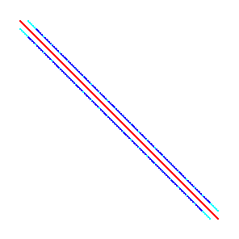

# Sparse and iterative linear algebra

Many matrices in applications, particularly the study of physical systems and graphs/networks, have the property that most entries are zero.  We can more efficiently store such systems by storing only the nonzero elements.  We will discuss storage and optimized implementations later.  Many of the methods for sparse systems apply to solving systems with matrices $A$ that can be applied to a vector ($y \gets A x$) in significantly less than $O(n^2)$ complexity, or that are "well-conditioned" such that an iterative method converges in significantly less than $n$ iterations.

[PETSc](https://mcs.anl.gov/petsc), the Portable Extensible Toolkit for Scientific computing, is an open source software package for the parallel solution of algebraic and differential-algebraic equations.  This includes linear algebra, for which PETSc offers a broad variety of implementations.  For general information about PETSc, I refer to [this primer](https://jedbrown.org/files/20150924-PETScPrimer.pdf).

## Direct solves

The complexity of this solve is potentially dominant, so we should understand its cost in terms of the problem size.  The standard method for a direct solve is $LU$ (or Cholesky) factorization.  Given a $2\times 2$ block matrix, the algorithm proceeds as
\begin{split}
  \begin{bmatrix} A & B \\ C & D \end{bmatrix} &=
  \begin{bmatrix} L_A & \\ C U_A^{-1} & S \end{bmatrix}
  \begin{bmatrix} U_A & L_A^{-1} B \\ & 1 \end{bmatrix}
\end{split}
where $L_A U_A = A$ and $S = D - C A^{-1} B$.  The factorization continues by factoring the Schur complement, which may be more dense than its original entries $D$.

For a sparse operator, the complexity depends on the ordering of degrees of freedom.

* "natural" ordering
* low-bandwidth ordering
* nested dissection ordering

For a structured grid, the "natural" ordering is the ordering of the original operator.

The red values represent positive entries, blue negative, and cyan stored zeros.

A sparse direct solve of this system will result in fill up to the bandwidth (showing lower triangular factor here).

These plots can be produced in PETSc using `-mat_view draw` and `-pc_type lu -pc_factor_mat_ordering_type natural -mat_factor_view draw` (e.g., with `-draw_pause 2` to wait 2 seconds for the viewer).

The Reverse Cuthill-McKee (`rcm`) ordering applies a breadth-first search to produce a low-bandwidth ordering.

#### Costs for banded solves

Suppose we have a grid containing $N = n^d$ points in $d$ dimensions.  The corresponding matrix is $N\times N$.  The furthest band is $k = n^{d-1}$ off the diagonal, and factorization creates
* Space: $kN = n^{2d-1} = N^{2-1/d}$
* Compute: $k^2N = n^{3d-2} = N^{3-2/d}$

### Nested dissection

The nested dissection (`nd`) ordering recursively bisects the domain by finding vertex separators.

The separator is ordered last so that each side can be factored independently.  That factorization is done by recursive bisection.  The Schur complement $S$ on the vertex separator is dense, and its factorization dominates the cost.

#### Costs for nested dissection

The size of the vertex separator is $n^{d-1}$ so its factorization costs $n^{3(d-1)}$.  This leads to
* $d=3$
  * Space: $N^{4/3}$
  * Time: $N^2$
* $d=2$
  * Space: $N \log N$
  * Time: $N^{3/2}$

## Convergence of stationary iterative methods

### Richardson iteration
The simplest iterative method is [Richardson's method](https://en.wikipedia.org/wiki/Modified_Richardson_iteration), which solves $A x = b$ by the iteration
$$ x_{k+1} = x_k + \omega (b - A x_k) $$
where $\omega > 0$ is a damping parameter and $x_0$ is an initial guess (possibly the zero vector).  If $b = A x_*$, this iteration is equivalent to
$$ x_{k+1} - x_* = (x_k - x_*) - \omega A (x_k - x_*) = (I - \omega A) (x_k - x_*) .$$
It is convenient for convergence analysis to identify the "error" $e_k = x_k - x_*$, in which this becomes
$$ e_{k+1} = (I - \omega A) e_k $$
or
$$ e_k = (I - \omega A)^k e_0 $$
in terms of the initial error.  Evidently powers of the *iteration matrix* $I - \omega A$ tell the whole story.
Suppose that the eigendecomposition
$$ X \Lambda X^{-1} = I - \omega A $$
exists.  Then
$$ (I - \omega A)^k = (X \Lambda X^{-1})^k = X \Lambda^k X^{-1} $$
and the convergence (or divergence) rate depends only on the largest magnitude eigenvalue.
This analysis isn't great for two reasons:

1. Not all matrices are diagonalizable.
2. The matrix $X$ may be very ill-conditioned.

We can repair these weaknesses by using the [Schur decomposition](https://en.wikipedia.org/wiki/Schur_decomposition)
$$ Q R Q^h = I - \omega A $$
where $R$ is right-triangular and $Q$ is unitary (i.e., orthogonal if real-valued; $Q^h$ is the Hermitian conjugate of $Q$).
The Schur decomposition always exists and $Q$ has a condition number of 1.

* Where are the eigenvalues in $R$?

Evidently we must find $\omega$ to minimize the maximum eigenvalue of $I - \omega A$.  We can do this if $A$ is well conditioned, but not in general.

### Preconditioning

Preconditioning is the act of creating an "affordable" operation "$P^{-1}$" such that $P^{-1} A$ (or $A P^{-1}$) is is well-conditoned or otherwise has a "nice" spectrum.  We then solve the system

$$ P^{-1} A x = P^{-1} b \quad \text{or}\quad A P^{-1} \underbrace{(P x)}_y = b $$

in which case the convergence rate depends on the spectrum of the iteration matrix
$$ I - \omega P^{-1} A . $$

* The preconditioner must be applied on each iteration.
* It is *not* merely about finding a good initial guess.

There are two complementary techniques necessary for efficient iterative methods:

* "accelerators" or Krylov methods, which use orthogonality to adaptively converge faster than Richardson
* preconditioners that improve the spectrum of the preconditioned operator

Although there is ongoing research in Krylov methods and they are immensely useful, I would say preconditioning is 90% of the game for practical applications, particularly as a research area.

# Krylov subspaces

All matrix iterations work with approximations in a *Krylov subspace*, which has the form

$$ K_n = \big[ b \big| Ab \big| A^2 b \big| \dotsm \big| A^{n-1} b \big] . $$

This matrix is horribly ill-conditioned and cannot stably be computed as written.  Instead, we seek an orthogonal basis $Q_n$ that spans the same space as $K_n$.  We could write this as a factorization

$$ K_n = Q_n R_n $$

where the first column $q_0 = b / \lVert b \rVert$.  The $R_n$ is unnecessary and hopelessly ill-conditioned, so a slightly different procedure is used.

### Arnoldi iteration

The Arnoldi iteration applies orthogonal similarity transformations to reduce $A$ to [Hessenberg form](https://en.wikipedia.org/wiki/Hessenberg_matrix), starting from a vector $q_0 = b$,

$$ A = Q H Q^h . $$

Let's multiply on the right by $Q$ and examine the first $n$ columns,

$$ A Q_n = Q_{n+1} H_n $$
where $H_n$ is an $(n+1) \times n$ Hessenberg matrix.

#### Conditioning
This representation is well-conditioned because $Q$ is orthogonal and

$$ \lVert H_n \rVert \le \lVert Q_{n+1}^h \rVert \lVert A \rVert \lVert Q_n \rVert \le \lVert A \rVert $$.

For a lower bound, we have

$$ \sigma_{\min}(A)^2 \le x^h A^h A x $$

for all $x$ of norm 1.  It must also be true for any $x = Q_n y$ where $\lVert y\rVert = 1$, thus

$$ \sigma_{\min}(A)^2 \le y^h Q_n^h A^h A Q_n y = y^h H_n^h Q_{n+1}^h Q_{n+1} H_n y = y^h H_n^h H_n y . $$

#### GMRES

GMRES (Generalized Minimum Residual) minimizes
$$ \lVert A x - b \rVert $$
over the subspace $Q_n$.  I.e., $x = Q_n y$ for some $y$.  By the recurrence above, this is equivalent to
$$ \lVert Q_{n+1} H_n y - b \lVert $$
which can be solved by minimizing
$$ \lVert H_n y - Q_{n+1}^h b \rVert . $$
Since $q_0 = b/\lVert b \lVert$, the least squares problem is to minimize
$$ \Big\lVert H_n y - \lVert b \rVert e_0 \Big\rVert . $$
The solution of this least squares problem is achieved by incrementally updating a $QR$ factorization of $H_n$.

**Notes**

* GMRES minimizes the 2-norm of the residual $\lVert r_n \rVert$ which is equivalent to the $A^T A$ norm of the error $\lVert x_n - x_* \rVert_{A^T A}$.
* The solution $x_n$ constructed by GMRES at iteration $n$ is not explicitly available.  If a solution is needed, it must be constructed by solving the $(n+1)\times n$ least squares problem and forming the solution as a linear combination of the $n$ vectors $Q_n$.  The leading cost is $2mn$ where $m \gg n$.
* The residual vector $r_n = A x_n - b$ is not explicitly available in GMRES.  To compute it, first build the solution $x_n$ as above.
* GMRES needs to store the full $Q_n$, which is unaffordable for large $n$ (many iterations).  The standard solution is to choose a "restart" $k$ and to discard $Q_n$ and start over with an initial guess $x_k$ after each $k$ iterations.  This algorithm is called GMRES(k).  PETSc's default solver is GMRES(30) and the restart can be controlled using the run-time option `-ksp_gmres_restart`.
* Most implementations of GMRES use classical Gram-Schmidt because it is much faster in parallel (one reduction per iteration instead of $n$ reductions per iteration).  The PETSc option `-ksp_gmres_modifiedgramschmidt` can be used when you suspect that classical Gram-Schmidt may be causing instability.
* There is a very similar (and older) algorithm called GCR that maintains $x_n$ and $r_n$.  This is useful, for example, if a convergence tolerance needs to inspect individual entries.  GCR requires $2n$ vectors instead of $n$ vectors, and can tolerate a nonlinear preconditioner.  FGMRES is a newer algorithm with similar properties to GCR.

### Lanczos iteration: the symmetric case

If $A$ is symmetric, then $H = Q^T A Q$ is also symmetric.  Since $H$ is Hessenberg, this means $H$ is tridiagonal.  Instead of storing $Q_n$, it is sufficient to store only the last two columns since the iteration satisfies a 3-term recurrence.  The analog of GMRES for the symmetric case is called MINRES and is also useful for solving symmetric indefinite problems.

#### Conjugate Gradients

Instead of minimizing the $A^T A$ norm of the error, the Conjugate Gradient method minimizes the $A$ norm of the error.  For $A$ to induce a norm, it must be symmetric positive definite.  [Jeremy Shewchuck's guide to CG](http://www.cs.cmu.edu/%7Equake-papers/painless-conjugate-gradient.pdf) is an excellent resource.
