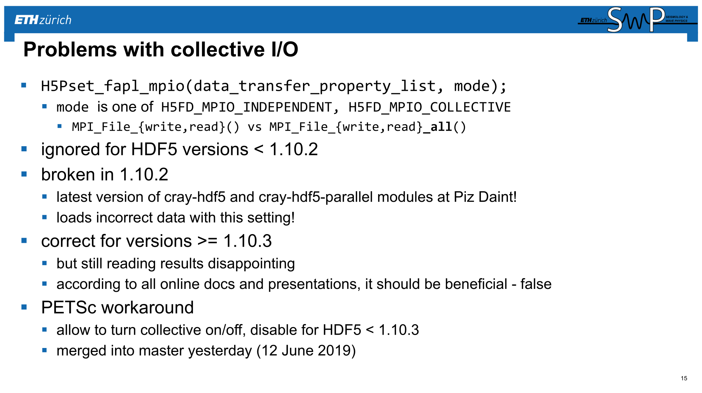
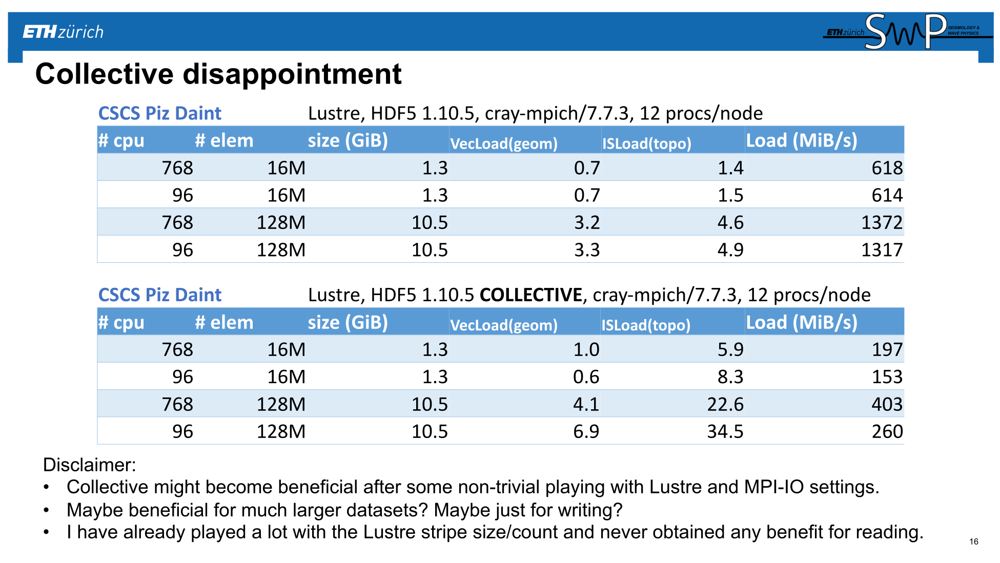
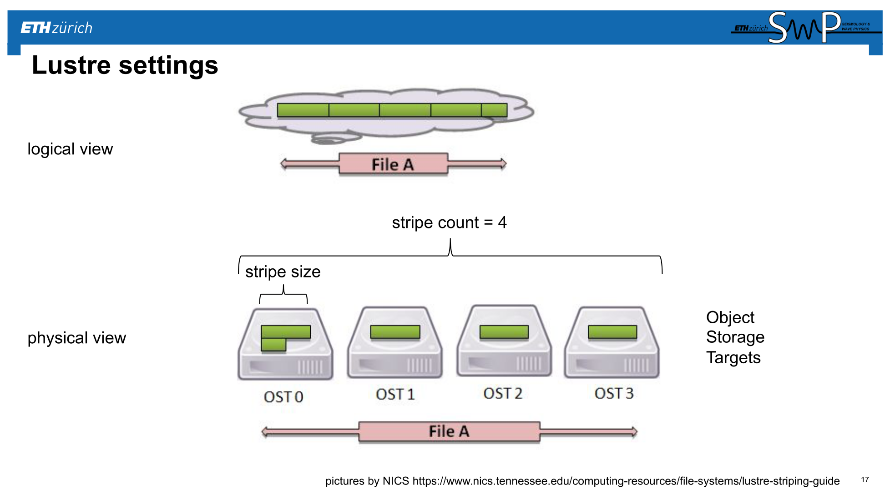
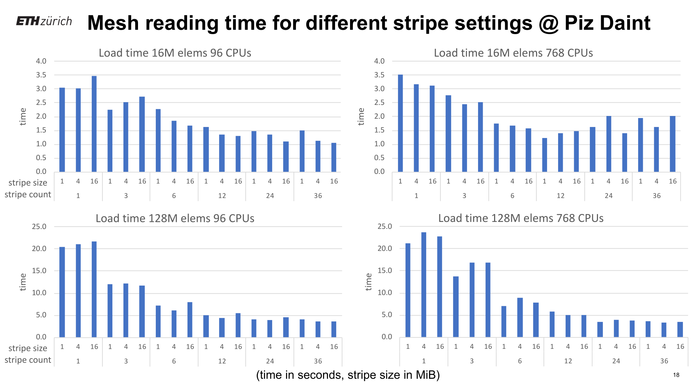
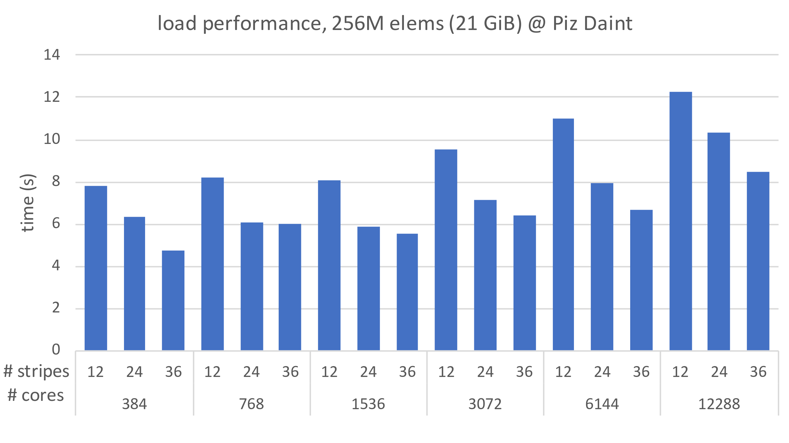
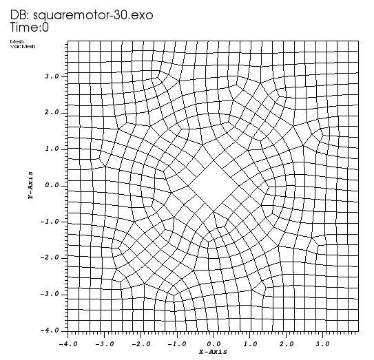

## MPI-IO

* [ATPESC 2019: Introduction to MPI-IO](https://press3.mcs.anl.gov//atpesc/files/2019/08/ATPESC_2019_Track-3_4_8-2_1030am_Latham-Introduction_to_MPI_IO.pdf)
* [ATPESC 2019: 

### Unstructured mesh load (from [Václav Hapla](https://geophysics.ethz.ch/people/person-detail.MjQxMDM0.TGlzdC8xMjgyLDExODQwMDM0MTI=.html))











## [DAOS: Distributed Asynchronous Object Storage](https://daos-stack.github.io/overview/storage/)


## [CF conventions](http://cfconventions.org/)

* CF = Climate and Forecast; widely used in earth sciences
* Based on NetCDF, which builds on top of HDF5
* [Documented standard, v1.7](http://cfconventions.org/Data/cf-conventions/cf-conventions-1.7/cf-conventions.html)
* [Standard Names Table](http://cfconventions.org/Data/cf-standard-names/current/build/cf-standard-name-table.html)
* [Compliance checker](https://pumatest.nerc.ac.uk/cgi-bin/cf-checker.pl)

## Unstructured mesh formats
* ExodusII (uses NetCDF uses HDF5)
* CGNS (uses HDF5)
* MED (uses HDF5)
* ...




```python
!ncdump -h squaremotor-30.exo
```

    netcdf squaremotor-30 {
    dimensions:
    	len_string = 33 ;
    	len_line = 81 ;
    	four = 4 ;
    	time_step = UNLIMITED ; // (0 currently)
    	num_dim = 2 ;
    	num_nodes = 719 ;
    	num_elem = 659 ;
    	num_el_blk = 2 ;
    	num_qa_rec = 1 ;
    	num_side_sets = 2 ;
    	num_side_ss1 = 108 ;
    	num_df_ss1 = 216 ;
    	num_side_ss2 = 12 ;
    	num_df_ss2 = 24 ;
    	num_el_in_blk1 = 117 ;
    	num_nod_per_el1 = 4 ;
    	num_att_in_blk1 = 1 ;
    	num_el_in_blk2 = 542 ;
    	num_nod_per_el2 = 4 ;
    	num_att_in_blk2 = 1 ;
    variables:
    	double time_whole(time_step) ;
    	char qa_records(num_qa_rec, four, len_string) ;
    	char coor_names(num_dim, len_string) ;
    	char eb_names(num_el_blk, len_string) ;
    	int ss_status(num_side_sets) ;
    	int ss_prop1(num_side_sets) ;
    		ss_prop1:name = "ID" ;
    	char ss_names(num_side_sets, len_string) ;
    	int elem_ss1(num_side_ss1) ;
    	int side_ss1(num_side_ss1) ;
    	double dist_fact_ss1(num_df_ss1) ;
    	int elem_ss2(num_side_ss2) ;
    	int side_ss2(num_side_ss2) ;
    	double dist_fact_ss2(num_df_ss2) ;
    	int elem_map(num_elem) ;
    	int eb_status(num_el_blk) ;
    	int eb_prop1(num_el_blk) ;
    		eb_prop1:name = "ID" ;
    	double attrib1(num_el_in_blk1, num_att_in_blk1) ;
    	int connect1(num_el_in_blk1, num_nod_per_el1) ;
    		connect1:elem_type = "SHELL4" ;
    	double attrib2(num_el_in_blk2, num_att_in_blk2) ;
    	int connect2(num_el_in_blk2, num_nod_per_el2) ;
    		connect2:elem_type = "SHELL4" ;
    	double coordx(num_nodes) ;
    	double coordy(num_nodes) ;
    
    // global attributes:
    		:api_version = 4.98f ;
    		:version = 4.98f ;
    		:floating_point_word_size = 8 ;
    		:file_size = 1 ;
    		:title = "cubit(squaremotor-30.exo): 11/20/2012: 15:12:45" ;
    }


```python
!h5dump -H cylinder.med
```

    HDF5 "cylinder.med" {
    GROUP "/" {
       ATTRIBUTE "descripteur de fichier" {
          DATATYPE  H5T_STRING {
             STRSIZE 27;
             STRPAD H5T_STR_NULLTERM;
             CSET H5T_CSET_ASCII;
             CTYPE H5T_C_S1;
          }
          DATASPACE  SCALAR
       }
       GROUP "ENS_MAA" {
          GROUP "box_3d_1" {
             ATTRIBUTE "DES" {
                DATATYPE  H5T_STRING {
                   STRSIZE 23;
                   STRPAD H5T_STR_NULLTERM;
                   CSET H5T_CSET_ASCII;
                   CTYPE H5T_C_S1;
                }
                DATASPACE  SCALAR
             }
             ATTRIBUTE "DIM" {
                DATATYPE  H5T_STD_I32LE
                DATASPACE  SCALAR
             }
             ATTRIBUTE "ESP" {
                DATATYPE  H5T_STD_I32LE
                DATASPACE  SCALAR
             }
             ATTRIBUTE "NOM" {
                DATATYPE  H5T_STRING {
                   STRSIZE 1;
                   STRPAD H5T_STR_NULLTERM;
                   CSET H5T_CSET_ASCII;
                   CTYPE H5T_C_S1;
                }
                DATASPACE  SCALAR
             }
             ATTRIBUTE "NXI" {
                DATATYPE  H5T_STD_I32LE
                DATASPACE  SCALAR
             }
             ATTRIBUTE "NXT" {
                DATATYPE  H5T_STD_I32LE
                DATASPACE  SCALAR
             }
             ATTRIBUTE "REP" {
                DATATYPE  H5T_STD_I32LE
                DATASPACE  SCALAR
             }
             ATTRIBUTE "SRT" {
                DATATYPE  H5T_STD_I32LE
                DATASPACE  SCALAR
             }
             ATTRIBUTE "TYP" {
                DATATYPE  H5T_STD_I32LE
                DATASPACE  SCALAR
             }
             ATTRIBUTE "UNI" {
                DATATYPE  H5T_STRING {
                   STRSIZE 1;
                   STRPAD H5T_STR_NULLTERM;
                   CSET H5T_CSET_ASCII;
                   CTYPE H5T_C_S1;
                }
                DATASPACE  SCALAR
             }
             ATTRIBUTE "UNT" {
                DATATYPE  H5T_STRING {
                   STRSIZE 1;
                   STRPAD H5T_STR_NULLTERM;
                   CSET H5T_CSET_ASCII;
                   CTYPE H5T_C_S1;
                }
                DATASPACE  SCALAR
             }
             GROUP "-0000000000000000001-0000000000000000001" {
                ATTRIBUTE "CGT" {
                   DATATYPE  H5T_STD_I32LE
                   DATASPACE  SCALAR
                }
                ATTRIBUTE "NDT" {
                   DATATYPE  H5T_STD_I32LE
                   DATASPACE  SCALAR
                }
                ATTRIBUTE "NOR" {
                   DATATYPE  H5T_STD_I32LE
                   DATASPACE  SCALAR
                }
                ATTRIBUTE "NXI" {
                   DATATYPE  H5T_STD_I32LE
                   DATASPACE  SCALAR
                }
                ATTRIBUTE "NXT" {
                   DATATYPE  H5T_STD_I32LE
                   DATASPACE  SCALAR
                }
                ATTRIBUTE "PDT" {
                   DATATYPE  H5T_IEEE_F64LE
                   DATASPACE  SCALAR
                }
                ATTRIBUTE "PVI" {
                   DATATYPE  H5T_STD_I32LE
                   DATASPACE  SCALAR
                }
                ATTRIBUTE "PVT" {
                   DATATYPE  H5T_STD_I32LE
                   DATASPACE  SCALAR
                }
                GROUP "MAI" {
                   ATTRIBUTE "CGT" {
                      DATATYPE  H5T_STD_I32LE
                      DATASPACE  SCALAR
                   }
                   GROUP "TE4" {
                      ATTRIBUTE "CGS" {
                         DATATYPE  H5T_STD_I32LE
                         DATASPACE  SCALAR
                      }
                      ATTRIBUTE "CGT" {
                         DATATYPE  H5T_STD_I32LE
                         DATASPACE  SCALAR
                      }
                      ATTRIBUTE "GEO" {
                         DATATYPE  H5T_STD_I32LE
                         DATASPACE  SCALAR
                      }
                      ATTRIBUTE "PFL" {
                         DATATYPE  H5T_STRING {
                            STRSIZE 24;
                            STRPAD H5T_STR_NULLTERM;
                            CSET H5T_CSET_ASCII;
                            CTYPE H5T_C_S1;
                         }
                         DATASPACE  SCALAR
                      }
                      DATASET "FAM" {
                         DATATYPE  H5T_STD_I32LE
                         DATASPACE  SIMPLE { ( 161 ) / ( 161 ) }
                         ATTRIBUTE "CGT" {
                            DATATYPE  H5T_STD_I32LE
                            DATASPACE  SCALAR
                         }
                         ATTRIBUTE "NBR" {
                            DATATYPE  H5T_STD_I32LE
                            DATASPACE  SCALAR
                         }
                      }
                      DATASET "NOD" {
                         DATATYPE  H5T_STD_I32LE
                         DATASPACE  SIMPLE { ( 644 ) / ( 644 ) }
                         ATTRIBUTE "CGT" {
                            DATATYPE  H5T_STD_I32LE
                            DATASPACE  SCALAR
                         }
                         ATTRIBUTE "NBR" {
                            DATATYPE  H5T_STD_I32LE
                            DATASPACE  SCALAR
                         }
                      }
                   }
                   GROUP "TR3" {
                      ATTRIBUTE "CGS" {
                         DATATYPE  H5T_STD_I32LE
                         DATASPACE  SCALAR
                      }
                      ATTRIBUTE "CGT" {
                         DATATYPE  H5T_STD_I32LE
                         DATASPACE  SCALAR
                      }
                      ATTRIBUTE "GEO" {
                         DATATYPE  H5T_STD_I32LE
                         DATASPACE  SCALAR
                      }
                      ATTRIBUTE "PFL" {
                         DATATYPE  H5T_STRING {
                            STRSIZE 24;
                            STRPAD H5T_STR_NULLTERM;
                            CSET H5T_CSET_ASCII;
                            CTYPE H5T_C_S1;
                         }
                         DATASPACE  SCALAR
                      }
                      DATASET "FAM" {
                         DATATYPE  H5T_STD_I32LE
                         DATASPACE  SIMPLE { ( 56 ) / ( 56 ) }
                         ATTRIBUTE "CGT" {
                            DATATYPE  H5T_STD_I32LE
                            DATASPACE  SCALAR
                         }
                         ATTRIBUTE "NBR" {
                            DATATYPE  H5T_STD_I32LE
                            DATASPACE  SCALAR
                         }
                      }
                      DATASET "NOD" {
                         DATATYPE  H5T_STD_I32LE
                         DATASPACE  SIMPLE { ( 168 ) / ( 168 ) }
                         ATTRIBUTE "CGT" {
                            DATATYPE  H5T_STD_I32LE
                            DATASPACE  SCALAR
                         }
                         ATTRIBUTE "NBR" {
                            DATATYPE  H5T_STD_I32LE
                            DATASPACE  SCALAR
                         }
                      }
                   }
                }
                GROUP "NOE" {
                   ATTRIBUTE "CGS" {
                      DATATYPE  H5T_STD_I32LE
                      DATASPACE  SCALAR
                   }
                   ATTRIBUTE "CGT" {
                      DATATYPE  H5T_STD_I32LE
                      DATASPACE  SCALAR
                   }
                   ATTRIBUTE "PFL" {
                      DATATYPE  H5T_STRING {
                         STRSIZE 24;
                         STRPAD H5T_STR_NULLTERM;
                         CSET H5T_CSET_ASCII;
                         CTYPE H5T_C_S1;
                      }
                      DATASPACE  SCALAR
                   }
                   DATASET "COO" {
                      DATATYPE  H5T_IEEE_F64LE
                      DATASPACE  SIMPLE { ( 168 ) / ( 168 ) }
                      ATTRIBUTE "CGT" {
                         DATATYPE  H5T_STD_I32LE
                         DATASPACE  SCALAR
                      }
                      ATTRIBUTE "NBR" {
                         DATATYPE  H5T_STD_I32LE
                         DATASPACE  SCALAR
                      }
                   }
                   DATASET "FAM" {
                      DATATYPE  H5T_STD_I32LE
                      DATASPACE  SIMPLE { ( 56 ) / ( 56 ) }
                      ATTRIBUTE "CGT" {
                         DATATYPE  H5T_STD_I32LE
                         DATASPACE  SCALAR
                      }
                      ATTRIBUTE "NBR" {
                         DATATYPE  H5T_STD_I32LE
                         DATASPACE  SCALAR
                      }
                   }
                }
             }
          }
       }
       GROUP "FAS" {
          GROUP "box_3d_1" {
             GROUP "ELEME" {
                GROUP "F_2D_1" {
                   ATTRIBUTE "NUM" {
                      DATATYPE  H5T_STD_I32LE
                      DATASPACE  SCALAR
                   }
                   GROUP "GRO" {
                      ATTRIBUTE "NBR" {
                         DATATYPE  H5T_STD_I32LE
                         DATASPACE  SCALAR
                      }
                      DATASET "NOM" {
                         DATATYPE  H5T_ARRAY { [80] H5T_STD_I8LE }
                         DATASPACE  SIMPLE { ( 1 ) / ( 1 ) }
                      }
                   }
                }
                GROUP "F_2D_126" {
                   ATTRIBUTE "NUM" {
                      DATATYPE  H5T_STD_I32LE
                      DATASPACE  SCALAR
                   }
                   GROUP "GRO" {
                      ATTRIBUTE "NBR" {
                         DATATYPE  H5T_STD_I32LE
                         DATASPACE  SCALAR
                      }
                      DATASET "NOM" {
                         DATATYPE  H5T_ARRAY { [80] H5T_STD_I8LE }
                         DATASPACE  SIMPLE { ( 1 ) / ( 1 ) }
                      }
                   }
                }
                GROUP "F_2D_128" {
                   ATTRIBUTE "NUM" {
                      DATATYPE  H5T_STD_I32LE
                      DATASPACE  SCALAR
                   }
                   GROUP "GRO" {
                      ATTRIBUTE "NBR" {
                         DATATYPE  H5T_STD_I32LE
                         DATASPACE  SCALAR
                      }
                      DATASET "NOM" {
                         DATATYPE  H5T_ARRAY { [80] H5T_STD_I8LE }
                         DATASPACE  SIMPLE { ( 1 ) / ( 1 ) }
                      }
                   }
                }
                GROUP "F_2D_130" {
                   ATTRIBUTE "NUM" {
                      DATATYPE  H5T_STD_I32LE
                      DATASPACE  SCALAR
                   }
                   GROUP "GRO" {
                      ATTRIBUTE "NBR" {
                         DATATYPE  H5T_STD_I32LE
                         DATASPACE  SCALAR
                      }
                      DATASET "NOM" {
                         DATATYPE  H5T_ARRAY { [80] H5T_STD_I8LE }
                         DATASPACE  SIMPLE { ( 1 ) / ( 1 ) }
                      }
                   }
                }
                GROUP "F_2D_132" {
                   ATTRIBUTE "NUM" {
                      DATATYPE  H5T_STD_I32LE
                      DATASPACE  SCALAR
                   }
                   GROUP "GRO" {
                      ATTRIBUTE "NBR" {
                         DATATYPE  H5T_STD_I32LE
                         DATASPACE  SCALAR
                      }
                      DATASET "NOM" {
                         DATATYPE  H5T_ARRAY { [80] H5T_STD_I8LE }
                         DATASPACE  SIMPLE { ( 1 ) / ( 1 ) }
                      }
                   }
                }
                GROUP "F_2D_134" {
                   ATTRIBUTE "NUM" {
                      DATATYPE  H5T_STD_I32LE
                      DATASPACE  SCALAR
                   }
                   GROUP "GRO" {
                      ATTRIBUTE "NBR" {
                         DATATYPE  H5T_STD_I32LE
                         DATASPACE  SCALAR
                      }
                      DATASET "NOM" {
                         DATATYPE  H5T_ARRAY { [80] H5T_STD_I8LE }
                         DATASPACE  SIMPLE { ( 1 ) / ( 1 ) }
                      }
                   }
                }
                GROUP "F_2D_136" {
                   ATTRIBUTE "NUM" {
                      DATATYPE  H5T_STD_I32LE
                      DATASPACE  SCALAR
                   }
                   GROUP "GRO" {
                      ATTRIBUTE "NBR" {
                         DATATYPE  H5T_STD_I32LE
                         DATASPACE  SCALAR
                      }
                      DATASET "NOM" {
                         DATATYPE  H5T_ARRAY { [80] H5T_STD_I8LE }
                         DATASPACE  SIMPLE { ( 1 ) / ( 1 ) }
                      }
                   }
                }
                GROUP "F_2D_2" {
                   ATTRIBUTE "NUM" {
                      DATATYPE  H5T_STD_I32LE
                      DATASPACE  SCALAR
                   }
                   GROUP "GRO" {
                      ATTRIBUTE "NBR" {
                         DATATYPE  H5T_STD_I32LE
                         DATASPACE  SCALAR
                      }
                      DATASET "NOM" {
                         DATATYPE  H5T_ARRAY { [80] H5T_STD_I8LE }
                         DATASPACE  SIMPLE { ( 1 ) / ( 1 ) }
                      }
                   }
                }
                GROUP "F_3D_1" {
                   ATTRIBUTE "NUM" {
                      DATATYPE  H5T_STD_I32LE
                      DATASPACE  SCALAR
                   }
                   GROUP "GRO" {
                      ATTRIBUTE "NBR" {
                         DATATYPE  H5T_STD_I32LE
                         DATASPACE  SCALAR
                      }
                      DATASET "NOM" {
                         DATATYPE  H5T_ARRAY { [80] H5T_STD_I8LE }
                         DATASPACE  SIMPLE { ( 1 ) / ( 1 ) }
                      }
                   }
                }
             }
             GROUP "FAMILLE_ZERO" {
                ATTRIBUTE "NUM" {
                   DATATYPE  H5T_STD_I32LE
                   DATASPACE  SCALAR
                }
             }
          }
       }
       GROUP "INFOS_GENERALES" {
          ATTRIBUTE "MAJ" {
             DATATYPE  H5T_STD_I32LE
             DATASPACE  SCALAR
          }
          ATTRIBUTE "MIN" {
             DATATYPE  H5T_STD_I32LE
             DATASPACE  SCALAR
          }
          ATTRIBUTE "REL" {
             DATATYPE  H5T_STD_I32LE
             DATASPACE  SCALAR
          }
       }
    }
    }

