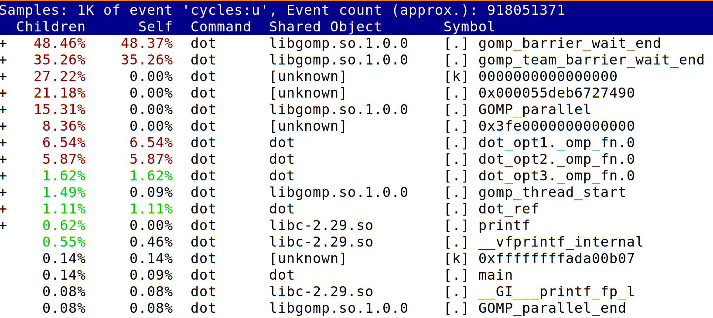
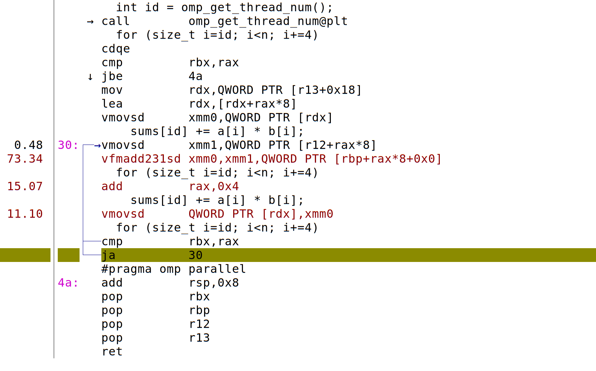

What does the compiler do when we add `#pragma omp parallel`?

```c
static double dot_opt3(size_t n, const double *a, const double *b) {
  double sum = 0;
  omp_set_num_threads(4);
  #pragma omp parallel
  {
    #pragma omp for reduction(+:sum)
    for (size_t i=0; i<n; i++)
      sum += a[i] * b[i];
  }
  return sum;
}
```

```bash
gcc -Os -march=native -fopenmp dot.c -o dot
objdump -d --prefix-addresses -M intel dot | grep dot_opt3
```
```
000000000000129f <main+0x1af> call   0000000000001779 <dot_opt3>
0000000000001779 <dot_opt3> push   r12
000000000000177b <dot_opt3+0x2> mov    r12,rdx
000000000000177e <dot_opt3+0x5> push   rbp
000000000000177f <dot_opt3+0x6> mov    rbp,rsi
0000000000001782 <dot_opt3+0x9> push   rbx
0000000000001783 <dot_opt3+0xa> mov    rbx,rdi
0000000000001786 <dot_opt3+0xd> mov    edi,0x4
000000000000178b <dot_opt3+0x12> sub    rsp,0x30
000000000000178f <dot_opt3+0x16> mov    rax,QWORD PTR fs:0x28
0000000000001798 <dot_opt3+0x1f> mov    QWORD PTR [rsp+0x28],rax
000000000000179d <dot_opt3+0x24> xor    eax,eax
000000000000179f <dot_opt3+0x26> call   0000000000001070 <omp_set_num_threads@plt>
00000000000017a4 <dot_opt3+0x2b> xor    ecx,ecx
00000000000017a6 <dot_opt3+0x2d> xor    edx,edx
00000000000017a8 <dot_opt3+0x2f> lea    rsi,[rsp+0x8]
00000000000017ad <dot_opt3+0x34> lea    rdi,[rip+0xc1]        # 0000000000001875 <dot_opt3._omp_fn.0>
00000000000017b4 <dot_opt3+0x3b> mov    QWORD PTR [rsp+0x18],r12
00000000000017b9 <dot_opt3+0x40> mov    QWORD PTR [rsp+0x10],rbp
00000000000017be <dot_opt3+0x45> mov    QWORD PTR [rsp+0x8],rbx
00000000000017c3 <dot_opt3+0x4a> mov    QWORD PTR [rsp+0x20],0x0
00000000000017cc <dot_opt3+0x53> call   00000000000010e0 <GOMP_parallel@plt>
00000000000017d1 <dot_opt3+0x58> mov    rax,QWORD PTR [rsp+0x28]
00000000000017d6 <dot_opt3+0x5d> xor    rax,QWORD PTR fs:0x28
00000000000017df <dot_opt3+0x66> vmovsd xmm0,QWORD PTR [rsp+0x20]
00000000000017e5 <dot_opt3+0x6c> je     00000000000017ec <dot_opt3+0x73>
00000000000017e7 <dot_opt3+0x6e> call   0000000000001080 <__stack_chk_fail@plt>
00000000000017ec <dot_opt3+0x73> add    rsp,0x30
00000000000017f0 <dot_opt3+0x77> pop    rbx
00000000000017f1 <dot_opt3+0x78> pop    rbp
00000000000017f2 <dot_opt3+0x79> pop    r12
00000000000017f4 <dot_opt3+0x7b> ret    
0000000000001875 <dot_opt3._omp_fn.0> push   r12
0000000000001877 <dot_opt3._omp_fn.0+0x2> push   rbp
0000000000001878 <dot_opt3._omp_fn.0+0x3> mov    rbp,rdi
000000000000187b <dot_opt3._omp_fn.0+0x6> push   rbx
000000000000187c <dot_opt3._omp_fn.0+0x7> sub    rsp,0x10
0000000000001880 <dot_opt3._omp_fn.0+0xb> mov    rbx,QWORD PTR [rdi]
0000000000001883 <dot_opt3._omp_fn.0+0xe> test   rbx,rbx
0000000000001886 <dot_opt3._omp_fn.0+0x11> jne    00000000000018b5 <dot_opt3._omp_fn.0+0x40>
0000000000001888 <dot_opt3._omp_fn.0+0x13> vxorpd xmm0,xmm0,xmm0
000000000000188c <dot_opt3._omp_fn.0+0x17> mov    rax,QWORD PTR [rbp+0x18]
0000000000001890 <dot_opt3._omp_fn.0+0x1b> lea    rdx,[rbp+0x18]
0000000000001894 <dot_opt3._omp_fn.0+0x1f> mov    QWORD PTR [rsp],rax
0000000000001898 <dot_opt3._omp_fn.0+0x23> vaddsd xmm1,xmm0,QWORD PTR [rsp]
000000000000189d <dot_opt3._omp_fn.0+0x28> vmovsd QWORD PTR [rsp+0x8],xmm1
00000000000018a3 <dot_opt3._omp_fn.0+0x2e> mov    rdi,QWORD PTR [rsp+0x8]
00000000000018a8 <dot_opt3._omp_fn.0+0x33> lock cmpxchg QWORD PTR [rdx],rdi
00000000000018ad <dot_opt3._omp_fn.0+0x38> cmp    QWORD PTR [rsp],rax
00000000000018b1 <dot_opt3._omp_fn.0+0x3c> je     000000000000190c <dot_opt3._omp_fn.0+0x97>
00000000000018b3 <dot_opt3._omp_fn.0+0x3e> jmp    0000000000001894 <dot_opt3._omp_fn.0+0x1f>
00000000000018b5 <dot_opt3._omp_fn.0+0x40> call   00000000000010b0 <omp_get_num_threads@plt>
00000000000018ba <dot_opt3._omp_fn.0+0x45> mov    r12d,eax
00000000000018bd <dot_opt3._omp_fn.0+0x48> call   0000000000001060 <omp_get_thread_num@plt>
00000000000018c2 <dot_opt3._omp_fn.0+0x4d> movsxd rcx,eax
00000000000018c5 <dot_opt3._omp_fn.0+0x50> movsxd rsi,r12d
00000000000018c8 <dot_opt3._omp_fn.0+0x53> mov    rax,rbx
00000000000018cb <dot_opt3._omp_fn.0+0x56> xor    edx,edx
00000000000018cd <dot_opt3._omp_fn.0+0x58> div    rsi
00000000000018d0 <dot_opt3._omp_fn.0+0x5b> cmp    rcx,rdx
00000000000018d3 <dot_opt3._omp_fn.0+0x5e> jb     0000000000001905 <dot_opt3._omp_fn.0+0x90>
00000000000018d5 <dot_opt3._omp_fn.0+0x60> imul   rcx,rax
00000000000018d9 <dot_opt3._omp_fn.0+0x64> vxorpd xmm0,xmm0,xmm0
00000000000018dd <dot_opt3._omp_fn.0+0x68> add    rdx,rcx
00000000000018e0 <dot_opt3._omp_fn.0+0x6b> add    rax,rdx
00000000000018e3 <dot_opt3._omp_fn.0+0x6e> cmp    rdx,rax
00000000000018e6 <dot_opt3._omp_fn.0+0x71> jae    000000000000188c <dot_opt3._omp_fn.0+0x17>
00000000000018e8 <dot_opt3._omp_fn.0+0x73> mov    rcx,QWORD PTR [rbp+0x10]
00000000000018ec <dot_opt3._omp_fn.0+0x77> mov    rsi,QWORD PTR [rbp+0x8]
00000000000018f0 <dot_opt3._omp_fn.0+0x7b> vmovsd xmm2,QWORD PTR [rsi+rdx*8]
00000000000018f5 <dot_opt3._omp_fn.0+0x80> vfmadd231sd xmm0,xmm2,QWORD PTR [rcx+rdx*8]
00000000000018fb <dot_opt3._omp_fn.0+0x86> inc    rdx
00000000000018fe <dot_opt3._omp_fn.0+0x89> cmp    rax,rdx
0000000000001901 <dot_opt3._omp_fn.0+0x8c> jne    00000000000018f0 <dot_opt3._omp_fn.0+0x7b>
0000000000001903 <dot_opt3._omp_fn.0+0x8e> jmp    000000000000188c <dot_opt3._omp_fn.0+0x17>
0000000000001905 <dot_opt3._omp_fn.0+0x90> inc    rax
0000000000001908 <dot_opt3._omp_fn.0+0x93> xor    edx,edx
000000000000190a <dot_opt3._omp_fn.0+0x95> jmp    00000000000018d5 <dot_opt3._omp_fn.0+0x60>
000000000000190c <dot_opt3._omp_fn.0+0x97> add    rsp,0x10
0000000000001910 <dot_opt3._omp_fn.0+0x9b> pop    rbx
0000000000001911 <dot_opt3._omp_fn.0+0x9c> pop    rbp
0000000000001912 <dot_opt3._omp_fn.0+0x9d> pop    r12
0000000000001914 <dot_opt3._omp_fn.0+0x9f> ret    
```

## Anatomy of a parallel region

<div class="mermaid">
graph LR;
  A[<tt>dot_opt3</tt>]-->B[<tt>GOMP_parallel</tt>];
  B-- id=0_ -->C{<tt>dot_opt3._omp_fn.0</tt>};
  B-- id=1_ -->C{<tt>dot_opt3._omp_fn.0</tt>};
  B-- id=2_ -->C{<tt>dot_opt3._omp_fn.0</tt>};
  A-. "Body inside__" .->C;
  C-->D[<tt>omp_get_num_threads</tt>];
  C-->E[<tt>omp_get_thread_num</tt>];
  style A fill:#9b9,stroke:#686,stroke-width:4px;
  style C fill:#9b9,stroke:#668,stroke-width:8px;
</div>

## Memory semantics

For each variable accessed within the parallel region, we can specify
whether it is

* `private` to the thread, with value undefined inside the region
* `firstprivate`, which is like private, but initialized by the value
upon entering the parallel region
* `shared`, meaning that every thread accesses the same value in
memory (but changes are not immediately visible)

```c
  int a=0, b=1, c=2;
  #pragma omp parallel private(a) firstprivate(b) shared(c)
  {
    int id = omp_get_thread_num();
    a++;
    b++;
    c++;
    printf("[%d] %d %d %d\n", id, a, b, c);
  }
  printf("END: %d %d %d\n", a, b, c);
```

```{bash}
make CFLAGS='-fopenmp -Wall' -B omp-mem
```

```
cc -fopenmp -Wall    omp-mem.c   -o omp-mem
omp-mem.c: In function ‘main._omp_fn.0’:
omp-mem.c:8:6: warning: ‘a’ is used uninitialized in this function [-Wuninitialized]
    8 |     a++;
      |     ~^~
omp-mem.c:5:7: note: ‘a’ was declared here
    5 |   int a=1, b=2, c=3;
      |       ^
```

**Question:** How could the compiler get `firstprivate` and `shared` variables into
the scope of `dot_opt3._omp_fn.0`?

### Programming style
I find `private` semantics unnecessary and error-prone.  We can just
declare those variables at inner-most scope.

```c
  int b=1, c=2;
  #pragma omp parallel firstprivate(b) shared(c)
  {
    int a = 0;
    int id = omp_get_thread_num();
    a++;
    b++;
    c++;
    printf("[%d] %d %d %d\n", id, a, b, c);
  }
  printf("END: %d %d %d\n", a, b, c); // Error: a not in scope here
```

### Updating shared variables
We see that the shared variable `c` has lots of opportunities for conflict.

<div class="mermaid">
sequenceDiagram
Thread0-->Memory: load c=2
Thread1-->Memory: load c=2
Note left of Thread0: c++ (=3)
Note right of Thread1: c++ (=3)
Note right of Thread1: print c
Thread0-->Memory: store c=3
Thread1-->Memory: store c=3
Note left of Thread0: print c
</div>

If we run the above many times, we may sometimes find that multiple
processes have the same value of `c`, each thread observes different
increments from others, and the total number of increments may vary.

We can define ordering semantics using `atomic`, `critical`, and `barrier`.

```c
  int b=1, c=2;
  #pragma omp parallel firstprivate(b) shared(c)
  {
    int a = 1;
    int id = omp_get_thread_num();
    b++;
    #pragma omp critical
    c++;
    #pragma omp barrier
    printf("[%d] %d %d %d\n", id, a, b, c);
  }
  printf("END: _ %d %d\n", b, c);
```

## A quick demo of `perf`

Linux `perf` is a kernel interrupt-based profiling tool.  It uses
performance counters and interrupts to diagnose all sorts of
bottlenecks.

```
$ perf stat ./dot -n 10000 > /dev/null

 Performance counter stats for './dot -n 10000':

              1.56 msec task-clock:u              #    1.201 CPUs utilized          
                 0      context-switches:u        #    0.000 K/sec                  
                 0      cpu-migrations:u          #    0.000 K/sec                  
               124      page-faults:u             #    0.079 M/sec                  
         3,041,706      cycles:u                  #    1.947 GHz                    
         2,272,231      instructions:u            #    0.75  insn per cycle         
           410,889      branches:u                #  262.962 M/sec                  
             7,911      branch-misses:u           #    1.93% of all branches        

       0.001301176 seconds time elapsed

       0.001970000 seconds user
       0.000000000 seconds sys
```

```
$ perf record -g ./dot -n 10000 -r 1000 > /dev/null
[ perf record: Woken up 1 times to write data ]
[ perf record: Captured and wrote 0.075 MB perf.data (1098 samples) ]
```

```
$ perf report -M intel
```



Note how GOMP overhead dominates the cost in this experiment.  We need
more work (longer arrays, etc.) to justify the overhead of
distributing and collecting the parallel work.

We can drill down into particular functions (especially ours, which we
have hopefully compiled with `-g` to include debugging information).



From this, we see specific instructions, and their corresponding lines
of code, that are most frequently being processed when the kernel
interrupts to check.  In this experiment, we see `*sd` "scalar double"
instructions, indicating lack of vectorization.

In contrast, the following annotation shows use of `*pd` "packed
double" instructions, indicating that the "hot" loop has been
vectorized.


(The reason for vectorization can sometimes be determined by
`-fopt-info -fopt-info-missed`, and can be encouraged by techniques
like manually splitting accumulators, preventing aliasing by using
`restrict`, directives like `#pragma omp simd`, and global compiler
flags like `-ffast-math`.)

For more on `perf`, see [Brendan Gregg's Linux Performance site](http://www.brendangregg.com/linuxperf.html).
