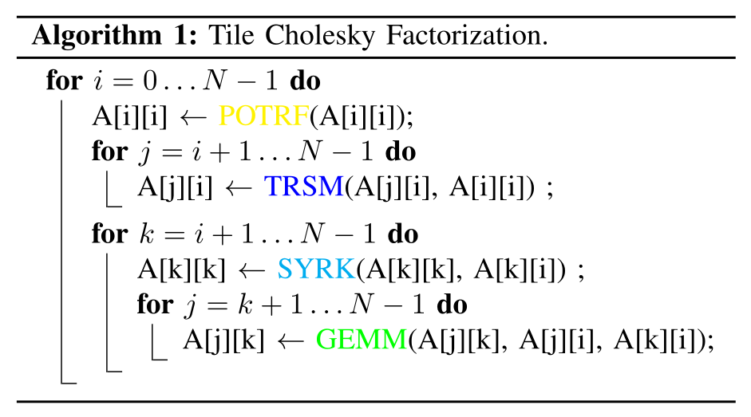
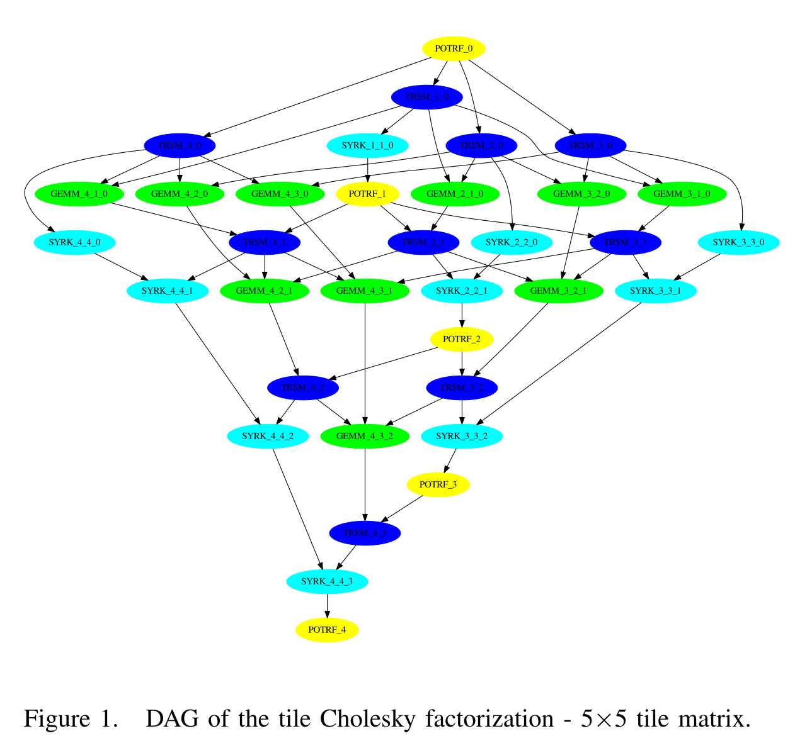

```python
def render_c(filename):
    from IPython.display import Markdown
    with open(filename) as f:
        contents = f.read()
    return Markdown("```c\n" + contents + "```\n")
```

## Using `#pragma omp task`

Up to now, we've been expressing parallelism for iterating over an array.


```python
render_c('task_dep.4.c')
```


```c
#include <stdio.h>
int main() {
  int x = 1;
  #pragma omp parallel
  #pragma omp single
  {
    #pragma omp task shared(x) depend(out: x)
    x = 2;
    #pragma omp task shared(x) depend(in: x)
    printf("x + 1 = %d. ", x+1);
    #pragma omp task shared(x) depend(in: x)
    printf("x + 2 = %d. ", x+2);
  }
  puts("");
  return 0;
}
```


```python
!make CFLAGS=-fopenmp -B task_dep.4
```

    cc -fopenmp    task_dep.4.c   -o task_dep.4


```python
!for i in {1..10}; do ./task_dep.4; done
```

    x + 2 = 4. x + 1 = 3. 
    x + 1 = 3. x + 2 = 4. 
    x + 2 = 4. x + 1 = 3. 
    x + 1 = 3. x + 2 = 4. 
    x + 2 = 4. x + 1 = 3. 
    x + 1 = 3. x + 2 = 4. 
    x + 1 = 3. x + 2 = 4. 
    x + 2 = 4. x + 1 = 3. 
    x + 2 = 4. x + 1 = 3. 
    x + 2 = 4. x + 1 = 3. 


```python
render_c('task_dep.4inout.c')
```


```c
#include <stdio.h>
int main() {
  int x = 1;
  #pragma omp parallel
  #pragma omp single
  {
    #pragma omp task shared(x) depend(out: x)
    x = 2;
    #pragma omp task shared(x) depend(inout: x)
    printf("x + 1 = %d. ", x+1);
    #pragma omp task shared(x) depend(in: x)
    printf("x + 2 = %d. ", x+2);
  }
  puts("");
  return 0;
}
```


```python
!make CFLAGS=-fopenmp -B task_dep.4inout
```

    cc -fopenmp    task_dep.4inout.c   -o task_dep.4inout


```python
!for i in {1..10}; do ./task_dep.4inout; done
```

    x + 1 = 3. x + 2 = 4. 
    x + 1 = 3. x + 2 = 4. 
    x + 1 = 3. x + 2 = 4. 
    x + 1 = 3. x + 2 = 4. 
    x + 1 = 3. x + 2 = 4. 
    x + 1 = 3. x + 2 = 4. 
    x + 1 = 3. x + 2 = 4. 
    x + 1 = 3. x + 2 = 4. 
    x + 1 = 3. x + 2 = 4. 
    x + 1 = 3. x + 2 = 4. 


## Computing the [Fibonacci numbers](https://en.wikipedia.org/wiki/Fibonacci_number) with OpenMP

Fibonacci numbers are defined by the recurrence
\begin{align}
  F_0 &= 0 \\
  F_1 &= 1 \\
  F_n &= F_{n-1} + F_{n-2}
\end{align}


```python
render_c('fib.c')
```


```c
#include <stdio.h>
#include <stdlib.h>

long fib(long n) {
  if (n < 2) return n;
  return fib(n - 1) + fib(n - 2);
}

int main(int argc, char **argv) {
  if (argc != 2) {
    fprintf(stderr, "Usage: %s N\n", argv[0]);
    return 1;
  }
  long N = atol(argv[1]);
  long fibs[N];
  #pragma omp parallel for
  for (long i=0; i<N; i++)
    fibs[i] = fib(i+1);
  for (long i=0; i<N; i++)
    printf("%2ld: %5ld\n", i+1, fibs[i]);
  return 0;
}
```


```python
!make CFLAGS='-O2 -march=native -fopenmp -Wall' -B fib
```

    cc -O2 -march=native -fopenmp -Wall    fib.c   -o fib


```python
!OMP_NUM_THREADS=4 time ./fib 40
```

     1:     1
     2:     1
     3:     2
     4:     3
     5:     5
     6:     8
     7:    13
     8:    21
     9:    34
    10:    55
    11:    89
    12:   144
    13:   233
    14:   377
    15:   610
    16:   987
    17:  1597
    18:  2584
    19:  4181
    20:  6765
    21: 10946
    22: 17711
    23: 28657
    24: 46368
    25: 75025
    26: 121393
    27: 196418
    28: 317811
    29: 514229
    30: 832040
    31: 1346269
    32: 2178309
    33: 3524578
    34: 5702887
    35: 9227465
    36: 14930352
    37: 24157817
    38: 39088169
    39: 63245986
    40: 102334155
    0.85user 0.00system 0:00.78elapsed 109%CPU (0avgtext+0avgdata 2044maxresident)k
    0inputs+0outputs (0major+99minor)pagefaults 0swaps


## Use tasks


```python
render_c('fib2.c')
```


```c
#include <stdio.h>
#include <stdlib.h>

long fib(long n) {
  if (n < 2) return n;
  long n1, n2;
  #pragma omp task shared(n1)
  n1 = fib(n - 1);
  #pragma omp task shared(n2)
  n2 = fib(n - 2);
  #pragma omp taskwait
  return n1 + n2;
}

int main(int argc, char **argv) {
  if (argc != 2) {
    fprintf(stderr, "Usage: %s N\n", argv[0]);
    return 1;
  }
  long N = atol(argv[1]);
  long fibs[N];
  #pragma omp parallel
  #pragma omp single nowait
  {
    for (long i=0; i<N; i++)
      fibs[i] = fib(i+1);
  }
  for (long i=0; i<N; i++)
    printf("%2ld: %5ld\n", i+1, fibs[i]);
  return 0;
}
```


```python
!make CFLAGS='-O2 -march=native -fopenmp -Wall' fib2
```

    make: 'fib2' is up to date.


```python
!OMP_NUM_THREADS=2 time ./fib2 30
```

     1:     1
     2:     1
     3:     2
     4:     3
     5:     5
     6:     8
     7:    13
     8:    21
     9:    34
    10:    55
    11:    89
    12:   144
    13:   233
    14:   377
    15:   610
    16:   987
    17:  1597
    18:  2584
    19:  4181
    20:  6765
    21: 10946
    22: 17711
    23: 28657
    24: 46368
    25: 75025
    26: 121393
    27: 196418
    28: 317811
    29: 514229
    30: 832040
    2.42user 0.81system 0:02.54elapsed 127%CPU (0avgtext+0avgdata 2028maxresident)k
    0inputs+0outputs (0major+100minor)pagefaults 0swaps


* It's expensive to create tasks when `n` is small, even with only one thread.  How can we cut down on that overhead?


```python
render_c('fib3.c')
```


```c
#include <stdio.h>
#include <stdlib.h>

long fib(long n) {
  if (n < 2) return n;
  if (n < 30)
    return fib(n - 1) + fib(n - 2);
  long n1, n2;
  #pragma omp task shared(n1)
  n1 = fib(n - 1);
  #pragma omp task shared(n2)
  n2 = fib(n - 2);
  #pragma omp taskwait
  return n1 + n2;
}

int main(int argc, char **argv) {
  if (argc != 2) {
    fprintf(stderr, "Usage: %s N\n", argv[0]);
    return 1;
  }
  long N = atol(argv[1]);
  long fibs[N];
  #pragma omp parallel
  #pragma omp single nowait
  {
    for (long i=0; i<N; i++)
      fibs[i] = fib(i+1);
  }
  for (long i=0; i<N; i++)
    printf("%2ld: %5ld\n", i+1, fibs[i]);
  return 0;
}
```


```python
!make CFLAGS='-O2 -march=native -fopenmp -Wall' fib3
```

    cc -O2 -march=native -fopenmp -Wall    fib3.c   -o fib3


```python
!OMP_NUM_THREADS=3 time ./fib3 40
```

     1:     1
     2:     1
     3:     2
     4:     3
     5:     5
     6:     8
     7:    13
     8:    21
     9:    34
    10:    55
    11:    89
    12:   144
    13:   233
    14:   377
    15:   610
    16:   987
    17:  1597
    18:  2584
    19:  4181
    20:  6765
    21: 10946
    22: 17711
    23: 28657
    24: 46368
    25: 75025
    26: 121393
    27: 196418
    28: 317811
    29: 514229
    30: 832040
    31: 1346269
    32: 2178309
    33: 3524578
    34: 5702887
    35: 9227465
    36: 14930352
    37: 24157817
    38: 39088169
    39: 63245986
    40: 102334155
    3.56user 0.00system 0:01.27elapsed 280%CPU (0avgtext+0avgdata 1920maxresident)k
    0inputs+0outputs (0major+103minor)pagefaults 0swaps


* This is just slower, even with one thread.  Why might that be?


```python
render_c('fib4.c')
```


```c
#include <stdio.h>
#include <stdlib.h>

long fib_seq(long n) {
  if (n < 2) return n;
  return fib_seq(n - 1) + fib_seq(n - 2);
}

long fib(long n) {
  if (n < 30)
    return fib_seq(n);
  long n1, n2;
  #pragma omp task shared(n1)
  n1 = fib(n - 1);
  #pragma omp task shared(n2)
  n2 = fib(n - 2);
  #pragma omp taskwait
  return n1 + n2;
}

int main(int argc, char **argv) {
  if (argc != 2) {
    fprintf(stderr, "Usage: %s N\n", argv[0]);
    return 1;
  }
  long N = atol(argv[1]);
  long fibs[N];
  #pragma omp parallel
  #pragma omp single nowait
  {
    for (long i=0; i<N; i++)
      fibs[i] = fib(i+1);
  }
  for (long i=0; i<N; i++)
    printf("%2ld: %5ld\n", i+1, fibs[i]);
  return 0;
}
```


```python
!make CFLAGS='-O2 -march=native -fopenmp -Wall' fib4
```

    make: 'fib4' is up to date.


```python
!OMP_NUM_THREADS=2 time ./fib4 40
```

     1:     1
     2:     1
     3:     2
     4:     3
     5:     5
     6:     8
     7:    13
     8:    21
     9:    34
    10:    55
    11:    89
    12:   144
    13:   233
    14:   377
    15:   610
    16:   987
    17:  1597
    18:  2584
    19:  4181
    20:  6765
    21: 10946
    22: 17711
    23: 28657
    24: 46368
    25: 75025
    26: 121393
    27: 196418
    28: 317811
    29: 514229
    30: 832040
    31: 1346269
    32: 2178309
    33: 3524578
    34: 5702887
    35: 9227465
    36: 14930352
    37: 24157817
    38: 39088169
    39: 63245986
    40: 102334155
    0.94user 0.00system 0:00.53elapsed 177%CPU (0avgtext+0avgdata 2040maxresident)k
    8inputs+0outputs (0major+97minor)pagefaults 0swaps


### Alt: `schedule(static,1)`


```python
render_c('fib5.c')
```


```c
#include <stdio.h>
#include <stdlib.h>

long fib(long n) {
  if (n < 2) return n;
  return fib(n - 1) + fib(n - 2);
}

int main(int argc, char **argv) {
  if (argc != 2) {
    fprintf(stderr, "Usage: %s N\n", argv[0]);
    return 1;
  }
  long N = atol(argv[1]);
  long fibs[N];
  #pragma omp parallel for schedule(static,1)
  for (long i=0; i<N; i++)
    fibs[i] = fib(i+1);
  for (long i=0; i<N; i++)
    printf("%2ld: %5ld\n", i+1, fibs[i]);
  return 0;
}
```


```python
!make CFLAGS='-O2 -march=native -fopenmp -Wall' fib5
```

    make: 'fib5' is up to date.


```python
!OMP_NUM_THREADS=2 time ./fib5 40
```

     1:     1
     2:     1
     3:     2
     4:     3
     5:     5
     6:     8
     7:    13
     8:    21
     9:    34
    10:    55
    11:    89
    12:   144
    13:   233
    14:   377
    15:   610
    16:   987
    17:  1597
    18:  2584
    19:  4181
    20:  6765
    21: 10946
    22: 17711
    23: 28657
    24: 46368
    25: 75025
    26: 121393
    27: 196418
    28: 317811
    29: 514229
    30: 832040
    31: 1346269
    32: 2178309
    33: 3524578
    34: 5702887
    35: 9227465
    36: 14930352
    37: 24157817
    38: 39088169
    39: 63245986
    40: 102334155
    0.88user 0.00system 0:00.54elapsed 161%CPU (0avgtext+0avgdata 1908maxresident)k
    8inputs+0outputs (0major+93minor)pagefaults 0swaps


### Better math


```python
render_c('fib6.c')
```


```c
#include <stdio.h>
#include <stdlib.h>

int main(int argc, char **argv) {
  if (argc != 2) {
    fprintf(stderr, "Usage: %s N\n", argv[0]);
    return 1;
  }
  long N = atol(argv[1]);
  long fibs[N];
  fibs[0] = 1;
  fibs[1] = 2;
  for (long i=2; i<N; i++)
    fibs[i] = fibs[i-1] + fibs[i-2];
  for (long i=0; i<N; i++)
    printf("%2ld: %5ld\n", i+1, fibs[i]);
  return 0;
}
```


```python
!make CFLAGS='-O2 -march=native -fopenmp -Wall' fib6
```

    cc -O2 -march=native -fopenmp -Wall    fib6.c   -o fib6


```python
!time ./fib6 100
```

     1:     1
     2:     2
     3:     3
     4:     5
     5:     8
     6:    13
     7:    21
     8:    34
     9:    55
    10:    89
    11:   144
    12:   233
    13:   377
    14:   610
    15:   987
    16:  1597
    17:  2584
    18:  4181
    19:  6765
    20: 10946
    21: 17711
    22: 28657
    23: 46368
    24: 75025
    25: 121393
    26: 196418
    27: 317811
    28: 514229
    29: 832040
    30: 1346269
    31: 2178309
    32: 3524578
    33: 5702887
    34: 9227465
    35: 14930352
    36: 24157817
    37: 39088169
    38: 63245986
    39: 102334155
    40: 165580141
    41: 267914296
    42: 433494437
    43: 701408733
    44: 1134903170
    45: 1836311903
    46: 2971215073
    47: 4807526976
    48: 7778742049
    49: 12586269025
    50: 20365011074
    51: 32951280099
    52: 53316291173
    53: 86267571272
    54: 139583862445
    55: 225851433717
    56: 365435296162
    57: 591286729879
    58: 956722026041
    59: 1548008755920
    60: 2504730781961
    61: 4052739537881
    62: 6557470319842
    63: 10610209857723
    64: 17167680177565
    65: 27777890035288
    66: 44945570212853
    67: 72723460248141
    68: 117669030460994
    69: 190392490709135
    70: 308061521170129
    71: 498454011879264
    72: 806515533049393
    73: 1304969544928657
    74: 2111485077978050
    75: 3416454622906707
    76: 5527939700884757
    77: 8944394323791464
    78: 14472334024676221
    79: 23416728348467685
    80: 37889062373143906
    81: 61305790721611591
    82: 99194853094755497
    83: 160500643816367088
    84: 259695496911122585
    85: 420196140727489673
    86: 679891637638612258
    87: 1100087778366101931
    88: 1779979416004714189
    89: 2880067194370816120
    90: 4660046610375530309
    91: 7540113804746346429
    92: -6246583658587674878
    93: 1293530146158671551
    94: -4953053512429003327
    95: -3659523366270331776
    96: -8612576878699335103
    97: 6174643828739884737
    98: -2437933049959450366
    99: 3736710778780434371
    100: 1298777728820984005
    0.002 real   0.002 user   0.000 sys   99.42 cpu


## To fork/join or to task?

When the work unit **size** and **compute speed** is predictable, we can partition work in advance and schedule with `omp for` to achieve load balance.
Satisfying both criteria is often hard:

* Adaptive algorithms, adaptive physics, implicit constitutive models
* AVX throttling, thermal throttling, network or file system contention, OS jitter

Fork/join and barriers are also high overhead, so we might want to express data dependencies more precisely.


For tasking to be efficient, it relies on **overdecomposition**, creating more work units than there are processing units.
For many numerical algorithms, there is some overhead to overdecomposition.  For example, in array processing, a halo/fringe/ghost/overlap region might need to be computed as part of each work patch, leading to time models along the lines of
$$ t_{\text{tile}}(n) = t_{\text{latency}} + \frac{(n+2)^3}{R} $$
where $R$ is the processing rate.
In addition to the latency, the overhead fraction is
$$ \frac{(n+2)^3 - n^3}{n^3} \approx 6/n $$
indicating that larger $n$ should be more efficient.

However, if this overhead is acceptable and you still have load balancing challenges, tasking can be a solution.
(Example from a recent [blog/talk](https://community.arm.com/developer/research/b/articles/posts/tasking-lives-up-to-its-promises).)


## Computational depth and the critical path

Consider the block Cholesky factorization algorithm (applying to the lower-triangular matrix $A$).



Expressing essential data dependencies, this results in the following directed acyclic graph (DAG).
No parallel algorithm can complete in less time than it takes for a sequential algorithm to perform each operation along the critical path (i.e., the minimum depth of this graph such that all arrows point downward).



Figures from [Agullo et al (2016): Are Static Schedules so Bad? A Case Study on Cholesky Factorization](https://doi.org/10.1109/IPDPS.2016.9), which is an interesting counterpoint to the common narrative pushing dynamic scheduling.

### Question: what is the computational depth of summing an array?

$$ \sum_{i=0}^{N-1} a_i $$

```c
double sum = 0;
for (int i=0; i<N; i++)
    sum += array[i];
```

Given an arbitrarily large number $P$ of processing units, what is the smallest computational depth to compute this mathematical result?  (You're free to use any associativity.)
