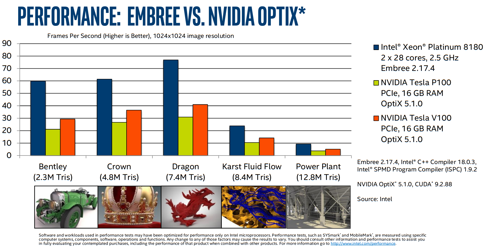
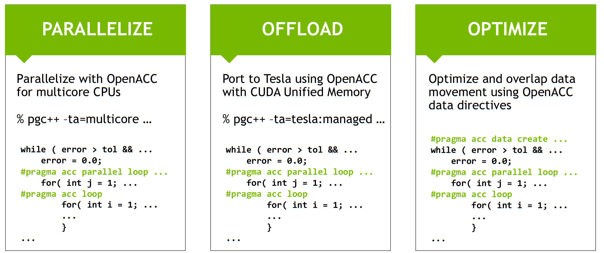

```python
def render_c(filename):
    from IPython.display import Markdown
    with open(filename) as f:
        contents = f.read()
    return Markdown("```c\n" + contents + "```\n")
```

| Architecture | Directives | SIMD | SPMD |
|---------|-----------|------|-----|
| Intel AVX+ (SIMD) | `#pragma omp simd` | [intrinsics](https://software.intel.com/sites/landingpage/IntrinsicsGuide/#) | [ISPC](https://ispc.github.io/ispc.html) |
| CUDA (SIMT) | `#pragma omp target` | C++ templates and other high-level APIs | CUDA |

## [ISPC: Intel SPMD Program Compiler](https://ispc.github.io/ispc.html)

We can program SIMT (e.g., CUDA) devices using directives, but we can also program SIMD (e.g., Intel CPUs) using a SPMD (CUDA-like, acronym comes from "single program" versus "single instruction") programming model.


```python
render_c('simple-ispc.ispc')
```


```c
export void simple_ispc(uniform double vin[], uniform double vout[],
                        uniform int count) {
  foreach (index = 0 ... count) {
    double v = vin[index];
    if (v < 3.)
      v = v * v;
    else
      v = sqrt(v);
    vout[index] = v;
  }
}
```


This function is callable from native C code.


```python
render_c('simple.c')
```


```c
#include <stdio.h>
#include <math.h>

void simple_ispc(double vin[], double vout[], int count);

void simple_c(double vin[], double vout[], int count) {
  for (int index=0; index<count; index++) {
    double v = vin[index];
    if (v < 3.)
      v = v * v;
    else
      v = sqrt(v);
    vout[index] = v;
  }
}

int main() {
  double vin[16], vout[16];
  for (int i = 0; i < 16; ++i)
    vin[i] = i;

  simple_ispc(vin, vout, 16);

  for (int i = 0; i < 16; ++i)
    printf("%d: simple_ispc(%f) = %f\n", i, vin[i], vout[i]);

  simple_c(vin, vout, 16);

  for (int i = 0; i < 16; ++i)
    printf("%d: simple_c(%f) = %f\n", i, vin[i], vout[i]);
  return 0;
}
```


```python
! make -B simple && ./simple
```

    cc -O3 -march=native   -c -o simple.o simple.c
    ispc -O3 --target=avx2-i32x8 simple-ispc.ispc -o simple-ispc.o
    cc   simple.o simple-ispc.o  -lm -o simple
    0: simple_ispc(0.000000) = 0.000000
    1: simple_ispc(1.000000) = 1.000000
    2: simple_ispc(2.000000) = 4.000000
    3: simple_ispc(3.000000) = 1.732051
    4: simple_ispc(4.000000) = 2.000000
    5: simple_ispc(5.000000) = 2.236068
    6: simple_ispc(6.000000) = 2.449490
    7: simple_ispc(7.000000) = 2.645751
    8: simple_ispc(8.000000) = 2.828427
    9: simple_ispc(9.000000) = 3.000000
    10: simple_ispc(10.000000) = 3.162278
    11: simple_ispc(11.000000) = 3.316625
    12: simple_ispc(12.000000) = 3.464102
    13: simple_ispc(13.000000) = 3.605551
    14: simple_ispc(14.000000) = 3.741657
    15: simple_ispc(15.000000) = 3.872983
    0: simple_c(0.000000) = 0.000000
    1: simple_c(1.000000) = 1.000000
    2: simple_c(2.000000) = 4.000000
    3: simple_c(3.000000) = 1.732051
    4: simple_c(4.000000) = 2.000000
    5: simple_c(5.000000) = 2.236068
    6: simple_c(6.000000) = 2.449490
    7: simple_c(7.000000) = 2.645751
    8: simple_c(8.000000) = 2.828427
    9: simple_c(9.000000) = 3.000000
    10: simple_c(10.000000) = 3.162278
    11: simple_c(11.000000) = 3.316625
    12: simple_c(12.000000) = 3.464102
    13: simple_c(13.000000) = 3.605551
    14: simple_c(14.000000) = 3.741657
    15: simple_c(15.000000) = 3.872983


```python
! objdump -d --prefix-addresses -M intel simple | grep sqrt
```

    0000000000001050 <sqrt@plt> jmp    QWORD PTR [rip+0x2fd2]        # 0000000000004028 <sqrt@GLIBC_2.2.5>
    0000000000001056 <sqrt@plt+0x6> push   0x2
    000000000000105b <sqrt@plt+0xb> jmp    0000000000001020 <.plt>
    00000000000012ec <simple_c+0x4c> vsqrtsd xmm1,xmm0,xmm0
    0000000000001302 <simple_c+0x62> call   0000000000001050 <sqrt@plt>
    000000000000142d <simple_ispc___un_3C_und_3E_un_3C_und_3E_uni+0xdd> vsqrtpd ymm1,ymm4
    0000000000001431 <simple_ispc___un_3C_und_3E_un_3C_und_3E_uni+0xe1> vsqrtpd ymm7,ymm5
    000000000000156e <simple_ispc___un_3C_und_3E_un_3C_und_3E_uni+0x21e> vsqrtpd ymm2,ymm6
    0000000000001577 <simple_ispc___un_3C_und_3E_un_3C_und_3E_uni+0x227> vsqrtpd ymm3,ymm7
    000000000000168d <simple_ispc+0xdd> vsqrtpd ymm1,ymm4
    0000000000001691 <simple_ispc+0xe1> vsqrtpd ymm7,ymm5
    00000000000017ce <simple_ispc+0x21e> vsqrtpd ymm2,ymm6
    00000000000017d7 <simple_ispc+0x227> vsqrtpd ymm3,ymm7


ISPC is a good option for code with cross-lane dependencies or vector lane divergence (branches that affect some lanes differently than others).  Writing such code with intrinsics is laborious and compilers often do a poor job of inferring good vectorization strategies (despite `#pragma omp simd` and the like).  An example of successful use of ISPC is Intel's [Embree](https://www.embree.org/) ray tracing engine.

(As with most vendor-reported performance numbers, we can probably take this with a grain of salt. But it indicates that CPUs remain highly competitive for ray tracing.)



## OpenMP target offload and OpenACC

CUDA is relatively hard to maintain and logic/tuning is spread out (between the kernel launch and the device code).  OpenMP target offload and OpenACC attempt to provide a more friendly story for maintenance and incremental migration of legacy code.

### Terminology
| CUDA Concept | CUDA keyword | OpenACC | OpenMP `target` |
|----|------|---------|--------|
| Thread block | `blockIdx` | `gang` | `teams` |
| Warp | (implicit) | `worker` | thread |
| Thread | `threadIdx` | `vector` | `simd` |

### Incremental porting with unified memory



### Example

OpenACC example from a Lattice-Boltzman miniapp

```cpp
void LBM::stream(Real* const __restrict a_f,
                 const Real* const __restrict a_f_post,
                 const int* a_loStr,
                 const int* a_hiStr,
                 const int* a_loAll,
                 const int* a_hiAll,
                 const int a_numPts) const
{

  const int* const __restrict latI = &m_lattice[0][0];
  const int* const __restrict latJ = &m_lattice[1][0];
  const int* const __restrict latK = &m_lattice[2][0];

  const int
    klo = a_loStr[2], khi = a_hiStr[2],
    jlo = a_loStr[1], jhi = a_hiStr[1],
    ilo = a_loStr[0], ihi = a_hiStr[0];

#pragma acc parallel loop independent collapse(3) \
        copyin(a_loAll[SPACEDIM],a_hiAll[SPACEDIM],a_f_post[a_numPts*m_numVels]) \
        copyout(a_f[a_numPts*m_numVels]) vector_length(256)
  for (int k = klo; k <= khi; ++k) {
    for (int j = jlo; j <= jhi; ++j) {
      for (int i = ilo; i <= ihi; ++i) {
#pragma acc loop seq independent
        for (int m = 0; m < NUMV; ++m) {
          const long int offset = m * a_numPts;
          const long int index0 = INDEX(i          ,           j,           k, a_loAll, a_hiAll);
          const long int index2 = INDEX(i - latI[m], j - latJ[m], k - latK[m], a_loAll, a_hiAll);
          a_f[index0 + offset]    = a_f_post[index2 + offset];  // new f comes from upwind
        }
      }
    }
  }
}
```

### Resources
* [Getting started with OpenACC](https://devblogs.nvidia.com/getting-started-openacc/)
* [Advanced OpenACC](http://icl.cs.utk.edu/classes/cosc462/2017/pdf/OpenACC_3.pdf)
* [SC18 OpenMP Presentations (with videos)](https://www.openmp.org/resources/openmp-presentations/resources-openmp-presentations-sc18-booth-talks/)
* [OpenMP 5.0 for Accelerators and What Comes Next](https://developer.download.nvidia.com/video/gputechconf/gtc/2019/presentation/s9353-openmp-5-for-accelerators-and-what-comes-next.pdf)
* [**Hackathon series**](https://www.openacc.org/hackathons)
