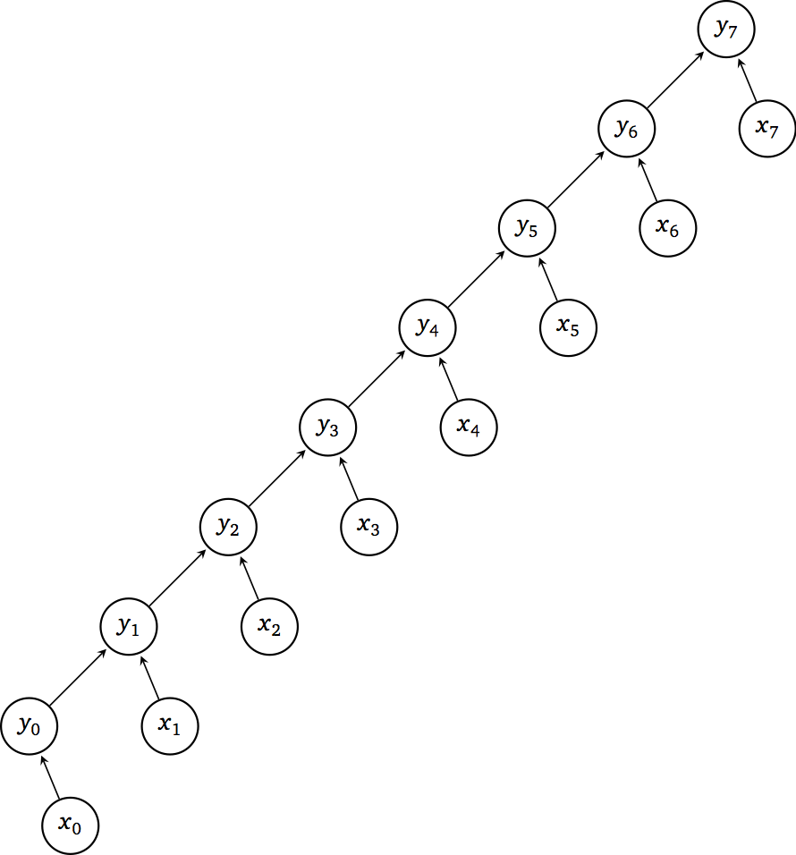
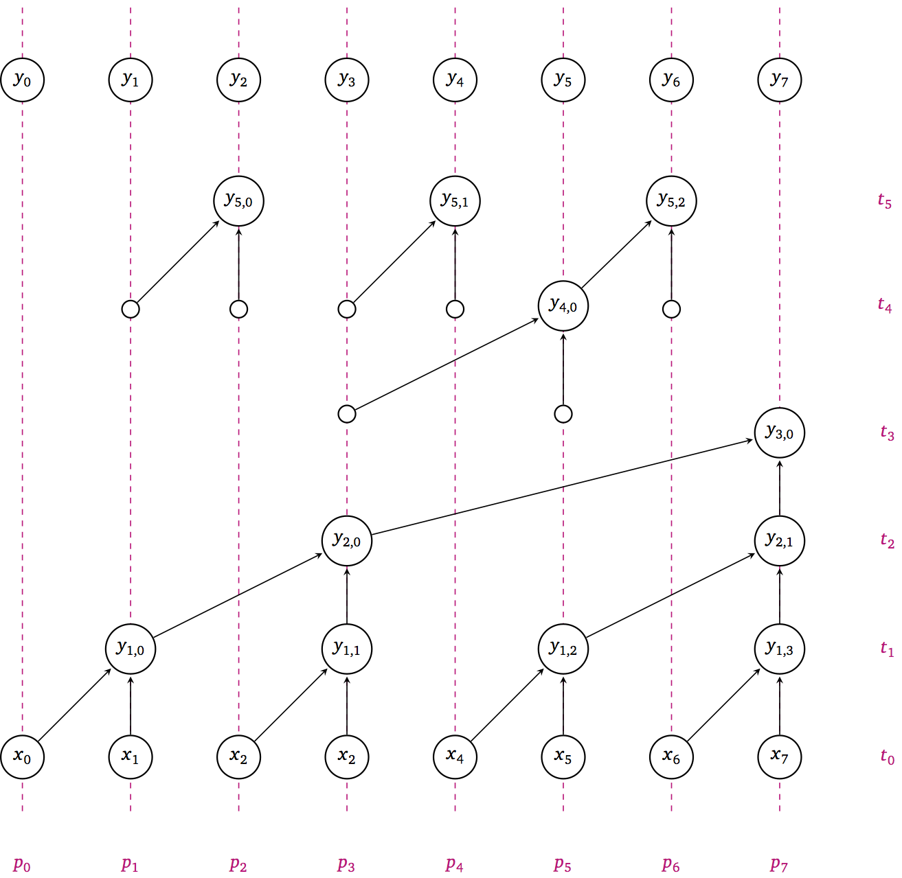

## Reductions

```c
double reduce(int n, double x[]) {
    double y = 0;
    for (int i=0; i<n; i++)
        y += x[i];
    return y;
}
```



#### DAG properties
* Work $W(n) = n$
* Depth $D(n) = n$
* Parallelism $P(n) = \frac{W(n)}{D(n)} = 1$

### A 2-level method

```c
double reduce(int n, double x[]) {
    int P = sqrt(n); // ways of parallelism
    double y[P];
    #pragma omp parallel for shared(y)
    for (int p=0; p<P; p++) {
        y[p] = 0;
        for (int i=0; i<n/P; i++)
            y[p] += x[p*(n/P) + i];
    }
    double sum = 0;
    for (int p=0; p<P; p++)
        sum += y[p];
    return sum;
}
```

#### DAG properties
* Work $W(n) = n + \sqrt{n}$
* Depth $D(n) = 2 \sqrt{n}$
* Parallelism $P(n) = \sqrt{n}$

### PRAM performance model
* Processing units (e.g., OpenMP threads) execute local programs
* Communication through shared memory with no access cost
* Synchronous operation on a common clock
  * Barrier-like constructs are free
* Multiple Instruction, Multiple Data (MIMD)

#### Scheduling

How much time does it take to execute a DAG on $p$ processors?

* Sum work of each node $i$ along critical path of length $D(n)$
$$ \sum_{i=1}^{D(n)} W_i $$

* Partition total work $W(n)$ over $p \le P(n)$ processors (as though there were no data dependencies)
$$ \left\lceil \frac{W(n)}{p} \right\rceil $$

* Total time must be at least as large as either of these
$$ T(n,p) \ge \max\left( D(n), \left\lceil \frac{W(n)}{p} \right\rceil \right) $$

### More levels?
```c
double reduce(int n, double x[]) {
    if (n == 1) return x[0];
    double y[n/2];
    #pragma omp parallel for shared(y)
    for (int i=0; i<n/2; i++)
        y[i] = x[2*i] + x[2*i+1];
    return reduce(n/2, y);
}
```


#### DAG properties
* $W(n) = n/2 + n/4 + n/8 + \dotsb = n$
* $D(n) = \log_2 n$
* $P(n) = n/2$

## Parallel scans

```c
void scan(int n, double x[], double y[]) {
    y[0] = x[0];
    for (int i=1; i<n; i++)
        y[i] = y[i-1] + x[i];
}
```

* What are the DAG properties of this algorithm?
* How fast can we make it?



```c
void scan_inplace(int n, double y[], int stride) {
    if (2*stride > n) return;
    #pragma omp parallel for
    for (int i=2*stride-1; i<n; i+=2*stride)
        y[i] += [i - stride];

    scan(n, y, 2*stride);

    #pragma omp parallel for
    for (int i=3*stride-1; i<n; i+=2*stride)
        y[i] += y[i - stride];
}

// call like
scan_inplace(n, x, 1);
```

### Application of scans: parallel select

Select elements of array `x[]` that satisfy a condition.

```c
int c[n];
#pragma omp parallel for
for (int i=0; i<n; i++)
    c[i] = cond(x[i]); // returns 1 or 0

scan_inplace(n, c, 1);

double results[c[n-1]]; // allocate array with total number of items
#pragma omp parallel for
for (int i=0; i<n; i++)
    if (cond(x[i])) // Can use `c[i] - c[i-1]` to avoid recomputing
        results[c[i]-1] = x[i];
```

---
Figures courtesy Abtin Rahimian's course notes.
